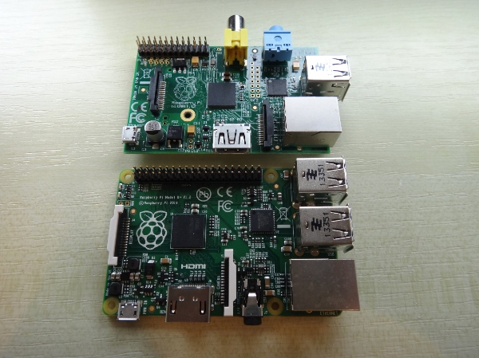

> ## 학습 목표
>
> *   라즈베리 파이 부품을 확인한다.
> *   유무선 인터넷과 소리를 설정한다.
> *   라즈베리 파이를 시작한다.

## 라즈베리 파이 시작

**라즈베리 파이(Raspberry Pi)**, 일명 산딸기를 구매했습니다. 축하합니다. 이제 뭔가 자신만의 프로젝트를 시작할 수 있다는 기대에 잔뜩 부풀어 있습니다. 무엇을 기다리나요. 아래 단계를 진행해서 시작해 보세요.

## 1단계: 필요한 모든 것을 갖췄는지 확인하세요.

본격적으로 시작하기 전에, 필요로 하는 모든 부품을 가졌는지 확인해 보세요.

### 필수 아이템

- 라즈베리파이 ([Model B](http://www.raspberrypi.org/product/model-b/), [Model B+](http://www.raspberrypi.org/product/model-b-plus/), [라즈베리 파이2](https://www.raspberrypi.org/products/raspberry-pi-2-model-b/))
- SD 카드 (SD Card)
    - 8GB 클래스 4 SD 카드를 추천, 이상적으로는 NOOBS가 사전에 설치됨.
    - [NOOBS가 미리 설치된 SD카드를 구매](http://swag.raspberrypi.org/collections/frontpage/products/noobs-8gb-sd-card)하거나, [다운로드 웹사이트](https://www.raspberrypi.org/downloads/)에서 무료로 다운로드 받아 운영체제를 설치한다.
- 화면 연결 케이블 (Cable)
    - 라즈베리 파이 모니터 화면으로 사용될 HDMI/DVI 모니터 혹은 TV.
    - 가장 권장하는 것은 HDMI 입력을 받는 화면 출력장치지만, 구형 화면 출력장비도 가능하다.
- 키보드와 마우스 (Keyboard and Mouse)
    - 표준 USB 키보드와 마우스를 라즈베리 파이에 표준 입력장치로 사용한다.
- 전원공급장치(Power Supply)    
    - 라즈베리 파이에 전원을 공급하기 위해서 [5V 마이크로 USB 전원 공급장치](http://swag.raspberrypi.org/collections/pi-kits/products/raspberry-pi-universal-power-supply)를 사용한다. 주의할 점은 적어도 5V 출력을 갖는 전원 공급장치면 된다; 충분하지 못한 전원 공급으로 라즈베리 파이가 오동작할 수 있다.
바로 시작할 수 있도록 돕는데 [라즈베리 파이 키트](http://swag.raspberrypi.org/collections/frontpage/products/b-raspberry-pi-starter-kit) 형태로도 구매할 수 있다. 

### 꼭 필요하지는 않지만 있으면 도움이 되는 것

- 인터넷 연결 (internet connection)
    - 소프트웨어를 갱신하거나 다운로드하는데, 라즈베리 파이를 유선 이더넷 케이블(ethernet cable) 혹은 무선 와이파이 어탭터(WiFi adapter)를 통해서 인터넷에 연결하는 것을 추천한다.
    - 이미 와이파이 어탭터를 갖고 있다면, [WiFi 설정 안내서](http://swag.raspberrypi.org/collections/frontpage/products/b-raspberry-pi-starter-kit)를 참조한다.
- 소리 (sound)
    - (전기 기구를 연결하는) 3.5 mm 잭(jack)을 갖는 헤디폰, 이어폰, 스피커를 라즈베리 파이에 연결하여 사용할 수 있다.

## 2 단계: 플러그를 라즈베리 파이에 꽂기

이제 라즈베리 파이를 실행하는데 필요한 모든 부품을 갖추었기 때문에, 플러그에 꽂고 시작한다.

1. 라즈베리 파이 SD 카드 슬롯에 SD 카드를 꽂는 것부터 시작한다. SD 카드를 꽂는 방법은 한가지다. *NOOBS 소프트웨어가 이미 SD카드에 설치되어 있어야 한다. 만약 설치되어 있지 않다면, [NOOBS 설치 안내](http://www.raspberrypi.org/help/noobs-setup/)를 참조하여 설치한다.*  

2. 다음으로, USB 키보드와 마우스를 라즈베리 파이 USB 슬롯에 꽂는다. 화면 출력장치 모니터 혹은 TV가 켜져있고 올바른 입력장치를 선택(예, HDMI 1, DVI 등)했는지 확인한다.  

3. 라즈베리 파이에서 HDMI 케이블을 뽑아 모니터 혹은 TV에 연결한다.  

4. 만약 라즈베리 파이를 인터넷에 연결하려면, 유선 인터넷 이더넷 포트를 라즈베리 파이 USB 포트 옆 이더넷 포트에 연결한다; 만약 인터넷 연결이 필요없다면, 이 단계는 건너뛴다.  

5. 마지막으로 모든 케이블과 SD카드를 꽂아 연결하고 나면 마이크로 USB 전원공급장치를 라즈베리 파이에 꽂는다. 이 동작이 라즈베리 파이 전원을 켜고 부팅하는 것이다.  

6. 만약 처음으로 라즈베리 파이와 NOOBS SD 카드를 사용한 것이라면, 운영체제를 선택하고 환경설정을 해야한다.  [환경설정을 위한 NOOBS 안내](http://www.raspberrypi.org/help/noobs-setup/)를 따른다.

## 3단계: 라즈베리 파이 로그인

만세!!! 라즈비안(Raspbian)이 적재되고 라즈베리 파이가 실행된다... 이제 로그인해서 다음을 알아보자.

1. 라즈베리 파이가 부팅 과정을 완료하면, 로그인 프롬프트(login prompt)가 나타난다. 라즈비안 시스템에 디폴트 로그인 사용자명은 `pi`, 비밀번호는 `raspberry`다.  

2. 성공적으로 로그인한 뒤에, 다음과 같은 명령라인 프롬프트가 보게된다. `pi@raspberrypi~$`  

3. 그래픽 사용자 인터페이스(graphic user interface, GUI)를 실행하기 위해서는, 키보드로 `startx`를 타이핑하고 **Enter**키를 친다.

## 다음 학습

만약 리눅스를 사용하는데 처음이라면, 간단한 텍스트 명령어를 사용해서 라즈베리 파이 컴퓨터를 돌아다니고, 파일을 생성하고, 응용프로그램 실행을 [xwMOOC](http://xwmooc.net) 소프트웨어 카펜트리 [유닉스 쉘](http://www.xwmooc.net/swc/book.html#unix-shell)을 통해서 좀더 자세한 정보를 얻을 수 있다.
