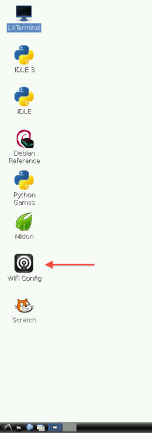
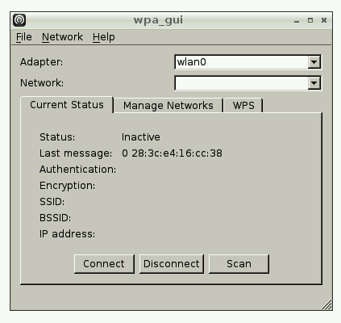
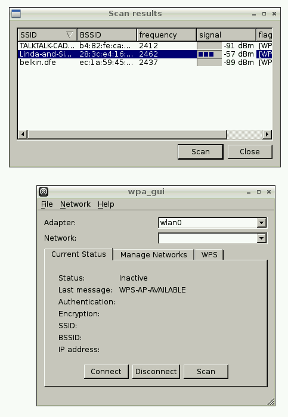
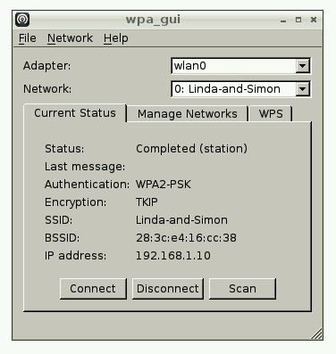
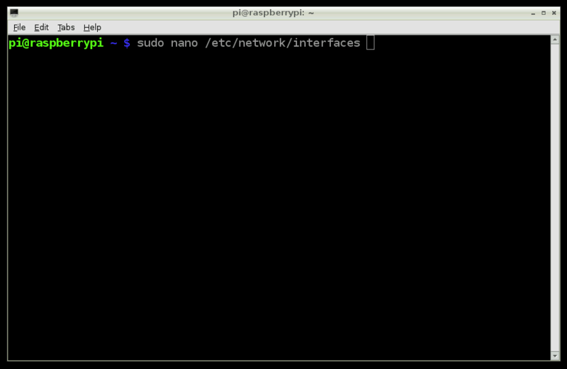
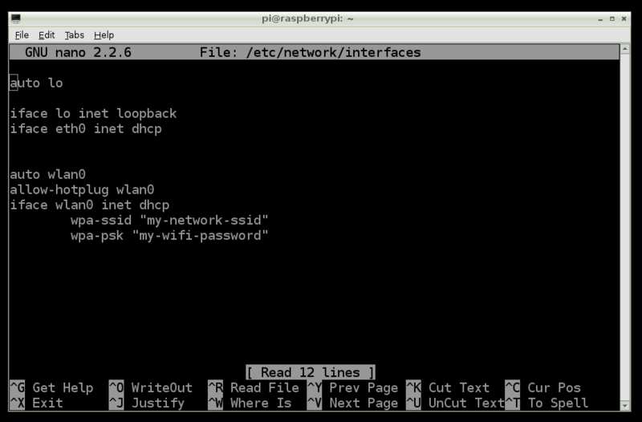
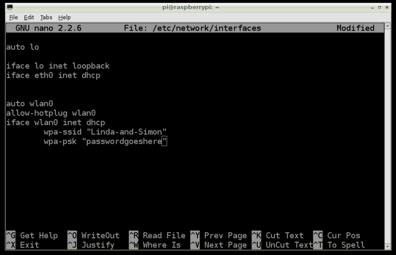
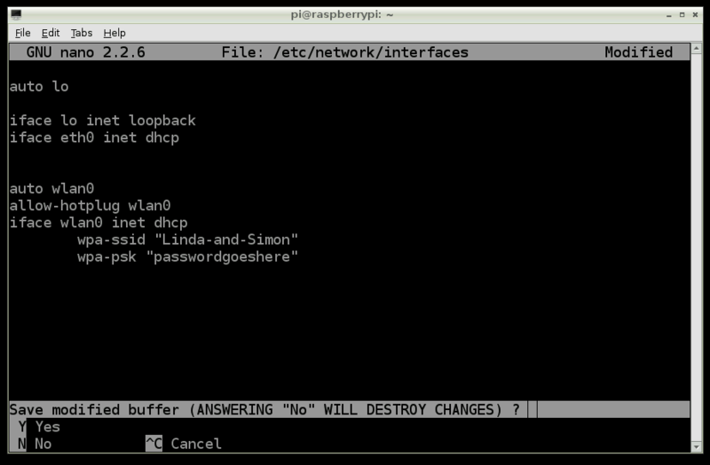

> ## 학습 목표
>
> *   무선 인터넷 와이파이를 설정한다.
> *   GUI를 사용해서 무선 인터넷을 설정한다.
> *   명령-라인(Command-Line) 명령어를 사용해서 무선 인터넷을 설정한다.

## 무선 인터넷 와이파이(WiFi)

라즈베리 파이에 무선 인터넷 와이파이(WiFi)를 사용하도록 준비하는 방법은 매우 다양한다. 여기서 세가지 와이파이 환경설정하는 방법만 다룬다.

### GUI 응용프로그램을 사용한 방법
출처: [adafruit](http://learn.adafruit.com/adafruits-raspberry-pi-lesson-3-network-setup/setting-up-wifi-with-raspbian) 내용을 한글로 번역한 것으로 저작권에 문제가 있다면 바로 삭제하겠습니다.

> ## 주의 사항 {.callout}
>
> 와이파이 설정하는데 라우터가 SSID를 방송(broadcasting)해야 한다. 
> 라우터에 "Broadcast SSID"로 설정되었는지 확인한다!
> "Private SSID"로는 정상동작하지 않는다.

2012-10-28일 뒤에 출시된 라즈비안에는 와이파이 환경설정 유틸리티(WiFi configuration utility)가 포함되어 있다. 바탕화면(Desktop)에 단축아이콘을 찾는다.만약 명령-라인 도구나 이더넷으로 로그인했다면, 수동으로 **/etc/network/interfaces**을 편집하는 방법을 참고한다.

#### 1 단계
와이파이 환경설정(WiFi Config) 아이콘을 두번 클릭하면, 다음 윈도우를 볼 수 있다.

#### 2 단계

상기 그림 윈도우에서 스캔(`Scan`) 버튼을 클릭하면 두번째 윈도우가 열린다. 목록에서 무선 접근지점(wireless access point)를 찾아서 두번 클릭한다.
그러면 또다른 윈도우가 열린다.

#### 3 단계

PSK 필드에 비밀번호를 입력하고 추가(`Add`)를 클릭한다. 첫번째 윈도우를 볼 때, 연결정보가 바로 사용하도록 설정된 것이 보여야 한다. 하단 버튼을 사용해서 연결(`Connect`) 혹은 연결 끊기(`Disconnect`)를 수행한다. 라즈베리 파이 IP 주소가 윈도우 하단에 보이는데 주목한다.

### 명령-라인(Command-Line) 방식을 사용한 방법
출처: [adafruit](https://www.raspberrypi.org/documentation/configuration/wireless/wireless-cli.md) 내용을 한글로 번역한 것으로 저작권에 문제가 있다면 바로 삭제하겠습니다.

> ## 주의 사항 {.callout}
>
> 와이파이 설정하는데 라우터가 SSID를 방송(broadcasting)해야 한다. 
> 라우터에 "Broadcast SSID"로 설정되었는지 확인한다!
> "Private SSID"로는 정상동작하지 않는다.

명령-라인 방식을 통한 와이파이 설정은 매우 간단한다.
무선 네트워크 이름(SSID)과 비밀번호를 환경설정 파일에 추가하면 된다.

#### 1 단계

와이파이 어탭터 플러그를 꽂지 않은 상태로 라즈베리 파이를 부팅한다.

#### 2 단계

LXTerminal 아이콘을 클릭해서 터미널을 연다. 
그리고 터미널 명령 프롬프트에 다음 명령어를 타이핑한다:

~~~ {.input}
sudo nano /etc/network/interfaces
~~~

~~~ {.input}
auto lo
 
iface lo inet loopback
iface eth0 inet dhcp
 
allow-hotplug wlan0
auto wlan0
 
 
iface wlan0 inet dhcp
        wpa-ssid "ssid"
        wpa-psk "password"
~~~

상기 환경설정 정보를 복사하여 붙여넣는다. 만약 'hidden SSID'를 사용한다면, 다음 웹사이트에서 [자세한 정보](http://www.dafinga.net/2013/01/how-to-setup-raspberry-pi-with-hidden.html)를 참조한다.

~~~ {.input}
auto lo
 
iface lo inet loopback
iface eth0 inet dhcp
 
auto wlan0
allow-hotplug wlan0
iface wlan0 inet dhcp
   wpa-scan-ssid 1
   wpa-ap-scan 1
   wpa-key-mgmt WPA-PSK
   wpa-proto RSN WPA
   wpa-pairwise CCMP TKIP
   wpa-group CCMP TKIP
   wpa-ssid "My Secret SSID"
   wpa-psk "My SSID PSK"
 
iface default inet dhcp
~~~

#### 3 단계

나노 편집기로 와이파이 환경설정 파일을 열고 변경이 필요한 부분을 수정한다.

변경해야 하는 두 곳은 끝에서 두줄이다.
파일을 변경하면 다음과 같이 보인다.

물론, **본인** 네트워크 SSID와 비밀번호를 적어 넣어야 한다. 무선 네트워크 이름과 비밀번호는 쌍따옴표로 감싸야만 한다.  

이런 유형의 텍스트 편집기에서는 마우스를 사용할 수 없다. 대신에, 커서키를 사용해서 파일내부 여기 저기를 돌아다닌다.  

#### 4 단계

편집이 완료되면 `Ctrl + x`를 눌러 빠져나온다. 빠져나올 때 파일에 변경된 부분을 저장할 것인지 묻는다.

`Y`를 누르고 나서 `Return`을 누르면 동일한 파일에 변경사항이 저장된다.

#### 5 단계

라즈베리 파이를 끄고나서, 와이파이 어탭터를 꽂고 다시 시작한다. 라즈베리 파이가 부팅되면서 와이파이 어탭터를 사용해서 인터넷 연결이 된 것을 확인한다. 

### wicd-curses 를 사용한 방법

자세한 사항은 [웹사이트](http://www.raspyfi.com/wi-fi-on-raspberry-pi-a-simple-guide/)를 참조한다.

> ## 저작권 관련 {.challenge}
> 라즈베리 파이 재단 웹사이트 내용을 번역하다 연결된 
> 웹사이트 [adafruit](https://learn.adafruit.com)내용을 번역하게 되었고, 저작권이 별도로 명시되지 않아 
> 혹시, adafruit 저작권을 아시는 분은 알려주시면 감사하겠습니다. 
> 본 번역 결과는 adafruit 기여할 곳을 못찾아 공개하는 부분도 있으니 관련 부분 알고 계신분은 연락을 주시면 감사하겠습니다.  
>
