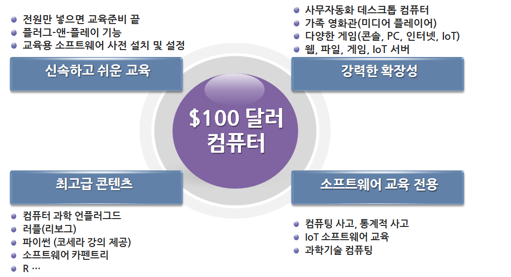
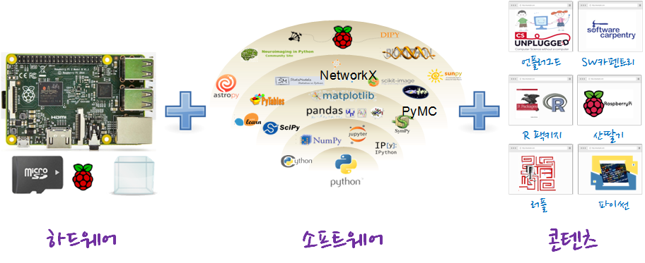

> ### $100 달러 컴퓨터 {.objectives}
>
> * 기계와의 경쟁을 준비할 한국인을 위한 공개 플랫폼
> * 한글을 이해하는 모두를 위한 [xwMOOC](httP://www.xwmooc.net)(엑스더블유무크) 오픈 컴퓨터

### $100 달러 오픈 컴퓨터 공개 배경

미래창조과학부는 시범적으로 초등학교, 중학교용 교재, 교사지도서 각 4종 개발하고 [SW 배움터](http://software.kr/t/education/school/swbook/swbook.do)에 '15년 3월 인터넷에 공개하고, 나아가 고등학교용 및 융합·심화교재, 교사지도서 3종 추가 보급 예정(’16년, ’17년)에 있고, 교육부도 초등학교, 중학교 교재, 교사지도서 각 1종개발·보급(’16년) 예정이다.

컴퓨터실 및 관련 컴퓨터 하드웨어 인프라도 소프트웨어를 가르칠 정보 교사 부족으로 인한 시설노후화도 예측된다. 

이러한 척박한 환경에서 정보격차가 사회경제적 불평등으로 되먹임되고 있는 것이 현실이고, 고가의 초기 컴퓨터 구입으로 인해서 애지중지하면서 다양한 실험을 컴퓨터로 할 수 없는 현실에서 한글을 읽을 수 있는 모든 사람을 위한 오픈 컴퓨터를 개발해서 공개합니다. 

> ### 거인의 어깨위에서 본 세상 {.getready}
>
> "The future is here, it's just not evenly distributed yet."  
>                                                           - William Gibson

### $100 달러 컴퓨터 혜택

1. 플러그-앤-플레이 기능과 소프트웨어가 사전 설치되어 교육 자체에 신속히 몰입할 수 있게 도와줍니다.
1. 전세계에서 선택된 최고급 교육 콘텐츠를 무료로 제공하여 드립니다.
    - 무료제공되는 [파이썬 교재](http://python.xwmooc.org)는 [코세라(Coursera)](https://www.coursera.org/specializations/python)에서 강의 교재로 사용되고 있습니다.
    - [소프트웨어 카펜트리](http://software-carpentry.org/)는 과학 컴퓨팅(Scientific Computing)을 위한 소프트웨어 기술보급 활동을 전세계적으로 활발히 추진하고 있고, [xwMOOC](http://swcarpentry.xwmooc.org/)에서 '14년부터 활발히 참여하고 있습니다.   
    - 뉴질랜드 팀벨 교수가 주도가 되어 ‘90년대부터 시작된 [컴퓨터 과학 언플러그드](http://csunplugged.org)는 컴퓨터 없이 컴퓨터 과학 개념을 잡을 수 있는 컴퓨터공학 비전공자가 처음 시작하는 교재로 많이 활용되고 있고, [xwMOOC 언플러그드](http://unplugged.xwmooc.org/)에서 한글화되어 무료로 제공하고 있습니다.
    - 캐나다 Andre Roberge 총장이 주도되어 2000년대 중반부터 시작된 [러플(RUR-PLE)](http://rur-ple.sourceforge.net/)은 현재 [Reeborg](http://reeborg.ca/)로 확장되어 새로이 시작되고 있고, [xwMOOC 러플](http://rur-ple.xwmooc.org/)은 [GitHub 저장소](https://github.com/statkclee/rur-ple)에서도 만날 수 있다.
1. 리눅스 운영체제를 기반으로 안정되게 다양한 기능을 제공합니다.
    - 사무자동화 데스트톱 컴퓨터
    - 가족 영화관 (미디어 플레이어)
    - 콘솔, PC, 인터넷, IoT 게임
    - 웹서버, 파일 서버, IoT 서버, 미디어 서버 등 
1. 소프트웨어 교육 전용 컴퓨터   
    - 컴퓨팅 사고(Computational Thinking)과 통계적 사고 및 논리적 사고 향상
    - 과학기술 컴퓨팅(Scientific Computing)
    - IoT(사물 인터넷) 및 피지컬 컴퓨팅(Physical Computing) 교육

### $100 달러 컴퓨터 구성

#### 하드웨어

|              구분        |      라즈베리 파이 2 (모델 B) |
|:----------------------:|:---------------------------------:|
| SOC(System-on-Chip)  |  BCM2836           |
| GPU                  |  브로드컴 VideoCore IV      |
| CPU                  | ARM Cortex A7 900 MHz |
| 주기억장치            |  1 GB                              |
| USB 포트            | 4                                     |
| 이더넷 포트           | 1                                     |
| 가격                    | $35                                 |
| 전력                    | 800 mA (5V)                    | 
| 하드디스크            | 마이크로SD (16GB)           |
| 컴퓨터 케이스        | xwMOOC 특허 케이스         |

#### 소프트웨어

- [파이썬 2, 3](https://www.python.org/)
- [아나콘다](http://continuum.io/)
- [러플(Rur-ple)](http://rur-ple.sourceforge.net/)
    - [Reeborg](http://reeborg.ca/index_en.html): [소스코드](https://github.com/aroberge/reeborg) 공개됨
    - [플레이봇(Playbot)](http://playbot.spaceii.com/): 소스코드가 공개되어 있지 않음
- [소프트웨어 카펜트리](http://software-carpentry.org/workshops/setup.html)
- [마인크래프트 파이](http://pi.minecraft.net/)

- [R](https://www.r-project.org/)
- [라즈베리 파이](http://raspberry-pi.xwmooc.org/)
- [매스매티카 울프램](http://www.wolfram.com/raspberry-pi/?source=nav)

#### 콘텐츠

- [컴퓨터과학 언플러그드 3.1](http://unplugged.xwmooc.org/)
- [소프트웨어 카펜트리 5.2](http://swcarpentry.xwmooc.org/)
- [러플(Rur-ple)](http://rur-ple.xwmooc.org/)
- [정보교육을 위한 파이썬](http://python.xwmooc.org/)
- [R 팩키지](http://r-pkgs.xwmooc.net/)
- [라즈베리 파이](http://raspberry-pi.xwmooc.org/)

### $100 달러 컴퓨터로 할 수 있는 것 (일부)
 

#### 1. 가정 영화관 (Home Theater) 

라즈베리 파이 2는 기존 브로드컴 BCM2835칩을 개선한 BCM2836칩을 사용하는데, H.264 형식을 사용해서 고해상도 비디오 정보를 고속으로 전송할 수 있다. 가족용 영화관 구성을 위해서 크기가 작고, 저전력이며 조용한 운영방식이 필요한데 라즈베리파이는 이 요건을 잘 충족하고 있다.

#### 2. 사무 자동화 (오피스) 

워드, 한글, 파워포인트 등 사무작업을 위한 [마이크로소프트 오피스](https://products.office.com/ko-KR/)가 상업용으로 많이 사용되고 있지만, 마이크로소프트 상용 오피스 제품에 대응되는 공개 오피스 소프트웨어도 다양하다. 
[리브레 오피스(LibreOffice)](http://www.libreoffice.org/)는 기존 [오픈 오피스(Open Office)](http://www.openoffice.org/) 개발에 참여한 인력이 나와서 만든 공개 오피스 제품으로 아래한글 뿐만 아니라 마이크로소프트 오피스와도 기능적 별반 차이가 없다. 최근에는 오피스 작업 파일간 호환성도 많이 개선되어 평균적인 기능을 사용한다는 측면에서 공개 소프트웨어 활용도가 많이 높아졌다.

[리브레오피스 한국어 사이트](http://ko.libreoffice.org/)에서 공식적인 정보를 얻을 수 있으며, Pootle 서버를 통해서 [한국어 번역](https://translations.documentfoundation.org/)어 번역이 활발히 진행되고 있다. [다큐먼트 재단 홈페이지](http://www.documentfoundation.org)가 공식 홈페이지이며, 과학 IT 동아에서 [무료 오피스의 진수, '리브레 오피스'](http://it.donga.com/21009/) 제목으로 리브레 오피스에 대해 기사로 소개가 되었다.

|   | 국문 | 영어 | 설명                                                                                        |
|---|:--------:|:--------:|---------------------------------------------------------------------------------------------|
|     |  라이터  |   Writer | 워드프로세서 프로그램으로 마이크로소프트 워드와 비슷하며 기본적인 위지위그 편집기를 지녔다. |
|     |   캘크   |     Calc | 스프레드시트 프로그램이다. 마이크로소프트 엑셀 또는 로터스 1-2-3과 비슷하다.                |
|     | 임프레스 |  Impress | 프레젠테이션 프로그램이다. 마이크로소프트 파워포인트와 비슷하다.                            |
|     | 베이스   | Base     | 데이터베이스 관리 프로그램이다. 마이크로소프트 액세스와 비슷하다.                           |
|     | 드로우   | Draw     | 벡터 그래픽 에디터다. 도표 프로그램인 마이크로소프트 비지오와 비슷하다.                     |
|     | 매쓰     | Math     | 수학 공식을 만들고 수정하는 프로그램이다. 마이크로소프트 수식편집기와 유사하다.             |

#### 3. 김프(Gimp) 이미지 편집

이미지 편집 분야에서 가장 많이 사용되는 것이 김프(GNU Image Maniuplation Program, GIMP)다. 김프는 상용 그래픽 편집 프로그램 아도비사 포토샵에 대응되도록 공개 소프트웨어 진영에서 개발한 소프트에어로 일부 기능이나 사용법에서 차이가 있지만, 상당부분 유사하다. 마치 마이크로소프트 오피스와 리브레 오피스와 비교하면 느낌이 올 것이다. 설치 방법은 `sudo apt-get install gimp` 다.

#### 4. LaTeX 으로 전자 출판 작업

스탠포드 대학 D. Knuth 교수가 창안한 TeX은 현존하는 가장 훌륭한 조판 엔진(typesetting engine) 중 하다.  `texlive-full` 을 설치하면 저장공간은 제법 차지하지만 별도 팩키지를 설치할 필요없어 초보자가 탁상전자출판을 시작하기 딱 좋다. 다양한 TeX 작업을 위한 프론트엔드(front-end) 편집기가 있지만, 크로스 플랫폼을 지원하는 [TeXworks](http://tug.org/texworks/)을 사용하면 생산성을 많이 높일 수 있다.

### 언론 보도자료
- [교육부·미래부,「SW중심사회를 위한 인재양성 추진계획」발표](http://m.blog.naver.com/moeblog/220426677439)
- [전자신문 - SW교육 인프라 재정비해야](http://www.etnews.com/20150819000107)
- [중앙일보 - 교사도 없이 소프트웨어 가르치겠다는 정신 나간 정부](http://article.joins.com/news/article/article.asp?Total_Id=18289368)
- [은행지점 대부분 5년 안에 사라지고](http://www.koreadaily.com/news/read.asp?art_id=3432670)
- ['위기의 서막'..30대 그룹 절반 사라질 것](http://media.daum.net/m/channel/view/media/20150803091559846)

### 기계가 바꿔가는 세상
- 게임
    - [드론 경주](https://www.youtube.com/watch?v=47LRsDMkDWc)
    - [RC카 경주](https://www.youtube.com/watch?v=Kaqd1NIWm7Q)
- 물류
    - [아마존(Amazon Kiva)](http://www.youtube.com/watch?v=aI_YQp3zoo8&amp;list=PL16A39FD504A786B1&amp;index=8)
    - [아마존 택배(Amazon Prime Air)](http://www.youtube.com/watch?v=98BIu9dpwHU)
- 자동차
    - [구글 무인자동차(Google Self-Driving Car)](http://www.youtube.com/watch?v=cdgQpa1pUUE)
    - [우버(Uber) 택시](http://www.youtube.com/watch?v=P2M0RD7bhYY)
- 호텔 
    - [에어비앤비(AirBnB)](http://www.youtube.com/watch?v=SaOFuW011G8)
- **[로봇과 일자리 경쟁](https://www.youtube.com/watch?v=7c_XO3Ouzts)**
    - [Oxford Martin School study shows nearly half of US jobs could be at risk of computerisation](http://www.futuretech.ox.ac.uk/news-release-oxford-martin-school-study-shows-nearly-half-us-jobs-could-be-risk-computerisation)