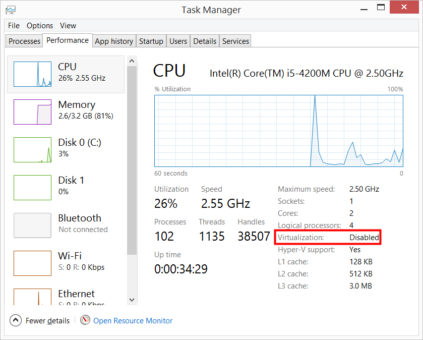

> ### 학습 목표 {.objectives}
>
> *  도커

### 1. 윈도우 도커 설치

윈도우 환경에서 도커를 사용하도록 설치하는 방식이 기존 [Boot2Docker](https://github.com/boot2docker/windows-installer/releases)에서 [도커 공구상자(Docker Toolbox)](https://www.docker.com/toolbox)으로 변경되었다.

바이오스 설정으로 들어가서 만약 가상화 기능이 비활성화되어 있다면 활성화시키고 도커 설치 작업을 시작한다.
