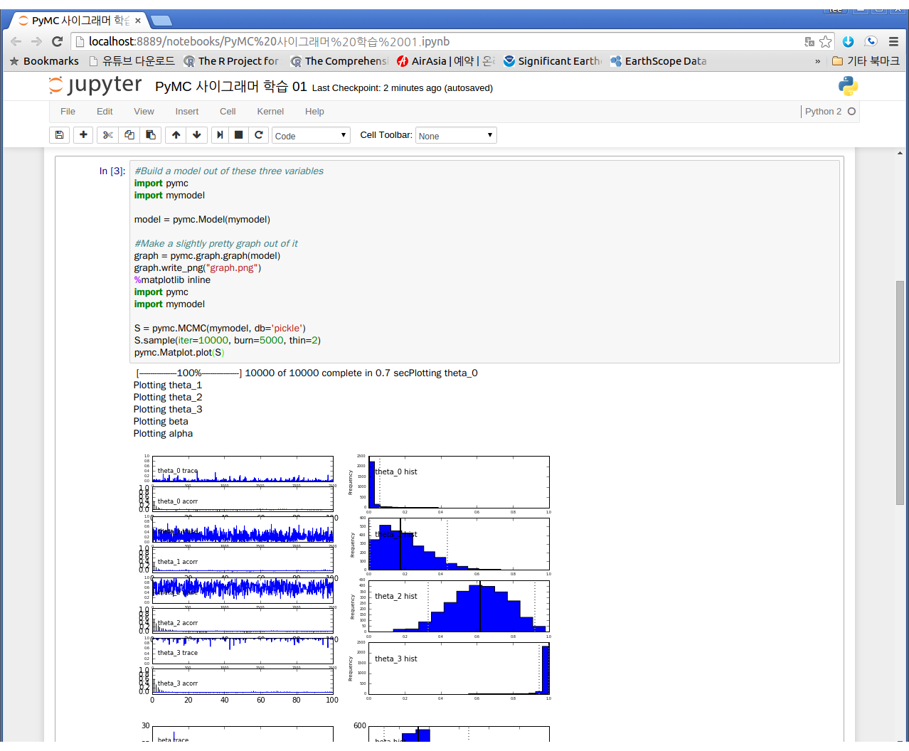
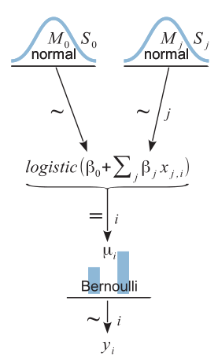
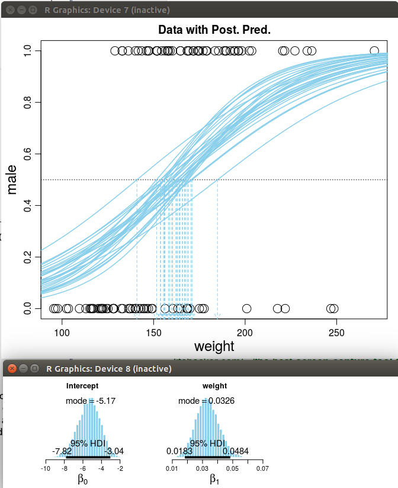
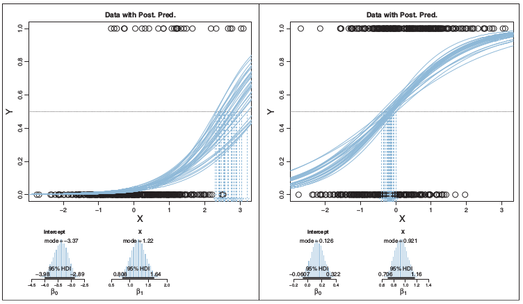
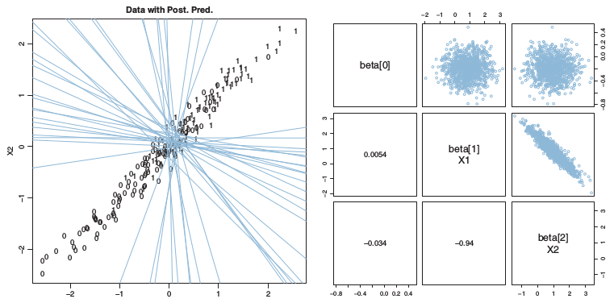
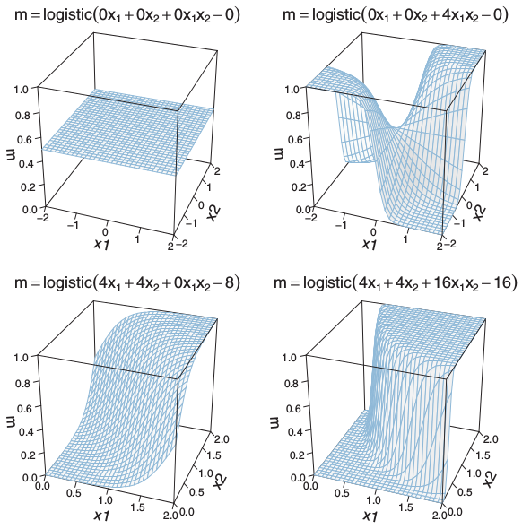

> ### 학습 목표 {.objectives}
>
> *  우분투에 베이지안 분석을 위한 툴체인 구축

### 1. 베이지안 R과 Jags

#### 1.1. R 기반 베이지안 분석을 위한 툴체인 구축

[JAGS](http://mcmc-jags.sourceforge.net/)는 *Just Another Gibbs Sampler*의 약어로 마코프 체인 몬테 카를로(Markov Chain Monte Carlo, MCMC) 모의실험을 사용해서 계층적 베이지안 모형 분석하는 프로그램이다.

1. 쉘 환경에서 별도 팩키지로 `jags`를 설치한다.

~~~ {.shell}
$ sudo apt-cache search jags
$ sudo apt-get install jags
~~~
2. R 환경에서 `R2jags` 팩키지를 설치한다. 

~~~ {.r}
> version
               _                           
platform       x86_64-pc-linux-gnu         
arch           x86_64                      
os             linux-gnu                   
system         x86_64, linux-gnu           
status                                     
major          3                           
minor          2.0                         
year           2015                        
month          04                          
day            16                          
svn rev        68180                       
language       R                           
version.string R version 3.2.0 (2015-04-16)
nickname       Full of Ingredients         
> install.packages("rjags") 
~~~

3. 베이지안 자료분석을 위한 프로그램과 데이터를 다운로드 받는다.
    - [Doing Bayesian Data Analysis: A Tutorial with R, JAGS, and Stan. 2nd Edition.](https://sites.google.com/site/doingbayesiandataanalysis/software-installation)

~~~ {.shell}
$ wget https://sites.google.com/site/doingbayesiandataanalysis/software-installation/DBDA2Eprograms.zip
$ unzip DBDA2Eprograms.zip
~~~

#### 1.2. 파이썬 기반 베이지안 분석을 위한 툴체인 구축

PyMC 및 베이지안 분석 결과 그래픽 산출물을 활용할 수 있는 도구가 일부 파이썬2 환경에서 구축되어 파이썬2를 기본으로 설치한다.

[아나콘다(Anaconda)](http://continuum.io/)는 파이썬 언어를 기반으로 과학 컴퓨팅을 지원하는 통합개발환경(IDE)로 개발시간을 획기적으로 단축시킬 수 있다.

1. 아나콘다 [다운로드 웹페이지](http://continuum.io/downloads)에서 설치 컴퓨터 사양에 맞는 아나콘다를 다운로드 한다.
    - 리눅스 우분투 64 Bit, 파이썬 2.7를 다운로드했다. 웹에서 직적 다운로드하거나, `wget` 명령어를 사용해서 링크를 터미널에 붙여넣고 다운로드 받아도 된다.
1. `bash` 명령어로 쉘스크립트를 실행하면 자동으로 설치된다.
    - 루트 권한이 필요없으며 사용자 홈디렉토리 밑에 `~/anaconda`가 기본 디렉토리가 된다.
    - 삭제를 원한다면 `rm -rf ~/anaconda` 명령어를 사용한다.
    - `conda`명령어를 즉시 사용할 수 있도록 `source .bashrc` 명령어를 실행한다.
1. 그래픽 관련 PyMC 팩키지를 설치한다.
    - `matplotlib`가 의존성을 갖는 그래픽 소프트웨어 `qt4`를 설치한다. 명령어는 `apt-get install python-qt4` 이다.
    - PyMC가 의존성을 갖는 `graphviz`와 `pydot`을 설치한다. 명령어는 `apt-get install graphviz` 과 `conda install pydot`이다. 

#### 1.2.1. 아나콘다 설치 : 파이썬 2.7 및 주피터

~~~ {.shell}
$  wget https://3230d63b5fc54e62148e-c95ac804525aac4b6dba79b00b39d1d3.ssl.cf1.rackcdn.com/Anaconda-2.3.0-Linux-x86_64.sh
$ bash Anaconda3-2.3.0-Linux-x86_64.sh 
$ source .bashrc
~~~

[참고: Installing Anaconda python on ubuntu](http://askubuntu.com/questions/505919/installing-anaconda-python-on-ubuntu)

#### 1.2.2. 그래픽 관련 팩키지 설치: qt4, pydot, graphviz

~~~ {.shell}
$ sudo apt-get install python-qt4 
$ sudo apt-get install graphviz
~~~

#### 1.2.3. 파이썬 가상환경 구축

파이썬 격리된 가상 개발환경을 구축해주는 팩키지는 `python-virtualenv`이다. 팩키지를 설치한 후에 `virtualenv`를 통해서 격리된 가상의 개발환경을 구축한다. `virtualenv -p /usr/bin/python venv` 명령어로 `venv` 명칭을 갖는 격리된 가상환경을 생성하고 `source venv/bin/activate` 명령어를 통해서 가상환경에 진입해서 `conda install pymc`명령어로 PyMC를 설치한다. 마지막으로 `deactivate`명령어로 가상환경을 빠져나온다.

~~~ {.shell}
$ sudo apt-get install python-virtualenv
$ which python
~~~
~~~ {.output}
/usr/bin/python
~~~~
~~~ {.shell}
$ which python3
~~~
~~~ {.output}
/usr/bin/python3
~~~~
~~~ {.shell}
$ virtualenv -p /usr/bin/python venv
~~~
~~~ {.output}
Already using interpreter /usr/bin/python
New python executable in venv/bin/python
Installing setuptools, pip...done.
~~~
~~~ {.shell}
$ source venv/bin/activate
(venv)[xwmooc:~ ] $ conda install pymc
(venv)[xwmooc:~ ] $ deactivate
~~~

#### 1.2.4. 주피터 통합개발환경 설치

`ipython notebook`명령어를 통해서 IPython 노트북을 실행하여 통합개발환경을 구축할 수도 있다. 또 다른 대안으로 주피터(Jupyter)를 설치해서 좀더 확장성 있는 통합개발환경을 동일하게 구축할 수도 있다. `conda install jupyter`를 통해서 설치한 후에 `jupyter notebook`명령어를 통해서 노트북을 실행한다.

~~~ {.shell}
$ conda install jupyter
~~~

~~~ {.shell}
$ jupyter notebook
~~~

### 2. 베이지안 데이터 분석 일반절차

[Kruschke 스타일](http://doingbayesiandataanalysis.blogspot.kr/2013/10/diagrams-for-hierarchical-models-new.html) 베이지안 모형 시각화 템플릿으로 [리브레 오피스 Draw](http://www.libreoffice.org/features/draw/)를 사용한다. 만약 LaTeX으로 동일한 작업을 하고자 한다면 Tinu Schneider의 [GitHub 저장소]((https://github.com/tinu-schneider/DBDA_hierach_diagram))를 참고한다.

> #### 베이지안 데이터 분석 절차 {.callout}
>
> 1. 데이터를 기술하는 모형을 정의한다.
> 1. 사전확률(Prior)을 지정한다.
> 1. 데이터를 수집한다.
> 1. MCMC를 사용해서 모수의 사후분포를 계산한다.

### 3. 베이지안 자료분석

[Doing Bayesian data analysis](https://sites.google.com/site/doingbayesiandataanalysis/) 책을 기반으로 [사이그래머](https://www.facebook.com/groups/psygrammer/) 베이지안 발표자료. 

### 3.1. 베이지안 이항회귀 모형

$\mu$는 종속변수로 이산형으로 예를 들어, 0 혹은 1 값을 갖고, 설명변수는 연속형 값을 갖는 것을 기준으로 베이지안 이행회귀 모형을 전개해 나간다.

$\mu = logistic(\beta_0 + \beta_1 x_1 + \beta_2 x_2)$  
$\lambda = Bernoulli(\mu)$

여기서 $logistic(x) = 1 / (1+ exp(-x))$

### 3.2. 데이터 및 Jags 코드

베이지안 이항회귀 모형에 사용되는 데이터는 `HtWtData110.csv` 파일로 설명변수 키와 몸무게 정보를 가지고 종속변수 여성(0)과 남성(1)에 대한 확률모형을 구축하는 것이다. 

관련된 베이지안 이항모형 코드는 R, Jags로 두가지 소스코드에 작성되어 있다. `Jags-Ydich-XmetMulti-Mlogistic-Example.R`, `Jags-Ydich-XmetMulti-Mlogistic`

#### 3.2.1 데이터

~~~ {.shell}
"male","height","weight"
0,63.2,168.7
0,68.7,169.8
0,64.8,176.6
0,67.9,246.8
1,68.9,151.6
1,67.8,158
1,68.2,168.6
0,64.8,137.2
1,64.3,177
0,64.7,128
~~~

#### 3.2.2. R, Jags 코드

~~~ {.r}
#------------------------------------------------------------------------------- 
# Optional generic preliminaries:
graphics.off() # This closes all of R's graphics windows.
rm(list=ls())  # Careful! This clears all of R's memory!
#------------------------------------------------------------------------------- 
# #.............................................................................
# # Two predictors:
# myData = read.csv( file="HtWtData110.csv" )
# yName = "male" ; xName = c("weight","height")
# fileNameRoot = "HtWtData110-" 
# numSavedSteps=15000 ; thinSteps=2
# #.............................................................................
# Only one predictor:
myData = read.csv( file="HtWtData110.csv" )
yName = "male" ; xName = c("weight")
fileNameRoot = "HtWtData110-weightOnly-" 
numSavedSteps=15000 ; thinSteps=2
# #.............................................................................
# # Add some outliers:
# outlierMat = matrix( c(
#   190,74,0,
#   230,73,0,
#   120,59,1,
#   150,58,1 ) , ncol=3 , byrow=TRUE , 
#   dimnames= list( NULL , c("weight","height","male") ) )
# myData = rbind( myData , outlierMat )
#.............................................................................
graphFileType = "eps" 
#------------------------------------------------------------------------------- 
# Load the relevant model into R's working memory:
source("Jags-Ydich-XmetMulti-Mlogistic.R")
#------------------------------------------------------------------------------- 
# Generate the MCMC chain:
#startTime = proc.time()
mcmcCoda = genMCMC( data=myData , xName=xName , yName=yName , 
                    numSavedSteps=numSavedSteps , thinSteps=thinSteps , 
                    saveName=fileNameRoot )
#stopTime = proc.time()
#duration = stopTime - startTime
#show(duration)
#------------------------------------------------------------------------------- 
# Display diagnostics of chain, for specified parameters:
parameterNames = varnames(mcmcCoda) # get all parameter names
for ( parName in parameterNames ) {
  diagMCMC( codaObject=mcmcCoda , parName=parName , 
            saveName=fileNameRoot , saveType=graphFileType )
}
#------------------------------------------------------------------------------- 
# Get summary statistics of chain:
summaryInfo = smryMCMC( mcmcCoda , 
                        saveName=fileNameRoot )
show(summaryInfo)
# Display posterior information:
plotMCMC( mcmcCoda , data=myData , xName=xName , yName=yName , 
          pairsPlot=TRUE , showCurve=FALSE ,
          saveName=fileNameRoot , saveType=graphFileType )
#------------------------------------------------------------------------------- 
~~~

### 3.3. 베이지안 로지스틱 모형 적합 및 해석

회귀계수는 정규분포를 모두 따르는 것으로 사전 분포를 두고 로지스틱 변환을 통한 결과 값은 베르누이 분포를 따라 종속변수 성별이 결정되는 베이지안 로지스틱 모형이다.

상기 모형을 Jags 코드로 작성하면 다음과 같다.

~~~ {.shell}
  #-----------------------------------------------------------------------------
  # THE MODEL.
  modelString = "
  # Standardize the data:
  data {
    for ( j in 1:Nx ) {
      xm[j]  <- mean(x[,j])
      xsd[j] <-   sd(x[,j])
      for ( i in 1:Ntotal ) {
        zx[i,j] <- ( x[i,j] - xm[j] ) / xsd[j]
      }
    }
  }
  # Specify the model for standardized data:
  model {
    for ( i in 1:Ntotal ) {
      # In JAGS, ilogit is logistic:
      y[i] ~ dbern( mu[i] )
      mu[i] <- ( guess*(1/2) 
                 + (1.0-guess)*ilogit(zbeta0+sum(zbeta[1:Nx]*zx[i,1:Nx])) )
    }
    # Priors vague on standardized scale:
    zbeta0 ~ dnorm( 0 , 1/2^2 )  
    for ( j in 1:Nx ) {
      zbeta[j] ~ dnorm( 0 , 1/2^2 )
    }
    guess ~ dbeta(1,9)
    # Transform to original scale:
    beta[1:Nx] <- zbeta[1:Nx] / xsd[1:Nx] 
    beta0 <- zbeta0 - sum( zbeta[1:Nx] * xm[1:Nx] / xsd[1:Nx] )
  }
~~~

체중에 따른 성별예측(남성:1, 여성:0) 모형으로 베이지안 로지스틱 회귀모형을 적합했으며, 각각의 이항 회귀모형 곡선은 MCMC 사후분포에서 나온 확률표본이다. 아래로 내려가는 점선으로 표현된 화살표는 남성 확률이 50% 지점을 나타낸다.

#### 3.3.1. 오즈비(Odds Ratio)

오즈비는 성공확률이 실패확률에 비해 몇배 더 높은가를 나타낸다.

$p(y=1 | x) / (1-p(y=1 | x))$  

함수 입력값이 $[-\inf, +\inf]$일 때 오즈비를 취하면 함수 출력값은 $[0, 1]$로 조정된다.

$logit(\mu) = log(\mu / (1-\mu))$

로지스틱 함수는 로짓 변환을 통해 다음과 같이 도출된다.

$logistic(x) = 1 / (1+ exp(-x))$

**사례:** 체중이 160 파운드, 신장이 67 인치 정보를 갖는 사람의 성별 모형

$logistic(\beta_0 + \beta_1 x_1 + \beta_2 x_2)$  
$=logistic(-50.0 + 0.02 * 160 + 0.70 * 67) = 0.525$  

로그 오즈비는 $0.525 / (1-0.525) = 0.10$가 된다.

만약 신장이 1 단위 증가(67 &rarr; 68)하게 되면,

- 확률: 0.525 &rarr; 0.690 (증감 +0.165)
- 로그 오즈비: 0.10 & rarr; 0.80 (증감 +0.70), **주목: $\beta_2$ = 0.70**

> #### 상대위험도(Relative Risk) vs. 오즈비(Odds Ratio) {.callout}
>
> 관심있는 집단과 그렇지 않은 집단의 모집단 정보를 아는 경우 상대위험도를 사용하고, 그렇지 않은 경우 오즈비를 사용한다.
> 참고: [왜 오즈비(odds ratio) vs 상대 위험도(relative risk) 를 만들었을까?](http://tip.daum.net/openknow/65887671)

#### 3.3.2. 종속변수 사례간 심각한 불균형

많은 경우 이항회귀모형을 구축할 경우 종속변수 사례간 심각한 불균형이 발생한다. 즉, 이항회귀모형을 사용하여 사기탐지모형(Fraud Detection Model), 부도예측모형(Default Prediction Model), 공장기계고장예측 모형 등을 예측하는데 대부분의 경우 정상 사례가 90% 이상이고 관심있는 사례가 1%가 되지 않는 경우도 많다. 

정상 사례와 비정상 사례가 과도하게 불균형인 경우 이항회귀모형을 적합하게 되면 다음과 같은 문제점이 발생된다.

#### 3.3.3. 설명변수간에 상관관계가 존재

설명변수간에 다공선선이 발생하게 되면 모형의 안정성이 심히 저하되어 신뢰성이 많이 떨어지게 된다.

#### 3.3.4. 설명변수간에 상호작용(interaction)이 존재

설명변수간에 상호작용이 존재할 경우 회귀계수를 설명에 특별한 주의가 요구된다.

