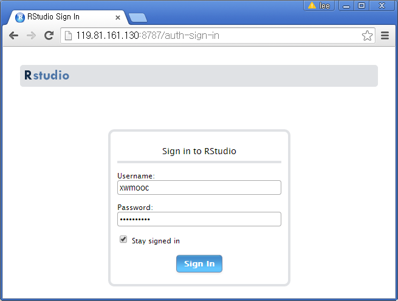
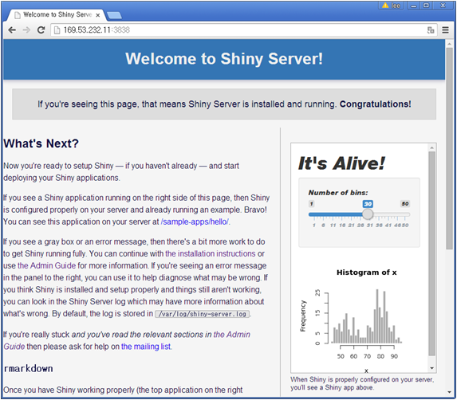

> ### 학습 목표 {.objectives}
>
> - RStudio 개발환경과 서비스 배포환경을 이해한다.
> - RStudio 통합개발환경을 설치한다.
> - Shiny 서비스를 설치한다.

### 1. R 개발환경과 서비스 배포환경 개요

R 언어로 데이터 제품(Data Product)를 개발하기 위해서 기본적으로 RStudio를 통합개발환경으로 Shiny 를 서비스 배포 플랫폼으로 많이 사용한다. 

### R 기반 데이터 제품 개발 툴체인 {.callout}
>
> - [RStudio](https://www.rstudio.com/) : 통합개발환경(IDE)
> - [Shiny](http://shiny.rstudio.com/) : 웹서비스 개발 플랫폼
> - [Shiny 클라우드 서비스](https://www.shinyapps.io/) : R 배포 클라우드 웹서비스  

### 2. `RStudio` 통합개발환경 서버 설치

`Shiny 서버`를 설치한 다음에 `RStudio` 개발환경을 설치한다.
`gdebi`는 `Shiny 서버` 소프트웨어를 설치할 때 설치했기 때문에 바로 최신 버전을 `wget`을 통해 다운로드하고 나서 설치한다.

~~~ {.input}
root@shiny-sl:~# wget http://download2.rstudio.org/rstudio-server-0.98.1103-amd64.deb
~~~

~~~ {.output}
--2015-05-22 03:42:29--  http://download2.rstudio.org/rstudio-server-0.98.1103-amd64.deb
Resolving download2.rstudio.org (download2.rstudio.org)... 54.192.7.233, 54.230.4.176, 54.230.5.20,
...
Connecting to download2.rstudio.org (download2.rstudio.org)|54.192.7.233|:80... connected.
HTTP request sent, awaiting response... 200 OK
Length: 36304754 (35M) [application/x-deb]
Saving to: 'rstudio-server-0.98.1103-amd64.deb'

100%[==========================================================>] 36,304,754  19.5MB/s   in 1.8s

2015-05-22 03:42:31 (19.5 MB/s) - 'rstudio-server-0.98.1103-amd64.deb' saved [36304754/36304754]
~~~

~~~ {.input}
root@shiny-sl:~# sudo gdebi rstudio-server-0.98.1103-amd64.deb
~~~

### 2.1 `RStudio` IDE 접속

이제 웹브라우져를 열고 **포트번호(port, 8787)**를 뒤에 `:8787`을 붙여 `http://169.53.232.11:8787/`와 같이 입력하면 
`Sign in to RStudio` 화면에 사용자명(`username:`)과 비밀번호(`Password:`)를 넣고 `Sign In`하라고 한다.
절대 `root`권한을 가지고 로그인하면 들어가지 않는다. `root`권한을 가지고 사용자를 추가한 후에 추가된 사용자명을 가지고 로그인한다.
[useradd](http://linux.die.net/man/8/useradd)를 통해서 사용자 추가를 추가하고, [userdel](http://linux.die.net/man/8/userdel)을 통해서 사용자를 삭제한다. `adduser` 혹은 `useradd` 동일한 명령어다. `xwmooc` 사용자를 `sudo useradd -m xwmooc` 혹은 `sudo adduser -m xwmooc`
명령어로 설정했으니, 다음올 비밀번호를 설정한다. `sudo passwd xwmooc` 비밀번호를 두번 입력하게 되면 설정이 완료되었다.  
  
**주의**: `sudo useradd -m xwmooc` 명령어에서 `-m` 옵션 플래그는 홈디렉토리를 생성하게 만든다. 그래야지만 정상적으로 `RStudio` 작업이 가능하다.

~~~ {.input}
root@shiny-sl:~# sudo useradd -m xwmooc
root@shiny-sl:~# sudo adduser -m xwmooc
adduser: The user `xwmooc' already exists.
root@shiny-sl:~# sudo passwd xwmooc
Enter new UNIX password:
Retype new UNIX password:
passwd: password updated successfully
root@shiny-sl:~#
~~~

이제 `RStudio`를 사용하기 위해서 `http://169.53.232.11:8787/` 사이트에서 사용자명 `xwmooc`를 넣고 비밀번호를 입력하게 되면 `RStudio`를 사용할 수 있게 된다.

### 3. `Shiny` 서버 설치 

기본적으로 `R` 라이선스가 `GPL`을 따르기 때문에 `Shiny` 서버도 동일한 라이선스를 따르니 리눅스를 이용하는 기분으로 소프트웨어를 사용한다.
이제 Shiny 서버를 클라우드에 구축하기 위해서 Shiny 서버를 다운로드하여 설치한다.
우분투 기준 `Shiny Server v1.3.0.403` 버젼 기준으로 설치해 나간다. 자세한 내용은 영어 설치페이지[http://www.rstudio.com/products/shiny/download-server/](http://www.rstudio.com/products/shiny/download-server/)를 참조한다.

운영체제 버젼 확인 결과 우분투 14.04 버젼으로 Rstudio 에서 설치시 권장하는 우분투 12.04보다 상위버젼으로 바로 `R`부터 설치를 진행해 나갈 수 있다.
`r-base`를 설치하고 난 다음에는 `Shiny 서버`를 설치하기 전에 `Shiny R` 팩키지를 설치해야한다. 물론 `R`로 들어가서 
`install.packages('shiny', repos='http://cran.rstudio.com/')`를 해서 `shiny` 팩키지를 설치해도 된다. 

~~~ {.input}
root@shiny-sl:~# sudo apt-get install r-base
root@shiny-sl:~# $ sudo su - -c "R -e \"install.packages('shiny', repos='http://cran.rstudio.com/')\""
~~~

`R`과 `Shiny` 패키지를 설치한 다음에 **gdebi**를 다음에 설치해야 한다. 그리고 나서 `gdebi`를 통해서 `Shiny 서버`를 설치할 수 있다.

`wget`을 통해서 `Shiny 서버` 설치 파일을 다운로드받고, `gdebi`를 통해서 `Shiny 서버`를 설치한다.

~~~ {.input}
root@shiny-sl:~# sudo apt-get install gdebi-core
root@shiny-sl:~# wget http://download3.rstudio.org/ubuntu-12.04/x86_64/shiny-server-1.3.0.403-amd64.deb
root@shiny-sl:~# sudo gdebi shiny-server-1.3.0.403-amd64.deb
~~~

`Shiny 서버`가 잘 실행되고 있는지 `status shiny-server` 명령어를 통해서 확인해보고, 만약 서비스가 시작되지 않았다면, `sudo start shiny-server` 명령어로 실행시킨다. 

~~~ {.input}
root@shiny-sl:~# status shiny-server
shiny-server start/running, process 14553

root@shiny-sl:~# sudo start shiny-server
start: Job is already running: shiny-server
~~~

이제 웹브라우져를 열고 **포트번호(port, 3838)**를 뒤에 `:3838`을 붙여 `http://169.53.232.11:3838/`와 같이 입력하면 
브라우져 상단에 다음과 같은 메시지가 출력되면 설치가 완료되고 사용준비가 완료된 것이다.

첫 설치 페이지 우측 하단에 `rmarkdown` 설치가 되지 않아 생기는 오류사항은 `R`에서 `install.packages("rmarkdown")`를 통해서 `rmarkdown` 팩키지를 설치해서 해결할 수 있고 다음과 같은 메시지가 보이면 설치가 모두 완료된 것이다.

~~~ {.output}
With Shiny and `rmarkdown` installed, you should see a Shiny doc above.
~~~

### 4. `shinyapp.io` 공용 Shiny 서버 설정

`Tools` --> `ShinyApps` --> `Manage Accounts...`를 통해 RStudio에서 바로 [https://www.shinyapps.io/](https://www.shinyapps.io/) 공용 Shiny 서버로 응용프로그램을 배포할 수 있다. 먼저 [https://www.shinyapps.io/](https://www.shinyapps.io/) 웹사이트에 접속해서 계정을 생성한다. 

[https://www.shinyapps.io/](https://www.shinyapps.io/) 웹사이트에 로그인한 뒤에 사용자명(우측상단)을 클릭하고 **Tokens**를 클릭하면 토큰과 비밀키 정보가 함께 볼 수 있다. 

~~~ {.output}
shinyapps::setAccountInfo(name='xwmooc',
        token='C9CXXXXXXXXXXXXXXXXXXXXX',
        secret='<SECRET>')
~~~

토큰 정보를 `Tools` --> `ShinyApps` --> `Manage Accounts...`에 등록한다.

**주의:** Shiny 응용프로그램을 배포하기 위해서 `ui.R`, `server.R`로 응용프로그램이 나눠줘야 한다.

iot-shiny-shinyapp-io.png

### 5. `Vagrant` 부랑자 R 툴체인 설치

