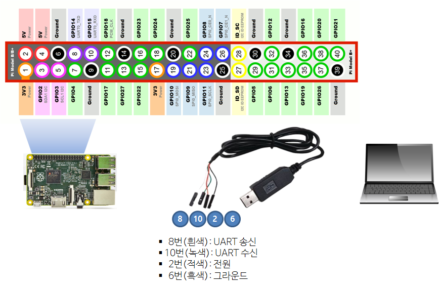
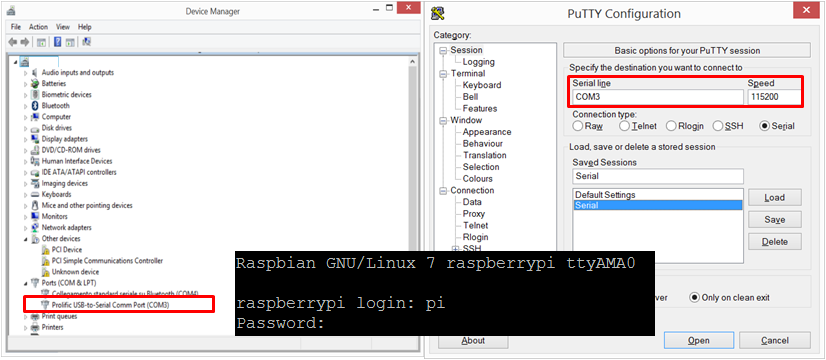

> ### 학습 목표 {.objectives}
>
> * 와이파이나 이더넷 대신 시리얼 통신을 통해 라즈베리 파이 접속한다.
> * UART RS-232 통신 표준을 활용한다.

> ### UART(범용 비동기화 송수신기) {.callout}
> **UART**는 Universal asynchronous receiver/transmitter)의 약자로
> `범용 비동기화 송수신기`로 번역되며 병렬 데이터의 형태를 직렬 방식으로 전환하여 데이터를 전송하는 컴퓨터 하드웨어의 일종이다. 
> UART는 일반적으로 EIA RS-232, RS-422, RS-485와 같은 통신 표준과 함께 사용된다.[^1]

[^1]: [위키백과, UART](https://ko.wikipedia.org/wiki/UART)

### 1. 자재 명세서(BOM)

UART 시리얼 방식으로 라즈베리 파이와 통신을 주고 받으려면, 
다음과 같은 하드웨어가 필요하다. 
즉, 기존에 사용하던 라즈베리 파이와 노트북 혹은 데스크톱 컴퓨터에
USB to TLL 시리얼 케이블만 필요하다.

- 라즈베리 파이 2
- USB to TLL 시리얼 케이블[^2]
- 노트북 컴퓨터 (USB포트지원)

[^2]: [USB to TTL Serial Cable - Debug / Console Cable for Raspberry Pi Model B +](http://www.aliexpress.com/snapshot/7172016922.html?orderId=71490745037815)

### 2. 와이어링 배선 연결

`USB to TLL 시리얼 케이블`을 라즈베리 파이와 노트북에 각각 연결한다.
라즈베리 파이 GPIO 핀 배열은 [Raspberry-Pi Spy](http://www.raspberrypi-spy.co.uk) 웹사이트에 자세히 나와 있다. [^3]

- `USB to TLL 시리얼 케이블`과 노트북 컴퓨터: USB 포트에 꽂는다.
- `USB to TLL 시리얼 케이블`과 라즈베리 파이: 4개 전선줄을 GPIO 포트에 맞춰 꽂는다.
    - GPIO 2번 (적색): 전원  5V
    - GPIO 6번 (흑색): 그라운드
    - GPIO 8번 (흰색): UART 송신
    - GPIO 10번 (녹색): UART 수신

[^3]: [Simple Guide to the RPi GPIO Header and Pins](http://www.raspberrypi-spy.co.uk/2012/06/simple-guide-to-the-rpi-gpio-header-and-pins/)

### 3. 소프트웨어 설치

라즈베리 파이는 GPIO에 `USB to TLL 시리얼 케이블` 4개 전선줄을 잘 맞춰 꽂으면 되지만,
노트북 마스터 컴퓨터쪽에는 USB 포트에 연결하는 것에 더해서 RS-232에 맞는 드라이버 소프트웨어를 설치한다.
본인 컴퓨터 운영체제에 맞춰 [PL2303 Windows Driver](http://www.prolific.com.tw/US/ShowProduct.aspx?p_id=225&pcid=41)를 다운로드 받아 설치한다. 

만약 윈도우 8.1을 보유하고 있다면 다음과 같이 순서대로 설치한다. [^4]

1. 프로리픽 [Profilic_Win8_x64_x86](http://ananddrs.com/wp-content/uploads/2014/09/Profilic_Win8_x64_x86.zip) 드라이버를 다운로드 받아 압축을 푼다.
1. 제어판에서 `장치 관리자`를 연다.
1. `포트 (COM &LPT)` 확장한다.
1. `Prolifc USB-to-Serial Comm Port` 디바이스를 선택하고 우클릭해서 `속성`으로 들어간다.
1. `드라이버` 탭을 선택한다.
1. `드라이버 업체이트(P)...`을 클릭하고 `컴퓨터에서 드라이버 소프트웨어 찾아보기(R)`을 선택한다.
1. 드라이버를 다운로드 받아 압축 푼 디렉토리로 이동한다.
1. `ser2pl.inf` 파일을 선택하고 `열기`를 클릭한다.
1. `확인`을 클릭한다.
1. 컴퓨터를 다시 재부팅한다.

[^4]: [PL2303 Prolific USB to TTL Driver for Windows 8.1](http://ananddrs.com/2014/09/24/pl2303-prolific-usb-to-ttl-driver-for-windows-8-1/)

### 4. 라즈베리 파이 시리얼 통신 접속

다시 `장치관리자` &rarr; `포트 (COM &LPT)` &rarr; `Prolifc USB-to-Serial Comm Port`의 COM 포트 번호를 확인한다.
COM5, COM6, COM7 등등이 될 수 있다. PUTTY를 실행해서, 연결 유형을 `Serial`로 선택하고, 
`Serial Line`에 COM 포트번호, `Speed`에 115200 혹은 확인된 값을 적어 넣고 연결한다.

