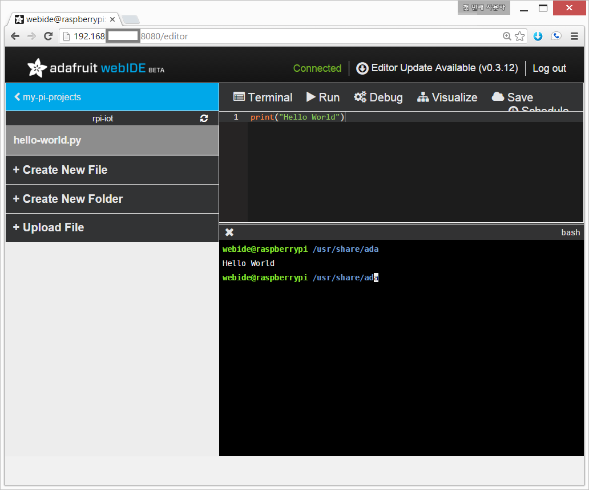
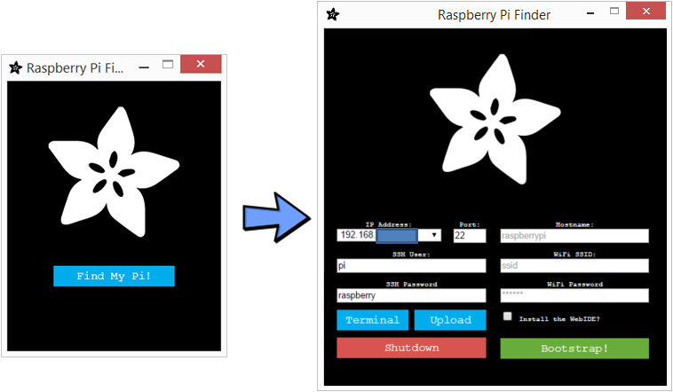
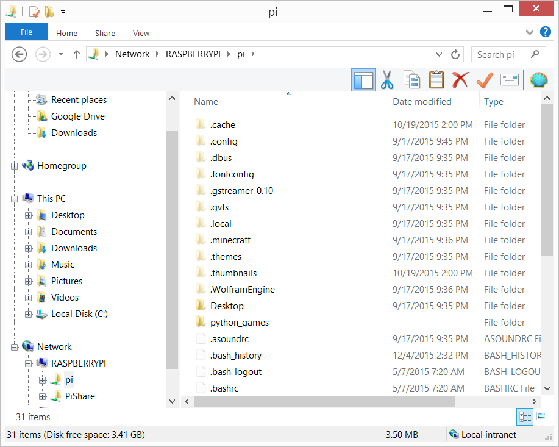

> ### 학습 목표 {.objectives}
>
> - 라즈베리 파이 IoT 웹통합개발환경을 구축한다.
> - 웹기반 IDE 활용 개발 생산성과 품질을 높인다.
>     - 코드 이력관리: 비트버킷
>     - 디버깅
>     - 시각화

### 1. 라즈베리 파이 웹통합개발환경(WebIDE)

Adafruit에서 라즈베리 파이에서 실행되는 웹통합개발환경(WebIDE)를 제공하여 있어 이를 활용하여 IoT 개발을 빠르고 쉽게 추진할 수 있다.

설치 방법은 [Adafruit WebIDE](https://learn.adafruit.com/webide/)를 참조한다.

~~~ {.shell}
$ curl https://raw.githubusercontent.com/adafruit/Adafruit-WebIDE/alpha/scripts/install.sh | sudo sh
$ sudo dpkg --configure -a
~~~

라즈베리 파이 WebIDE는 [비트버킷(Bitbucket)](https://bitbucket.org/)과 연결되어 자동으로 코드관리를 해주는 장점이 있으니 순서에 맞춰 동영상[^1]을 보고 설정한다.

### 2. 라즈베리 파이 찾기

라즈베리 파이를 찾기가 때로 까다로울 수 있다. 이를 위해서 아이디어를 낸 사람이 있다. [Pi Finder](http://ivanx.com/raspberrypi/)가 그것이고 이를 [Adafruit](https://www.adafruit.com/)에서 GitHub에 공개[^2]를 하였다. 사용방법은 [Adafruit Pi Finder 다운로드](https://github.com/adafruit/Adafruit-Pi-Finder/releases)에서 본인 로컬 컴퓨터 환경에 맞춰 다운로드닫고 압축을 풀어 실행하면 윈도의 경우 `PiFinder.exe`을 더블클릭하고 화면이 나오면 `Find My Pi!`를 클릭하면 쉽게 주변 라즈베리 파이를 찾아 준다.

전제 조건은 라즈베리파이를 이더넷 인터넷에 연결해 놔야 된다는 것이다.

### 3. 라즈베리 파이 디렉토리(폴더) 공유하기

라즈베리 파이와 개발용 노트북/데스크톱 컴퓨터의 디렉토리(폴더)를 공유하면 작업하기 한결 수월하다. 설치에 대한 자세한 설명과 내용은 Raspberry Pi HQ [^3] 웹사이트를 참조한다.

#### 3.1 라즈베리 파이 설정

먼저 라즈베리 파이에 로그인해서 [삼바(Samba)](https://www.samba.org/) 소프트웨어를 설치하고 환경설정을 한다. `sudo apt-get install samba samba-common-bin`명령어를 통해서 삼바를 설치한다. `sudo nano /etc/samba/smb.conf` 명령어를 통해 작업공유 그룹설정과 윈도우 지원을 활성화한다.

~~~{.shell}
$ sudo apt-get install samba samba-common-bin
$ sudo nano /etc/samba/smb.conf
~~~

~~~ {.output}
workgroup = WORKGROUP
wins support = yes
~~~
라즈베리 파이 홈 디렉토리 `\home\pi` 를 공유 폴더로 정하고, `sudo nano /etc/samba/smb.conf` 명령어로 공유 디렉토리를 지정한다.

~~~ {.shell}
$ mkdir ~/share
$ sudo nano /etc/samba/smb.conf
~~~

~~~ {.output}
[PiShare]
 comment=Raspberry Pi Share
 path=/home/pi
 browseable=Yes
 writeable=Yes
 only guest=no
 create mask=0777
 directory mask=0777
 public=no
~~~

`sudo smbpasswd -a pi` 명령어를 통해서 윈도우에서 라즈베리 파이 공유폴더 접속할 때 인증을 위한 사용자와 비밀번호를 설정한다. 비밀번호는 임의로 가능하지만, `raspberry`로 일치하는 것도 좋다.

~~~ {.shell}
$ sudo smbpasswd -a pi
~~~

#### 3.2 윈도우즈 설정

윈도우즈 `네트워크`에서 라즈베리 파이 공유 디렉토리가 보이면 등록한 ID(`pi`)와 비밀번호(`raspberry`)를 사용해서 로그인한다. 

[^1]: [Raspberry Pi WebIDE Installation & Setup](https://www.youtube.com/watch?v=8NoiBBgaKCI)
[^2]: [Adafruit Raspberry Pi Finder](https://github.com/adafruit/Adafruit-Pi-Finder)
[^3]: [How-To: Share a folder with a Windows computer from a Raspberry Pi](http://raspberrypihq.com/how-to-share-a-folder-with-a-windows-computer-from-a-raspberry-pi/)

