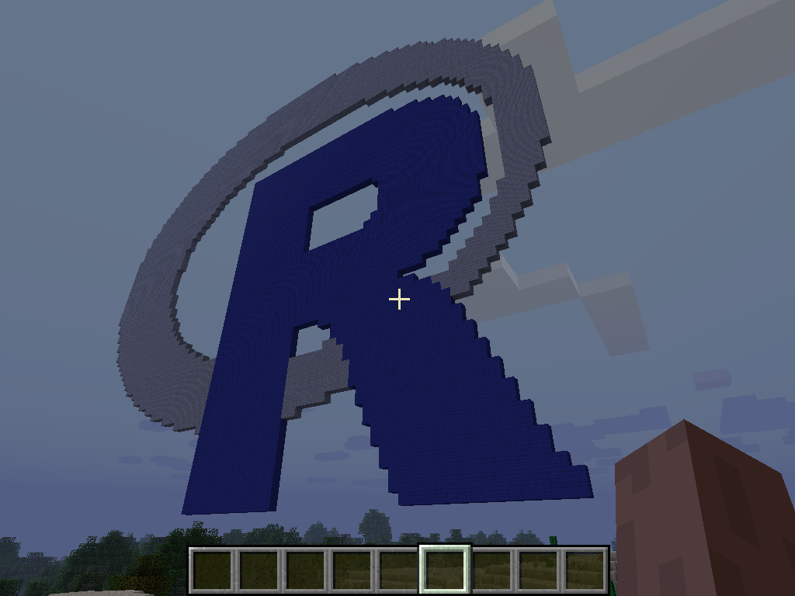
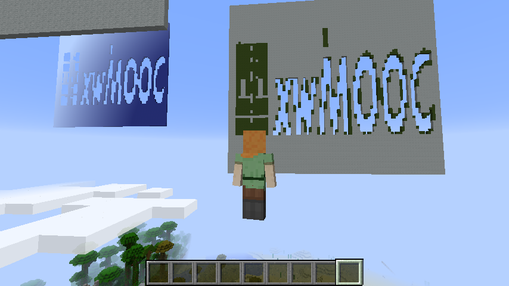
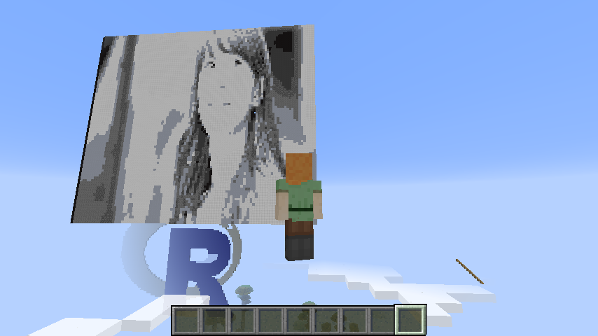

```{r, include=FALSE}
source("tools/chunk-options.R") 
```

## 1. 마인크래프트에 R 로고 그리기 [^micraft-logo]

[^micraft-logo]: [Rendering the R logo in Minecraft](https://ropenscilabs.github.io/miner_book/rendering-the-r-logo-in-minecraft.html)

예제 코드를 가져와서 R 로고를 두가지 색상으로 이미지를 줄여 조정한 후에 for 루프를 돌려 블록을 놓아 R로고를 마인크래프트에 생성시킨다.

``` {r minecraft-rlogo, eval=FALSE}
# 1. R 로고  -----------------------------------------
## 1.1. R로고 가져오기 ----------------------------------

# url <- "https://www.r-project.org/logo/Rlogo.png"
# file <- basename(url)
# download.file(url, file)
logo <- load.image("fig/Rlogo.png")

## 1.2. R로고 정제 ----------------------------------

par(mar=c(5.1,4.1,0.6,0.6), las=1)
hist(logo[,,,1], breaks=100, main="", xlab="Red color intensity")

logo <- resize(logo, 80, 70)

logo[] <- cut(logo, c(-Inf, 0.2, 0.8, Inf))
logo <- logo[,,1,1]

## 1.3. R로고 색상 --------------------------------
blue <- find_item("Blue Wool")
gray <- find_item("Light Gray Wool")

## 1.4. 스티브 위치 --------------------------------
host_pos <- getPlayerPos()
host_pos[2] <- host_pos[2] + 10

for(i in 1:nrow(logo)) {
  for(j in 1:ncol(logo)) {
    if(logo[i,j] == 2)
      setBlock(host_pos[1]+(nrow(logo)-i),
               host_pos[2]+(ncol(logo)-j),
               host_pos[3],
               blue[2], blue[3])
    if(logo[i,j] == 3)
      setBlock(host_pos[1]+(nrow(logo)-i),
               host_pos[2]+(ncol(logo)-j),
               host_pos[3],
               gray[2], gray[3])
  }
}
```

| | |
|-|-|
| | |

## 2. 수지 사진 [^micraft-suji]

[^micraft-suji]: [Rendering an image in Minecraft](https://ropenscilabs.github.io/miner_book/rendering-an-image-in-minecraft.html)

`.png` 이미지를 인터넷에서 구해와서 이를 흑백으로 변환을 한 후 0에서 1 사이 8단계를 두고 이를 마인크래프트에 전광판을 올리듯 사진을 게시한다.


``` {r minecraft-suji, eval=FALSE}
# 0. 환경설정 -----------------------------------------
library(miner)
library(imager)

mc_connect("127.0.0.1")

# 1. 수지 가져오기 ----------------------------------

suji <- load.image("fig/suji.png")

# 2. 수지 흑백 및 크기 조정 ----------------------------------

suji <- grayscale(suji)
suji <- resize(suji, 100, 100)
suji[] <- cut(suji, seq(0, 1, length.out=8))

grayscale_blocks <- c("Black Wool", "Gray Wool", "Bedrock",
                      "Coal Ore", "Clay", "White Wool", "Iron Block")
grayscale_blocks <- do.call("rbind", lapply(grayscale_blocks,
                                            function(a) find_item(a)[1,,drop=FALSE]))

# 3. 현재위치 및 수지 블록 쌓기 ----------------------------------

host_pos <- getPlayerPos()
host_pos[2] <- host_pos[2] + 20

## 3.1. 위아래 뒤바뀜 보정
for(i in 1:100) {
  for(j in 1:100) {
    setBlock(host_pos[1]+(101-i), host_pos[2]+(101-j), host_pos[3],
             grayscale_blocks[suji[i,j,1,1], 2],
             grayscale_blocks[suji[i,j,1,1], 3])
  }
}

## 3.2. 기본 --> 위아래 뒤바
for(i in 1:100) {
  for(j in 1:100) {
    setBlock(host_pos[1]+i, host_pos[2]+j, host_pos[3],
             grayscale_blocks[img[i,j,1,1], 2],
             grayscale_blocks[img[i,j,1,1], 3])
  }
}
```

| | |
|-|-|
| | |


