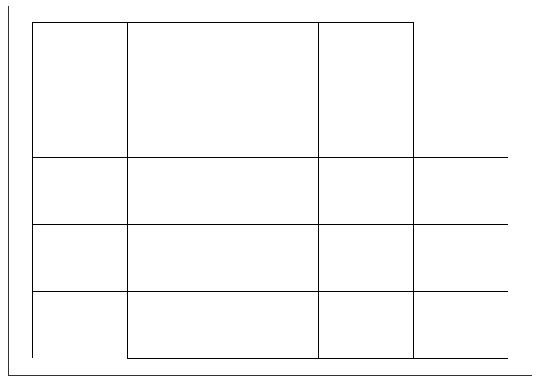
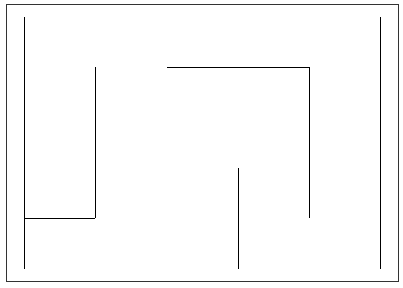
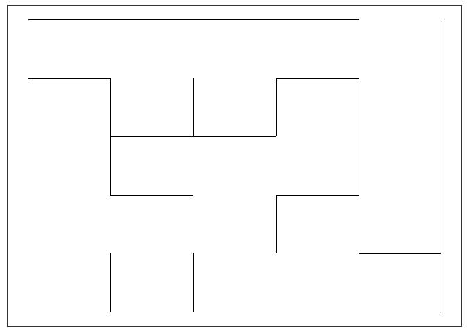
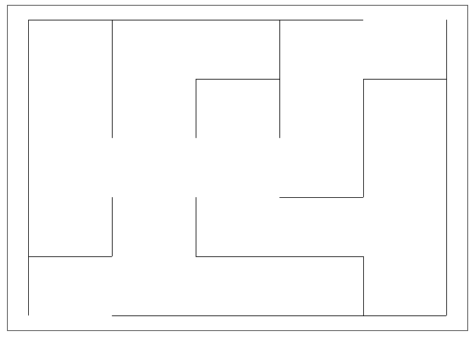
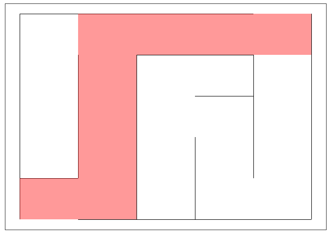
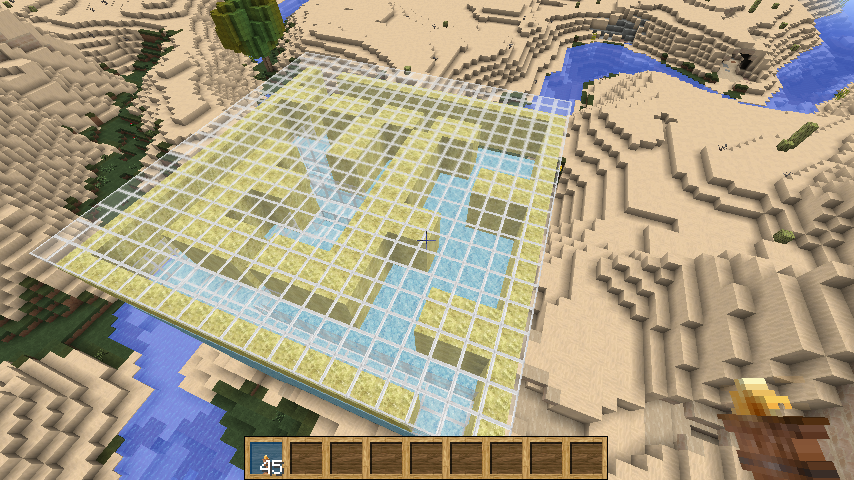
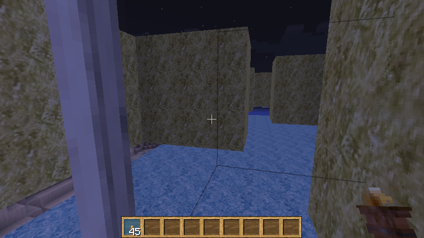

# xwMOOC 데이터과학

## 1. R 미로 [^minecraft-maze]

[^minecraft-maze]: [Generate a maze in Minecraft](https://ropenscilabs.github.io/miner_book/generate-a-maze-in-minecraft.html)

마인크래프트 미로를 생성하기 전에 R에서 풀수 있는 미로를 만드는 실습을 먼저한다.
다행히도 `Rmaze` 팩키지가 있어서 자동으로 다양한 미로를 생성할 수 있게 해준다.

- 설치방법: `devtools::install_github('Vessy/Rmaze')`
- 예제 돌려보기: Rmaze::runExample()

행과 열이 $5 \times 5$ 미로를 만드는데 `makeGraph` 함수를 생성시키고, `plotMaze()` 함수로 생성된 미로를 살펴본다.
하지만 이것은 진정한 미로라고 할 수 없다.

~~~{.r}
# 0. 환경설정 ----------------------------------------------
# devtools::install_github('Vessy/Rmaze')
library(Rmaze)
library(miner)

# 1. 미로 예제 ---------------------------------------------
# Rmaze::runExample()

## 1.1. 단순 미로 ------------------------------------------
n <- 5
set.seed(77)
maze <- makeGraph(n, n)
plotMaze(maze, n, n)
~~~

### 1.1. 다양한 미로

알고리즘별로 풀수 있는 즉, 입구와 출구가 존재하고 이를 통한 경로도 존재하는 미로를 자동으로 만들 수 있는 알고리즘이 몇개 있다.

- Recursive Backtracker 알고리즘: `makeMaze_dfs()`
- 크루스칼(Kruskal) 알고리즘: `makeMaze_kruskal()`
- 프림(Prim) 알고리즘: `makeMaze_prim()`

이에 대한 해법을 보고자 한다면 생성된 미로를 입력값으로 넣어두고 나서, `plotMazeSolution()` 함수를 사용한다.

~~~{.r}
## 1.2. 알고리즘 별 미로 ------------------------------------------
# Recursive Backtracker 
rb_maze <- makeMaze_dfs(maze)
plotMaze(rb_maze, n, n)
~~~

~~~{.r}
# Kruskal
kruskal_maze <- makeMaze_kruskal(maze)
plotMaze(kruskal_maze, n, n)
~~~

~~~{.r}
# Prim
prim_maze <- makeMaze_prim(maze)
plotMaze(prim_maze, n, n)
~~~

~~~{.r}
## 1.3. 알고리즘 별 단계로 보는 미로 --------------------------
# Recursive Backtracker 
# makeMaze_dfs(maze, stepBystep = TRUE, n, n)
# Kruskal
# makeMaze_kruskal(maze, stepBystep = TRUE, n, n)
# Prim
# makeMaze_prim(maze, stepBystep = TRUE, n, n)

## 1.4. 미로 풀이 ---------------------------------------------
plotMazeSolution(rb_maze, n, n)
~~~

## 2. 마인크래프트 미로

미로를 마인크래프트 내부에 구현하기 위해서 다음 단계를 걸쳐 미로를 생성시킨다.

1. 미로 크기 템플릿 생성
1. 미로를 데이터프레임에 변환시켜 저장
1. setBlock() 함수로 미로를 생성

~~~{.r}
# 1. 마인크래프트 서버 접속 ---------------------------------------------

mc_connect("127.0.0.1")

# 2. 마인크래프트 미로 생성 -----------------------------------

## 2.1. 마인크래프트 미로 템플릿 ------------------------------
df <- matrix(NA, nrow = n*4, ncol = n*4)

df[c(1, nrow(df)), ] <- 1
df[, c(1, nrow(df))] <- 1

df[1, ncol(df) - 1:2] <- NA
df[nrow(df), 2:3] <- NA

## 2.2. 미로를 데이터프레임에 변환하여 저장 ------------------------------

library(igraph)
maze_df <- as_data_frame(rb_maze)
library(data.table)
setDT(maze_df)

for (v in c('from', 'to')) {
  maze_df[, (paste0(v, 'x')) := as.numeric(sub('A_([0-9]*)_[0-9]*', '\\1', get(v)))]
  maze_df[, (paste0(v, 'y')) := as.numeric(sub('A_[0-9]*_([0-9]*)', '\\1', get(v)))]
}

maze_df[fromx < tox, direction := 'top']
maze_df[fromy < toy, direction := 'right']

maze_df[, x := nrow(df) - fromx * 4 + 3 - as.numeric(direction == 'top') * 2]
maze_df[, y := fromy * 4 - 1 + as.numeric(direction == 'right') * 2]

for (i in seq_len(nrow(maze_df))) {
  cell <- maze_df[i]
  if (cell$wall == 'ON') {
    df[cell$x + -1:0, cell$y + -1:0] <- 1
  }
  if (cell$direction == 'top' & cell$wall == 'ON') {
    df[cell$x - 0:1, cell$y - 1:2] <- 2
  }
  if (cell$direction == 'right' & cell$wall == 'ON') {
    df[cell$x - 2:3, cell$y - 0:1] <- 3
  }
}

## 2.3. 미로를 마인크래트에 생성 ------------------------------
nr <- dim(df)[1]
nc <- dim(df)[2]

setPlayerPos(1, 80,1)
## 미로를 위한 공간 생성
setBlocks(1, 80, 1, nr, 54, nc, 0)
## 밑바닥 생성
setBlocks(1, 79, 1, nr, 50, nc, 57)
## 미로 덮개
setBlocks(1, 84, 1, nr, 54, nc, 95)
## 플레이어가 돌아다닐 수 있는 키크기 블록 3개 생성
for (i in 1:nrow(df)) {
  for (j in 1:ncol(df)) {
    if (!is.na(df[i, j])) {
      setBlock(i, 81, j, 41)
      setBlock(i, 82, j, 41)
      setBlock(i, 83, j, 41)
    }
  }
}
~~~

위에서 내려다본 미로와 미로내부에 들어가서 본 모습은 다음과 같다.

| | |
|-|-|
| | |

