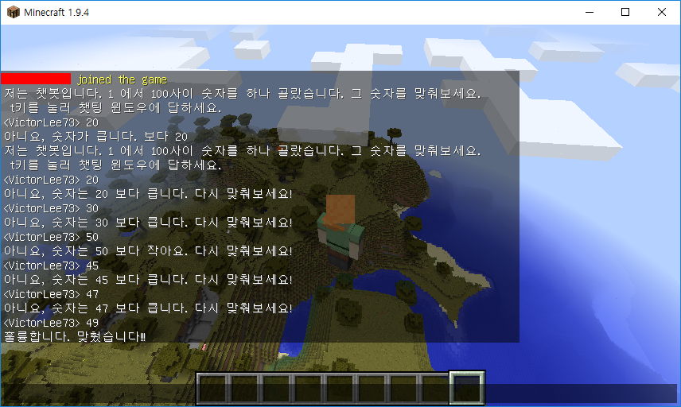

```{r, include=FALSE}
source("tools/chunk-options.R") 
```

## 숫자 맞추기 문제 개요 [^micraft-chatbot]

[^micraft-chatbot]: [umber-guess chat bot in Minecraft](https://ropenscilabs.github.io/miner_book/number-guess-chat-bot-in-minecraft.html)

마인크래프트 챗봇이 숫자를 내면 플레이어가 숫자를 맞추는 문제다. 물론 가장 적은 횟수로 문제를 맞춰야 한다.

1. 마인크래프트 서버가 1 에서 100 사이 숫자를 난수로 하나 생성시킨다.
1. 플레이어가 서버가 낸 숫자를 맞춘다.
1. 한번에 맞출 확률이 당근 $\frac {1} {100}$ 확률이기 때문에 서버가 플레이어가 숫자를 맞추도록 추가 정보를 채팅창을 통해 제공한다.
    - 채팅창에 플레이어가 숫자를 맞추면 프로그램은 종료된다.
    - 숫자가 플레이어가 제시한 숫자보다 큰지 적은지 정보를 채팅창을 통해 제공한다.

> ### 마인크래프트 채팅 단축키 {.callout}
>
> 마인크래프트 채팅창에 메시지를 입력하는 방법은 키보드에서 `t` 키를 누르면 된다.
> 한글이 눌러진 상태에서 채팅창 활성화를 위해 `t` 키를 누리지 않도록 주의한다.

## R 마인크래프트 코드

균등분포에서 0과 1사이 숫자를 하나 생성하고 이를 `number`로 저장하고 
`chatPost`를 통해 챗팅 숫자 문제 맞추기를 시작한다.

숫자를 맞출 때까지 `while` 루프를 돌린다. 
채팅창에 숫자를 입력하게 되면 입력된 숫자가 서버가 생성시킨 `number`와 같은지 확인한다.
만약 맞추지 못한다면 추가적인 정보를 제공하서 다시 채팅창에 숫자를 맞추도록 정보를 제공한다.
그리고 숫자를 맞추게 되면 프로그램을 종료시킨다.

``` {r minecraft-number-guess, eval=FALSE}
# 0. 환경설정 ------------------------------
library(miner)
mc_connect("127.0.0.1")

# 1. 숫자생성 ------------------------------

number <- ceiling(runif(1) * 100)
chatPost("저는 챗봇입니다. 1 에서 100사이 숫자를 하나 골랐습니다. 그 숫자를 맞춰보세요. t키를 눌러 챗팅 윈도우에 답하세요.")

# 2. 숫자맞추기 ------------------------------

while (TRUE) {
  
  ## 가장 최근 챗팅 메시지가 있는지 폴링
  msg <- getChatPosts()
  
  ## 마지막 폴링이후 메시지가 없다면 아무일도 수행하지 않음.
  if (nrow(msg) > 0) {
    
    ## 모든 메시지에 대해 반복 돌림.
    for (msgi in seq_len(nrow(msg))) {
      
      ## 메시지가 숫자인지 확인
      numi <- suppressWarnings(as.numeric(as.character(msg[msgi, 'message'])))
      if (!is.na(numi)) {
        
        ## 숫자 비교
        if (number == numi) {
          chatPost('훌륭합니다. 맞췄습니다!!!')
        } else {
          chatPost(sprintf("아니요, 숫자는 %s 보다 %s 다시 맞춰보세요!",
                           numi, ifelse(numi > number, '작아요.', '큽니다.')))
        }
        
      }
    }
  }
}
```



