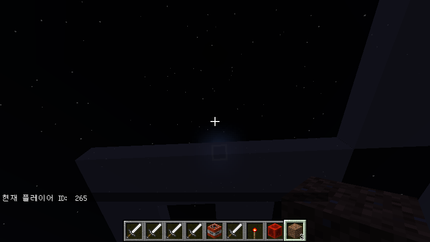
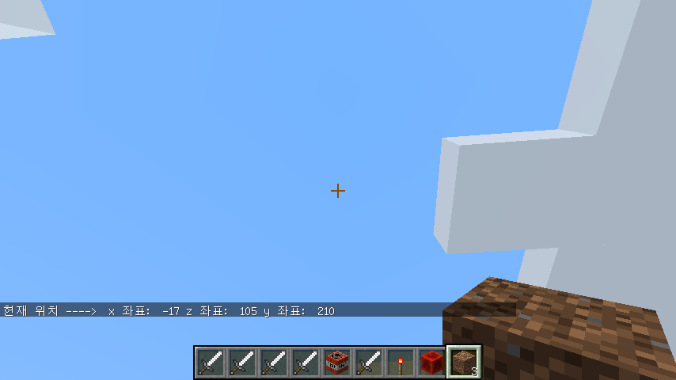
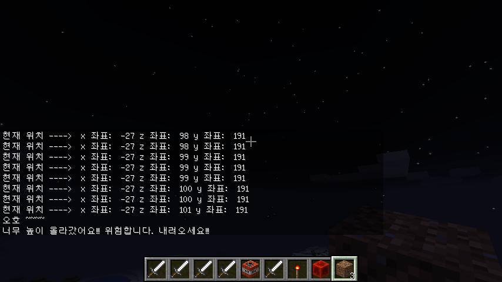
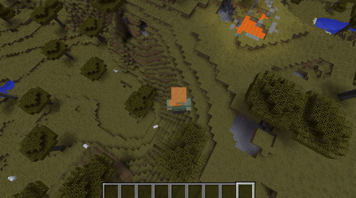

```{r, include=FALSE}
source("tools/chunk-options.R") 
```

## 1. 마인크래프트 플레이어 [^minecraft-book]

[^minecraft-book]: [Brooke Anderson, Karl Broman, Gergely Daróczi, Mario Inchiosa, David Smith, and Ali Zaidi, "R Programming with Minecraft"](https://ropenscilabs.github.io/miner_book/)

마인크래프트 코딩을 시작할 때 헬로월드를 찍었다면, 그 다음으로 플레이어가 누구인지 확인하고,
현재 플레이어의 위치가 어디인지 확인한 과정이 중요하다.

플레이어를 확인하는 방법은 `id`를 확인해야 하는데, 이 경우 필요한 것이 `getPlayerIds()` 함수로 확인한다. 
다수 플레이어가 존재하는 경우 벡터로 표현되고 로컬 컴퓨터에서 
마인크래프트 게임을 수행하는 경우 한명의 플레이어만 존재하게 된다.


``` {r mc-playerid, eval=FALSE}
# 0. 환경설정 ------------------------------
library(miner)
mc_connect("127.0.0.1")

# 1. 현재 플레이어와 현재 위치 ------------------------------
## 1.1. 현재 플레이어 ID
player_ids <- getPlayerIds()
junghoon <- player_ids[1]

chatPost(paste("현재 플레이어 ID: ", junghoon))
```



## 2. 마인크래프트 플레이어 위치

`getPlayerIds()` 함수를 통해 플레이어(`junghoon`)를 확인했다면,
플레이어의 위치를 확인하는 것이 자연스러운 순서가 된다.

플레이어 위치는 `getPlayerPos()` 함수를 통해 확인되고 `tile = TRUE` 인자를 넘기게 되면 
플레이어 위치가 정수로 변환되어 지정된다.
`chatPost()` 함수를 통해 3차원 공간 플레이어 위치를 확인한다. 

``` {r mc-player-position, eval=FALSE}
## 1.2. 현재 플레이어 위치
jh_pos <- getPlayerPos(player_id = junghoon, tile = TRUE)

chatPost(paste("현재 위치 ----> ", "x 좌표: ", jh_pos[1], "z 좌표: ", jh_pos[2], "y 좌표: ", jh_pos[3]))
```




이제 `x`, `y`, `z`가 현재 위치 좌표 각각의 정보를 담고 있다.
`x`와 `z`는 걷는 방향(전진/후진, 좌측/우측) 정보를, `y`는 상/하 정보를 담고 있다. 
마인크래프트 좌표계는 다음과 같이 구성된다. 윈도우 `F3`를 클릭(노트북이나 맥에서 `Fn+F3`)하게 되면 디버그 화면에서
좌측 상단에 좌표정보를 확인할 수 있다.

- `x`축은 원점에서 동쪽(양수), 서쪽(음수), 즉 경도 (longitude)
- `z`축은 원점에서 남쪽(양수), 북쪽(음수), 즉 위도 (latitude)
- `y`축은 원점에서 높낮이(0~255, 64가 해수면), 즉 표고 (elevation)


> ## 좌표(Coordinate) {.callout}
>
> 데카르트가 침대에 누워 천장을 바라보며 날아가고 있는 파리의 위치를 정확히 표현하기 위해서 `x`축과 `y`으로
> 표현되는 직교 좌표계를 고안했다고 한다. **좌표(coordiante)** 는 위치를 유일하게 표현하는 숫자 집합이다. 
> 마인크래프트에서도 3차원 좌표계를 사용해서 사용자 및 물체의 위치를 표현한다. 참조 [영문 좌표계(Coordinate System)](http://en.wikipedia.org/wiki/Coordinate_system), [국문 좌표계](https://ko.wikipedia.org/wiki/%EC%A2%8C%ED%91%9C%EA%B3%84), [마인크래프트 좌표](http://minecraft.gamepedia.com/Coordinates)

## 3. 위험해요 너무 높이 올라갔어요...

`getPlayerIds()` 함수를 통해 플레이어가 누구인지, `getPlayerPos()` 함수를 통해
위치정보가 확인되면 `chatPost()` 함수를 사용해서 경고메시지를 던질 수 있다.

즉, 너무 높이 `junghoon` 플레이어가 올라가면 경고 메시지를 채팅창을 통해 전달한다.
현재 위치 좌표를 채팅창을 통해 전달하다가 높이가 100을 넘게 되면 채팅창에 경고 메시지를 전달한다.


``` {r mc-player-warning, eval=FALSE}
## 1.3. 현재 좌표 표시

repeat {
  jh_pos <- getPlayerPos(player_id = junghoon, tile = TRUE)
  chatPost(paste("현재 위치 ----> ", "x 좌표: ", jh_pos[1], "z 좌표: ", jh_pos[2], "y 좌표: ", jh_pos[3]))
  # Check
  if(jh_pos[2] > 100) {
    chatPost("오호 ~~~~ ")
    chatPost("너무 높이 올라갔어요!!! 위험합니다. 내려오세요!!!")
    break
  }
} 
```



## 4. 텔레포트 순간이동 기능

`setPlayerPos()` 메쏘드를 사용하게 되면 텔레포트 순간이동을 할 수 있다.

현재위치를 지정하고 나서, `Sys.sleep`을 통해 7초동안 동영상화면 캡쳐시간을 갖는다. [^avi-to-gif]

[^avi-to-gif]: [동영상 &rarr; 움짤 GIF 편환하기](https://brunch.co.kr/@eastgo/451)

즉, [ezgif.com](https://ezgif.com/video-to-gif) 웹사이트에 동영상을 올리면 `.gif` 파일로 변환이 가능하다.
이제 모든 준비가 되었으니, 플레이어를 텔레포트시켜보자.

그리고 난수를 발생시키켜 플레이어 위치를 이동시키는데 x,y,z 좌표의 합이 300을 넘어서게 되면 
중지시킨다.

``` {r mc-player-teleport, eval=FALSE}
setPlayerPos(10,100,5, tile = TRUE)

Sys.sleep(7)

repeat {
  jh_pos <- getPlayerPos(player_id = junghoon, tile = TRUE)
  setPlayerPos(jh_pos[1] + sample(c(-20:30), 1), jh_pos[2] + sample(c(-5:10), 1), jh_pos[3] + sample(c(-20:30), 1), tile = TRUE)
  Sys.sleep(0.5)
  # 탈출조건
  if(sum(jh_pos) > 300) {
    break
  }
}  

```


