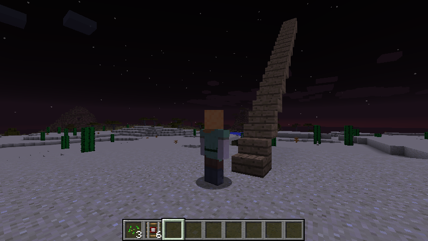

```{r, include=FALSE}
source("tools/chunk-options.R") 
```

## 1. 사전준비 - 하늘로 올라가는 계단 [^minecraft-stairs]

[^minecraft-stairs]: [A Stairway to Heaven](https://ropenscilabs.github.io/miner_book/a-stairway-to-heaven.html)

하늘로 올라가는 계단을 만들기 전에 현재 플레이어가 누군지 위치가 어디인지 파악해야만 된다.
그리고 나서 `53` 번 블록이 계단이라는 것이 확인되면 이를 하나 놓아본다.
물론 종류별로 놓아보는 ㄱ서도 좋다.

``` {r minecraft-stairs-setup, eval=FALSE}
# 0. 환경설정 --------------------------------------------
library(miner)
library(tidyverse)
mc_connect("127.0.0.1")

# 1. 플레이어 ID와 위치 --------------------------------------------
ids <- getPlayerIds()
lapply(ids, getPlayerPos)
ali <- ids[1]

(pos <- getPlayerPos(player_id = ali, tile = TRUE))

# 2. 블록 놓기 --------------------------------------------
## 2.1. 블록 하나 
setBlock(pos[1]+1, pos[2], pos[3]+1, id = 53)

## 2.2. 종류별 블록
for (i in 1:10) {
  setBlock(pos[1]+i, pos[2]+i, pos[3]+i, id = i+40)
}
```

## 2. 하늘로 올라가는 계단

현재 플레이어 위치를 파악하고 10 단을 갖는 계단을 상정하고 데이터를 만들어 낸다.
그리고 나서 `map` 함수를 활용하여 생성된 계단 데이터를 블록을 쌓아 마무리한다.

바로 올라갈 수 있도록 플레이어 위치를 계단 바로 앞에 위치시킨다.

``` {r minecraft-build-stairs, eval=FALSE}
# 3. 하늘로 가는 계단 --------------------------------------------
## 현재 위치
cur_pos <- getPlayerPos(player_id = ali, tile = TRUE)

## 계단 정보 설정
stair_blocks <- 10
stepsize <- 1

## 계단 데이터 준비
stairs <- replicate(stair_blocks, cur_pos)
upset <- cbind(rep(0, 3), replicate(stair_blocks - 1, c(1, 1, 0)))
t_upset <- t(apply(upset, 1, cumsum))

t_stairs <- stairs + t_upset
d_stairs <- as.data.frame(t_stairs) %>% tbl_df

## 하늘로 가는 계단 만들기
d_stairs %>% 
  map(function(x) setBlock(x[1], x[2], x[3], id = 53))

setPlayerPos(cur_pos[1]-1, cur_pos[2], cur_pos[3], tile=TRUE)
```

