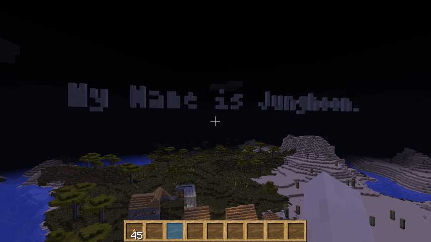
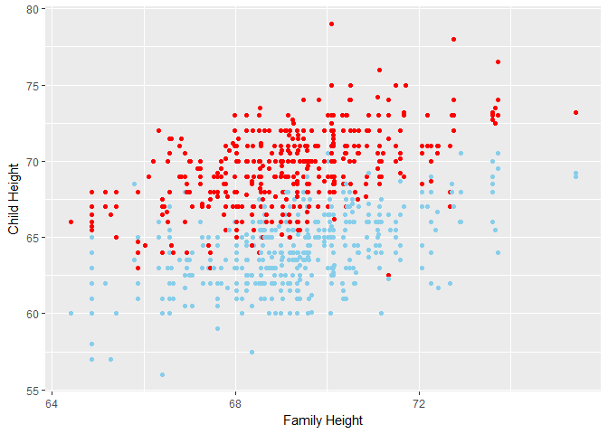
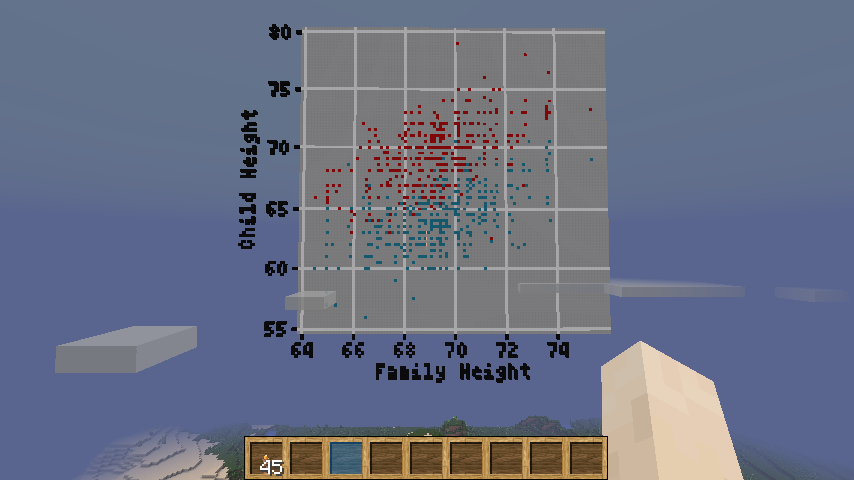

# xwMOOC 데이터과학

## 마인크래프트 텍스트

마인크래프트 게임공간에 텍스트를 표현하는 것도 가능하다.
[craft](https://github.com/kbroman/craft) 팩키지 `write_text()` 함수를 사용하면 된다.
텍스트를 사용할 수 있게 되면 x축, y축에 축라벨을 붙이는 것이 가능하게 되어 산점도를 그리게 될 때 가독성이 높아진다.

~~~{.r}
# 0. 환경설정 --------------------------------------------
# devtools::install_github("ROpenSciLabs/craft")
library(craft)
library(miner)

mc_connect("127.0.0.1")

# 1. 텍스트 영문이름 --------------------------------------------

cur_pos <- getPlayerPos()

write_text("My Name is Junghoon.", cur_pos+c(5,3,0), font="4x6", dir = "north", top = "up")
~~~

## 회귀분석 

`HistData` 팩키지에 역사상 의미있는 데이터를 모아놨는데 그중 갤턴 경의 부모신장과 자식신장과의 관계를 기록한 데이터는
통계학의 꽃인 회귀분석을 학습할 때 빠질 수 없는 데이터로 그 의미가 매우 심대하다.

`ggplot()`으로 데이터를 시각화면 살펴하는 것과 이를 마인크래프트 공간 직접 산점도로 표현하는 것은 요즘 관심을 갖는
AR, VR 등의 측면에서 봐도 학생들이 통계를 바라보는 다양한 관점을 제시해줄 것으로 생각된다.

~~~{.r}
# 2. 그래프 --------------------------------------------
library(HistData)
~~~

~~~{.output}
Warning: package 'HistData' was built under R version 3.3.2

~~~

~~~{.r}
DT::datatable(GaltonFamilies)
~~~

<!--html_preserve-->

<!--/html_preserve-->

~~~{.r}
ggplot(GaltonFamilies, aes(x=midparentHeight, y=childHeight, color=gender)) +
  geom_point() +
  labs(x="Family Height", y="Child Height") +
  theme(legend.position = "none") +
  scale_color_manual(values = c("skyblue", "red"))
~~~

~~~{.r}
mc_plot(getPlayerPos()+c(0, 5, 5),
         x=GaltonFamilies$midparentHeight, y=GaltonFamilies$childHeight,
         group=GaltonFamilies$gender,
         xlab="Family Height", ylab="Child Height")
~~~

~~~{.output}
[1] 383.3799 150.0195 406.9835

~~~

