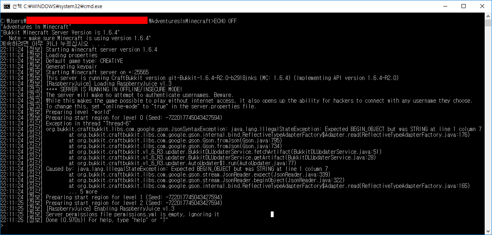
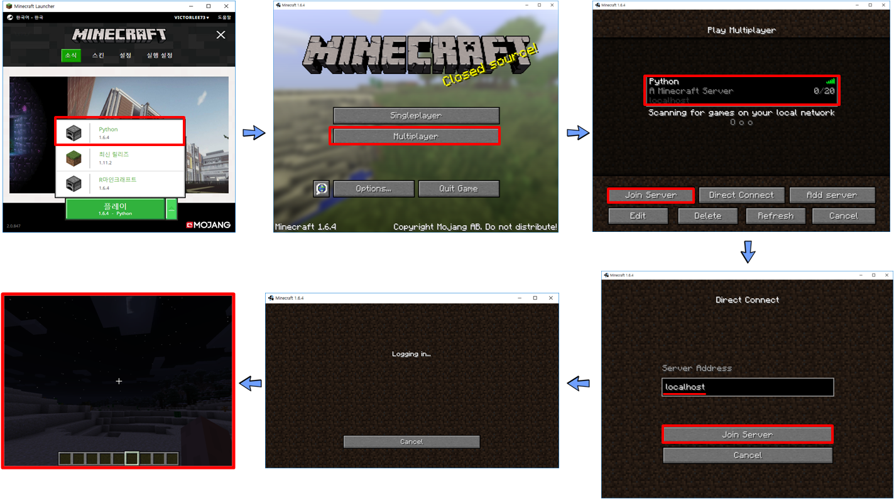
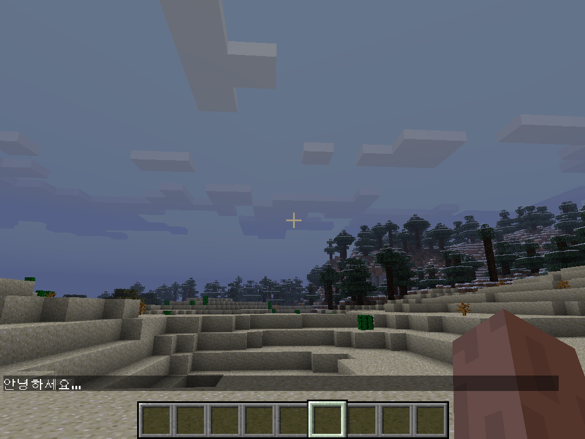

```{r, include=FALSE}
source("tools/chunk-options.R") 
library(tidyverse)
library(extrafont)
library(gridExtra)
library(fpp)
library(ggthemes)
library(xts)
library(tidyquant)
library(DT)
```

## 1. R 마인크래프트

[miner: R package for controlling Minecraft via API](https://github.com/ropenscilabs/miner) 팩키지가 개발되어 R을 활용한 마인크래프트 도전이 
가능하게 되었습니다.

## 2. 환경설정

마인크래프트에 R로 작성한 코드를 돌리기 위해서 크게 3가지 구성요소가 필요하다.

- 마인크래프트 서버 설치
- 마인크래프트 클라이언트 (즉, 마인크래프트 게임) 설치
- R에서 API를 통해 마인크래프트 서버에 접속

### 2.1. 마인크래프트 서버 설치

[Wiley 출판사, Adventures in Minecraft](http://as.wiley.com/WileyCDA/Section/id-823690.html)책은 파이썬을 이용한 마이크래프트 
프로그래밍을 학습할 수 있다.

[마인크래프트 PC Bukkit 서버](http://media.wiley.com/assets/7266/45/AIMStarterKitPC.zip)를 다운로드 받아 압축을 풀어 `StartBukkit.bat`를 
실행하게 되면 쉽게 마인크래프트 서버를 본인 PC에 설치할 수 있다.
물론, 맥을 비롯해 라즈베리파이에도 동일한 방식으로 쉽게 설치할 수 있다. 
웹사이트에서 설치 동영상도 제공하니 찬찬히 살펴보고나서 직접 따라하는 것도 좋을 듯 하다.



### 2.2. 마인크래프트 클라이언트 (즉, 마인크래프트 게임) 설치

라즈베리파이를 소지한 경우 라즈비언을 설치하게 되면 무료 마인크래프가 포함되어 있어 문제가 없다.
하지만, 모바일 `Pocket Minecraft`, 윈도우 10 버젼 마인크래프트는 지원이 되지 않기 때문에 꼭 PC 버젼 
[minecraft.net](https://minecraft.net/ko-kr/)을 통해 구매를 한 버젼을 사용한다. 
저자와 같이 두번 결재를 하고 돈을 돌려받지 못한 경험은 하지 않았으면 좋겠다.
윈도우 10으로 구매를 하면 더 비싸기도 하다. 그리고 돈을 돌려달라고 여러번 의견을 표현해도 묵묵부답이다.
윈도우 10 스토어를 통한 구매는 비추한다.

[minecraft.net](https://minecraft.net/ko-kr/)에서 구매를 하게 되면 마인크래프트 론쳐(launcher)가 윈도우 바탕화면에 설치된다.
마인크래프트 론쳐에서 위에서 설치한 마인크래프트 서버에 접속한다는 강력한 의사를 전달해야 한다.
상기 마인크래프트 버킷서버가 1.6.4를 지원하기 때문에 론처에서 설정을 하고 나서 앞서 실행시킨 서버에 접속을 한다.



### 2.3. R에서 마인크래프트 서버에 접속

R에서 API를 통해 마인크래프트에 접속하는 것은 초딩도 한다는 R 프로그래밍에 경험이 조금만 있다면 쉽게 할 수 있다.

`miner` 팩키지를 설치하고 나서, `mc_connect("127.0.0.1")` 명령어를 통해 로컬 컴퓨터에 접속한다.
그리고 `chatPost` 명령어를 통해 채팅을 통해 헬로월드를 통해 R코드를 마인크래프트에 정상적으로 전송할 수 있음을 확인한다.

``` {r minecraft-helloworld, eval=FALSE}
devtools::install_github('ropenscilabs/miner')

library(miner)
mc_connect("127.0.0.1")

chatPost("안녕하세요...")
```




## 3. 마인크래프트에 R로고 그리기

예제 코드를 가져와서 R 로고를 두가지 색상으로 이미지를 줄여 조정한 후에 for 루프를 돌려 블록을 놓아 
R로고를 마인크래프트에 생성시킨다.

``` {r minecraft-rlogo, eval=FALSE}
# 0. 환경설정
library(miner)
library(imager)

mc_connect("127.0.0.1")

# 1. R로고 가져오기
url <- "https://www.r-project.org/logo/Rlogo.png"
file <- basename(url)
download.file(url, file)

logo <- load.image(file)

# 2. R로고 크기 및 색상 조정
logo <- resize(logo, 80, 70)

logo[] <- cut(logo, c(-Inf, 0.05, 0.4, Inf))
logo <- logo[,,1,1]

# 3. 스티브 위치 파악
host_pos <- getPlayerPos()
host_pos[2] <- host_pos[2] + 10

# 4. R로고 색상

blue <- find_item("Blue Wool")
gray <- find_item("Light Gray Wool")

# 5. R로고 블록으로 표현

for(i in 1:nrow(logo)) {
  for(j in 1:ncol(logo)) {
    if(logo[i,j] == 2)
      setBlock(host_pos[1]+(nrow(logo)-i),
               host_pos[2]+(ncol(logo)-j),
               host_pos[3],
               blue[2], blue[3])
    if(logo[i,j] == 3)
      setBlock(host_pos[1]+(nrow(logo)-i),
               host_pos[2]+(ncol(logo)-j),
               host_pos[3],
               gray[2], gray[3])
  }
}
```


