> ### 학습 목표 {.objectives}
>
> *  라즈베리 파이 운영체제를 이해한다.
> *  리눅스 기반 라즈베리 파이용 운영체제를 설치한다.
> *  미디어 센터, 콘솔 게임, IoT, 네트워크 등 특화된 운영체제를 설치한다.  

> #### 라즈베리 파이 운영체제 {.prereq}
>
> 1. 리눅스
>      * 라즈비언(Raspian) : 데비안(Debian) 계열
>      * 피도라(Pidora) : 페도라(Fedora) 기반  
>      * 아치리눅스(Archlinux) : DIY 운영체제 
> 1. 미디어센터 : OpenELEC, OSMC
> 1. RetroPie, PiPlay
> 1. Prota Pi

라즈베리 파이 위에 올릴 수 있는 운영체제는 다양하다. 먼저 리눅스 계열로 라즈비언이 가장 대표적이고, 초보자도 쉽게 설치해서 사용할 수 있으면 피도라, 아치리눅스도 지원한다. 라즈베리 파이가 다양한 리눅스 배포판을 지원함으로 인해서 윈도우나 맥과 같은 데스크톱 컴퓨터로 활용할 수 있다. 

미디어 센터로 활용할 수 있는 [오픈일렉(openELEC)](http://openelec.tv/)과 [OSMC](https://osmc.tv/)가 있어 가족영화관을 $35달러 라즈베리 파이를 활용하여 구축할 수 있다. 오픈일렉은 가장 최소 기능만 설치되어 있어 성능을 최적으로 낼 수 있도록 고안되었으나 그에 상응해서 별도 설정에 공수가 들 수 있다. 최근 라즈베리 파이 2는 코어가 4개 되고 오버클로킹을 사용하면 강력한 성능을 발휘하고 있고 앞으로는 더 강력해 질 것으로 OSMC 도 훌륭한 대안이 되고 있다.

XBOX 같은 ROM 기반 가족용 게임기를 생각한다면 RetroPi나 PiPlay를 통해서 활용가능하다. [RetroPie](http://blog.petrockblock.com/)는 Retro-Gaming 콘솔을 라즈베리 파이에 이식하는 것으로 시작되었으나 이제는 글로벌 공개 소프트웨어 프로젝트로 다양한 방면으로 영역을 확장하고 있다. [PiPlay](http://piplay.org/)는 과거 PiMAME로도 잘 알려져 있다. 

[프로타 파이 (Prota Pi)](http://thenaran.blogspot.kr/2015/01/prota-new-class-of-operating-system-for.html) 는 웹인터페이스를 통해 클릭만으로 다양한 IoT 기기를 제어할 수 있다. 

참고: [7 Operating Systems You Can Run With Raspberry Pi](http://www.makeuseof.com/tag/7-operating-systems-you-can-run-with-raspberry-pi/)

> #### 다양한 리눅스 배포판 {.callout}
> 
> |  리눅스 배포판 | 명칭 | 활용분야 |
> |---|:--------:|:--------:|-----------------|
> |     |  우분투 | 사용하기 편한 개인용 컴퓨터(데스크톱, 노트북) 및 서버 |
> |     |  레드햇 | 금융 등 기업 대상 상업용 |
> |     |  코어OS | 클라우드 분산 컴퓨팅 환경 컨테이너 배포  |
> |     |  민트OS | 우분투를 기반으로 좀더 사용하기 쉽고 시각적으로 보기 좋은 환경  |
> |    |  루부투 | LXDE와 Ubuntu 합성어로 우분투 기반 유니티 대신 LXDE를 사용하고 > 저성능 컴퓨터용으로 설계 |
> |    |  데비안 | 안정성과 높은 신뢰성을 갖지만 출시 주기가 길다 |

### 1. 라즈베리 파이 운영체제 

처음 컴퓨터를 접하는 분들은 [사전 NOOBS 설치](http://swag.raspberrypi.org/collections/frontpage/products/noobs-8gb-sd-card)된 SD 카드를 구매해서 라즈베리 파이를 시작하는 것이 좋다. 마치 노트북이나 데스트톱 컴퓨터를 처음 구매할 때, 제조판매업체에서 운영체제와 오피스등 관련된 소프트웨어를 미리 설치해줘서 전원만 꼽아 사용하는 것과 유사하다. 

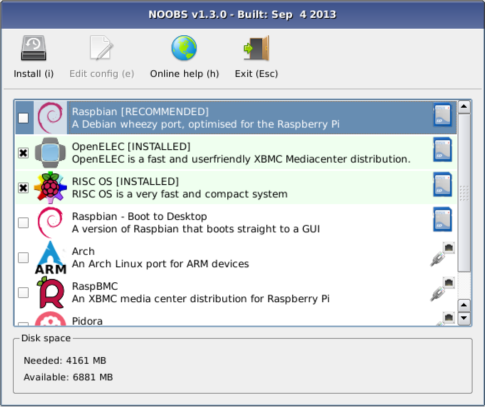

라즈베리 파이의 장점 중의 하나는 [NOOBS](https://www.raspberrypi.org/downloads/)를 통해서 손쉽게 다양한 운영체제를 설치할 수 있다는 것이다.  데이안 리눅스 기반 라즈비언 설치를 권장하고 있고, 만약 네트워크에 연결되어 있으면, OSMC/openELEC미디어센터, Arch 리눅스, 피도라, RISC OS 등도 쉽게 설치할 수 있다.

#### 1.1. NOOBS를 통한 라즈비언 설치 

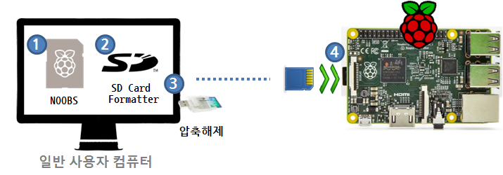

1. SD 카드만 구매하면 깡통 하드디스크를 구매한 것에 비견될 수 있다. 이제는 깡통 SD 카드에 라즈비언(Raspbian) 운영체제를 담고 있는 설치자를 [NOOBS 다운로드](https://www.raspberrypi.org/downloads/)한다.
    - 압축파일 zip으로 내려받으면 파일명이 `NOOBS_v1_4_1.zip`와 유사하다.
1. SD 카드를 처음 포맷하는 경우 [SD Card Formatter](https://www.sdcard.org/downloads/formatter_4/)를 사용해서 포맷한다.
    - `SD Card Formatter`를 실행하고 나서, Format Option: `Option` 버튼을 클릭하고, `FORMAT SIZE ADJUSTMENT`를 `ON`으로 선택하여 포맷한다.
        - `FORMAT SIZE ADJUSTMENT`를 `ON`을 선택하면 4GB 이상 SD 카드 전체 용량을 사용할 수 있다.
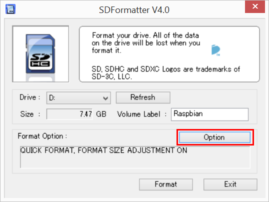
    - 앞에서 다운로드한 zip파일을 압축해제 프로그램을 사용해서 압축을 푼다.
        - [반디집](http://www.bandisoft.co.kr/bandizip/), [알집](http://www.altools.co.kr/Download/ALZip.aspx) 같은 무료 압축해제 프로그램을 사용해서 압축을 푼다.
1. SD카드리더를 분리하고 SD 카드만 라즈베리 파이 SD 카드 슬롯에 장착한다.
1. 라즈비안 운영체제를 안내에 맞춰 설치한다.
    - 한국어는 선택이 없으니 별도 설치한다.

참고 : [NOOBS 설치 동영상(영문), 라즈베리파이 B 기준](https://www.raspberrypi.org/help/noobs-setup/)

#### 1.2. 한글 관련 기본 설정 

라즈비언을 비롯한 다양한 리눅스 배포판에서 가장 처음 접하는 문제는 한글 입출력 문제다. 이를 위한 다양한 접근법이 시도되고 제시되고 있는데 너무 많다는 것도 문제다. 하나의 하드웨어 상에서 다양한 조합을 실험해서 본인에게 가장 적합한 것을 찾아야 되기 때문이다. 다음에 제시하는 방법은 그 다양한 방법 중의 하나로 라즈베리파이에서 한글 입출력에 대한 검증된 방법이다. 

1. 한국 로컬(locale) 설정
    - `sudo dpkg-reconfigure locales` 명령어를 통해서 `ko_KR.UTF-8 UTF-8` 으로 설정한다.
1. 시간대 설정
    - `sudo dpkg-reconfigure tzdata` 명령어를 통해서 `Asia` `Seoul`로 시간대 설정한다.
1. 한글 폰트 설치 
    - `sudo apt-get install ttf-unfonts-core` 명령어를 통해서 폰트를 설치한다.
1. 한글 입력기 소프트웨어 `iBus` 설치
    - `sudo apt-get install ibus-hangul` 명령어를 통해서 한글 입력기 설치한다.
1. 한글 키보드 설정
    -  일반적으로 _Generic 105 key (Intl) PC_ 를 선택하지만, 슬림 키보드 혹은 파이(노트)북의 경우 _Generic 102 key (Intl) PC_로 키보드 자판을 선택한다.
        - Internationalisation Options &rarr; Change Keyboard Layout &rarr; Generic 105 key (Intl) PC
       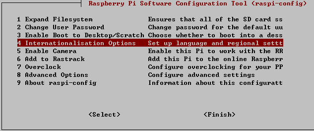    
    - `sudo nano /etc/default/keyboard` 명령어를 통해서 한글 키보드로 설정한다. 키보드자판 한영 전환키를 누를 때 한글과 영문으로 전환된다.
    - `XKBLAYOUT="us"` 설정을 `XKBLAYOUT="ko"` 로 변환한다.

> #### **[한글 입력기](http://kwonnam.pe.kr/wiki/linux/inputmethod) 종류** {.callout}
> 
> 한글입력기는 다양하나 많은 리눅스 배포판이 표준으로 사용하는 iBus를 설치한다.
> 
> - [iBus](https://github.com/ibus/ibus/wiki) : 많은 리눅스 배포판들이 표준으로 사용하고 있는 입력기.
> - [나비](https://code.google.com/p/nabi/) : 한국어 전용 입력으로 구글 코드에 저장소가 있다.
> - [uim](https://github.com/uim/uim/wiki) : 일본계로, 한중일 언어 지원. 
> - [Fcitx](https://fcitx-im.org/wiki/Fcitx) : 중국계로, 한중일 언어 지원.

~~~
pi@raspberrypi ~ $ sudo apt-get update # 최신 팩키지로 갱신한다.
pi@raspberrypi ~ $ sudo dpkg-reconfigure locales
pi@raspberrypi ~ $ sudo dpkg-reconfigure tzdata
pi@raspberrypi ~ $ sudo apt-get install ttf-unfonts-core
pi@raspberrypi ~ $ sudo apt-get install ibus-hangul
pi@raspberrypi ~ $ sudo nano /etc/default/keyboard
~~~

> #### 라즈베리 파이 초기 환경 설정 {.callout}
>
> `sudo raspi-config` 명령어를 통해서 최초 라즈베리 파이 환경을 설정한다. 
> Raspberry Pi Software Configuration Tool (raspi-config) Setup Options에 9가지 선택 옵션이 나와있다.
> `whoami` 명령어를 콘솔에서 입력하면 사용자가 `root` 가 되야 한다. 초기 `pi` 사용자로 로그인 했고 `root` 사용자에 대한 비밀번호를 설정하지 않았기 때문에, `sudo passwd root` 명령어로 `root` 사용자 비밀번호 설정하고 나서 `su root` 명령어로 `root`로 로그인하면 `sudo raspi-config` 명령어를 사용할 수 있다.

### 2. 미디어 센터 

**미디어 센터(media center)**는 다양한 종류의 전자 매체 (음악, 영화, 사진 등)를 재생하는 데 적합한 컴퓨터 기기나 개인용 컴퓨터의 전문 소프트웨어를 말한다. 미디어 센터는 또한 DVD 영화를 시청하고, 또 텔레비전 방송을 시청하면서 녹화하는 기능을 제공한다.

위성, 지상파, 케이블 방송이나 인터넷의 스트리밍을 통해 방송 내용을 저장할 수 있고, 저장된 매체는 로컬 하드 드라이브나 무선 네트워크 부척 기억장치에 보관할 수 있다. 일부 소프트웨어는 인터넷으로부터 소식(RSS)을 찾는 등 다른 작업을 할 수 있다. 미디어 센터는 텔레비전 수상기에 연결하며 일반 개인용 컴퓨터의 기능을 하기도 하며, 또 리모컨으로 동작한다. 

미디어 센터는 특수 목적으로 만들거나 개인이 PC나 다른 컴퓨터(엑스박스 등)와 같은 데에 미디어 센터 소프트웨어를 추가하여 만들 수 있다. 나중에 나온 플레이스테이션 3, 엑스박스 360과 같은 일부 네트워크 서비스를 채용한 일부 게임기는 기본적으로 미디어 센터 장치로 사용할 수 있다.

자세한 사항은 [한국어 위키](https://ko.wikipedia.org/wiki/미디어_센터)를 참조한다.

#### 2.1. OSMC

[OSMC, 이전 RaspBMC](https://osmc.tv/)는 라즈베리파이 NOOBS에 포함된 (네트워크 설치) 미디어센터로 [Kodi, 이전 XBMC로 불림](http://kodi.tv/) 다양한 미디어 콘텐츠를 라즈베리 파이에 경험할 수 있다. OSMC를 설치하는 방법은 크게 인터넷에 연결된 NOOBS에서 설치하는 방법과  [OSMC](https://osmc.tv/) 웹사이트에서 포맷된 USB(마이크로SD)에 설치하는 방법으로 크게 나눌 수 있다. 

##### 2.1.1. OSMC 두가지 설치방법

|  NOOBS | [OSMC 다운로드](https://osmc.tv/download/) | 
|-------------|:----------------------------------:|
| 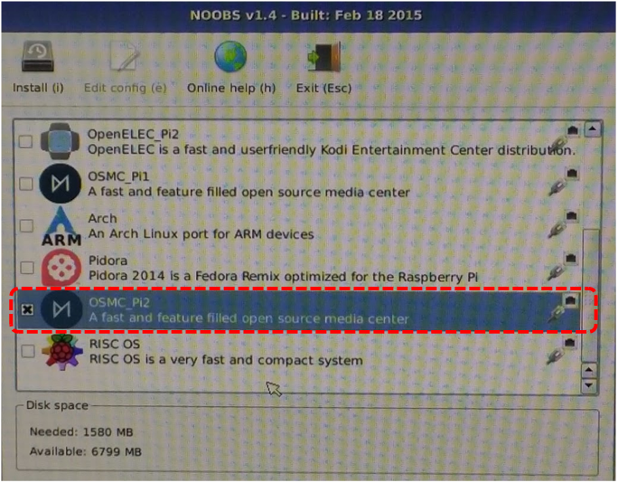    |  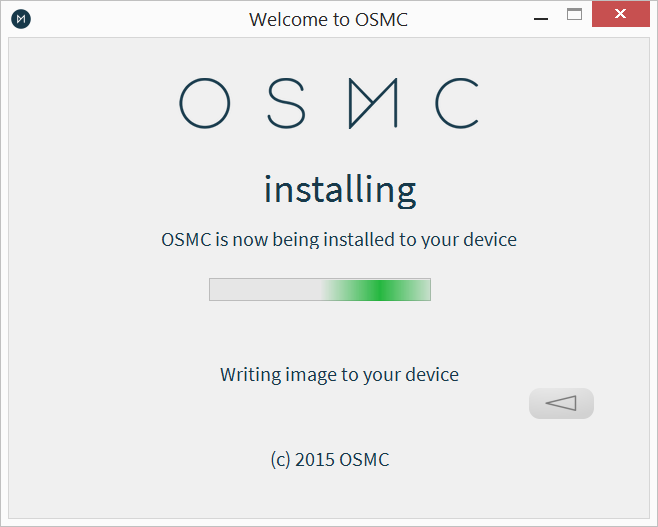  | 

설치방법은 두가지 방법 모두 [OSMC](https://osmc.tv/)를 마이크로SD카드에 담아 라즈베리파이에 장착을 하고 전원을 연결하고 안내에 따라 설치를 진행하면 된다.

##### 2.1.2. OSMC 한글설정 방법

OSMC에서 한글을 볼 수 있는 방법은 두가지가 있다. 하나는 원하는 한글 폰트를 설치하고 해당 폰트를 OSMC 언어로 한국어(Korea)을 인식시키는 방법이고, 다른 하나는 영문 폰트 중 한글도 표시해주는 폰트를 찾아 기본 폰트로 설정하고 언어를 한국어(Korean)로 맞추는 것이다. 한국어가 표시되는 폰트에는 `Arial` 폰트가 가장 대표적이다.

결국, 문제의 원인은 한국어를 지원하는 기본폰트가 몇개 없기 때문이다. 

##### 2.1.3. OSMC 기본폰트 한국어 설정   

`Settings` &rarr; `Appearance` &rarr; `Skin` &rarr; `Fonts` 에서 **Arial based**를 선택을 통해서 OSMC 기본 폰트로 설정했다. 

`Settings` &rarr; `Appearance` &rarr; `Language` 에서 `Korean`을 선택해서 언어를 한국어(Korean)로 설정했다. 

아쉬운 점은 아름다운 한글을 마음대로 사용할 수 없다는데 있다.

##### 2.1.4. OSMC 한글폰트 한국어 설정   

OSMC GUI에서 한글폰트를 설치할 수 없기 때문에 원격 터미널 접속 `ssh`를 통한 접근이나, 기본으로 OSMC 영문 GUI로부터 시작한다. 부팅이 완료된 후에 `Power` > `Exit` 를 클릭해서 나가자 마자 **Esc** 버튼을 눌러 명령라인 인터페이스 터미널로 빠져나온다. 

~~~ {.output}
OSMC: Open Source Media Center osmc tty1

osmc login: osmc
Password:
Linux osmc 3.18.13-1-osmc #1 SMP PREEMPT Sun May 17 18:50:26 UTC 2015 armv7l

The programs included with the Debian GNU/Linux system are free software;
the exact distribution terms for each program are described in the
individual files in /usr/share/doc/*/copyright.

Debian GNU/Linux comes with ABSOLUTELY NO WARRANTY, to the extent
permitted by applicable law.
osmc@osmc:~# 
~~~

* osmc login: 로그인에 사용자명 `osmc` 와 비밀번호 `osmc`를 입력해서 로그인한다.
* `sudo passwd root` 명령어로 루트 비밀번호를 설치하고 `su -` 명령어로 루트로 로그인한다.
* 한글 폰트를 `sudo apt-get install -y fonts-nanum fonts-nanum-coding fonts-nanum-extra fonts-unfonts-core fonts-baekmuk fonts-nanum-eco fonts-unfonts-extra xfonts-baekmuk` 명령어를 통해서 설치한다.
* `nano /usr/share/kodi/addons/skin.osmc/16x9/Font.xml` 명령어로 `.ttf`를 설치한 한글 폰트로 모두 변경한다. `Ctrl+O`를 단축키를 눌러 저장하고 나서, `Ctrl+X`를 눌러 빠져나와서 `reboot` 명령어로 재시작한다.

~~~ {.input}
osmc@osmc:~# sudo passwd root
osmc@osmc:~# su -
root@osmc:~# sudo apt-get update
root@osmc:~# sudo apt-get install -y fonts-nanum fonts-nanum-coding fonts-nanum-extra fonts-unfonts-core fonts-baekmuk fonts-nanum-eco fonts-unfonts-extra xfonts-baekmuk 
root@osmc:~# nano /usr/share/kodi/addons/skin.osmc/16x9/Font.xml
root@osmc:~# reboot
~~~

다시 재부팅하고 나서,  OSMC 초기화면에서 `Settings` &rarr; `Appearance` &rarr; `Language` 에서 `Korean`을 선택하면 모든 설정이 끝난다. 그러면 OSMC 영문을 OSMC 한글로 볼 수 있게 된다.

|  OSMC 영문 | OSMC 한글 | 
|-------------|:----------------------------------:|
| 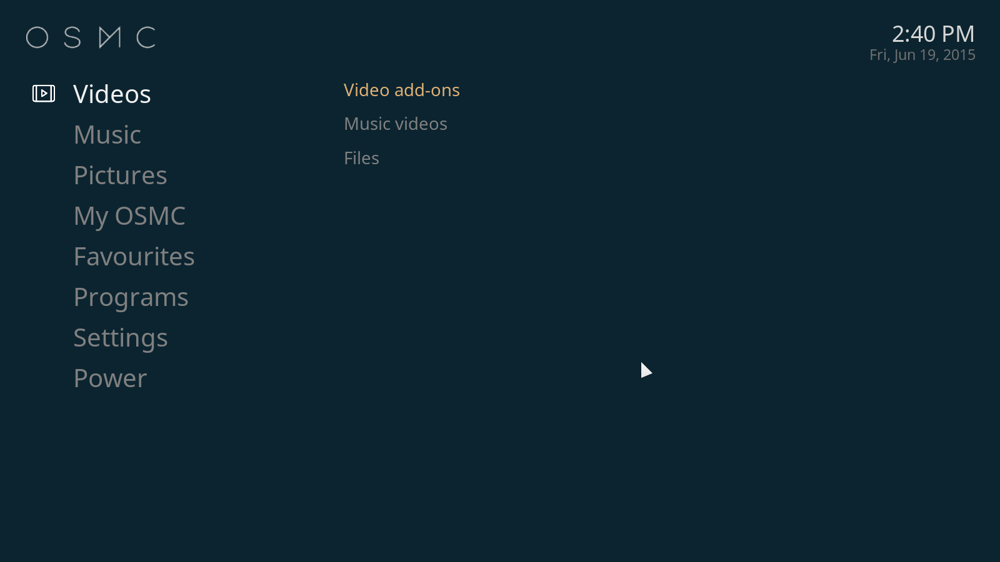    |  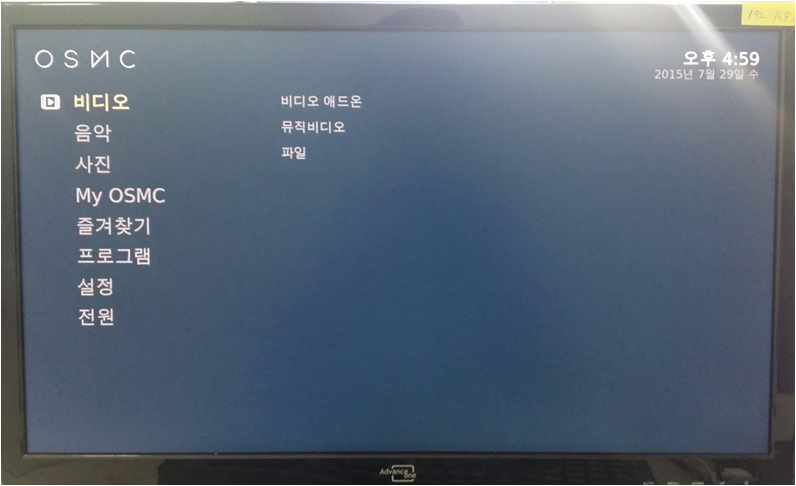  | 

##### 2.1.5. OSMC 배쉬(bash) 통한 제어   

먼저 OSMC 가 설치된 라즈베리파이 IP 주소를 알아낸다. `192.168.103.130` 와 같이 IP 주소를 알아내면 `ssh`를 통해 사용자 `osmc`, 비밀번호 `osmc`로 로그인한다.

~~~ {.output}
$ ssh osmc@192.168.103.130
OSMC: Open Source Media Center
osmc@192.168.103.130's password:

The programs included with the Debian GNU/Linux system are free software;
the exact distribution terms for each program are described in the
individual files in /usr/share/doc/*/copyright.

Debian GNU/Linux comes with ABSOLUTELY NO WARRANTY, to the extent
permitted by applicable law.
Last login: Thu Aug  6 06:27:53 2015 from 192.168.103.125
osmc@osmc:~$
~~~

오픈일렉 코디와 다르게 OSMC 보다 좀더 폭넓은 제어를 기능을 제공한다.

#### 2.2. 오픈일렉(OpenElec) 코디 

[오픈일렉(openelec)](http://openelec.tv/get-openelec) Kodi 미디어센터 설치를 설치한다. 다양한 중앙처리장치(CPU, Processor)가 존재하기 때문에 본인 하드웨어에 맞춰 설치한다. 라즈베리 파이는 ARM 계열이라 *ARMv7 Builds - RPi2 ARMv7 quad core models (Model B 1024MB)* 을 설치한다.

##### 2.2.1. 오픈일렉(OpenElec) 한글 설정

1. System &rarr; Settings &rarr; Appearance &rarr; Fonts 를 **Arial based** 로 변경
1. International &rarr; Language 를 **Korean**으로 설정하면 한글을 볼 수 있다.
1. International &rarr; Timezone country 를 **Korea (South)** 로 바꿔주면, 현재 한국 시간으로 변경됩니다.

##### 2.2.2. 오픈일렉(OpenElec) 로그인

오픈일렉 로그인은 기본 사용자명은 `root`, 비밀번호는 `openelec` 으로 설정되어 있다.  

~~~ {.input}
$ ssh root@192.168.103.130
root@192.168.103.130's password:
##############################################
# OpenELEC - The living room PC for everyone #
# ...... visit http://www.openelec.tv ...... #
##############################################

OpenELEC (official) Version: 5.95.3
OpenELEC:~ #
~~~

##### 2.2.3. 단축키

| 키(key)   |    기능     |
|:------------:|:--------------------------------------------------------|
| F8           | 조용히 (Mute)                  |               
| F9           | 소리 낮춤 (Volume Down)   |
| F10         | 소리 높임 (Volume Down)   |
| Spacebarr         | 재생 / 일시정지 (Play/Pause)   |
| F         | 앞으로 빨리감기 (Fast Forward)   |
| R         | 되감기 (Rewind)   |
| &larr;         | 30초 뒤로 (Stepback 30s)   |
| &rarr;         | 30초 앞로 (Stepforward 30s)   |
| X         | 정지 (Stop)   |
| I        | 정보 (Info)   |
| T         | 자막 켜고/끄기 (Subtitle On/Off)   |
| M         | 재생기 제어 (Player Control)   |
| S         | 끄기 메뉴 (Shutdown Menu)   |
| C         | 맥락 메뉴 (Context Menu)   |
| P         | 봤는지 안봤는지 표시 (Mark Watched / Unwatched)   |
| Ctrl + S     | 화면 캡쳐 (Screenshot)   |

참조 : [XBMC Keyboard Shortcuts](http://www.htpcbeginner.com/15-xbmc-keyboard-shortcuts/)

##### 2.2.4. 오픈일렉 코디 웹 인터페이스

오픈일렉 코디가 설치된 라즈베리 파이 IP 주소를 알면 웹 주소창에 IP 주소를 입력해서 웹 인터페이스를 통해 제어가 가능하다.

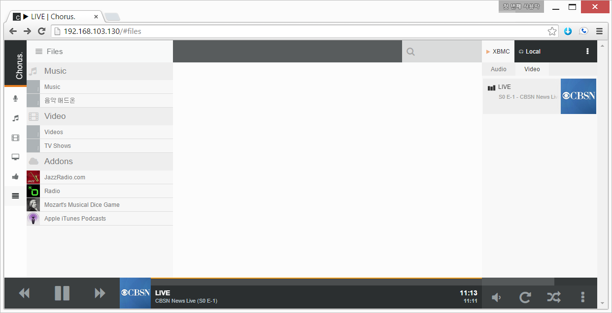

### 3. 라즈베리 파이 콘솔 게임

#### 3.1. RetroPie 콘솔 게임

[RetroPie](http://blog.petrockblock.com/retropie/) 프로젝트는 라즈베리파이에서도 레트로 콘솔 게임을 즐기려는 시도로 시작되었다. 라즈비언 운영체제를 기반으로 해서 수십년동안 개발된 다양한 콘솔게임에 대한 에뮬레이터와 더불어 프론트엔드 인터페이스를 제공한다. 소프트웨어 외에서 GPIO를 통해 버튼, 조이스틱 등의 하드웨어도 붙여서 사용할 수 있도록 했다.

**RetroPie 윈도우에서 설치 순서**

1. RetroPie 이미지를 웹사이트에서 [다운로드](http://blog.petrockblock.com/retropie/retropie-downloads/retropie-sd-card-image-for-raspberry-pi-2/) 받는다. 
    * 다운로드 받은 파일명은 `retropie-v2.6.0-rpi2.img.gz` 와 비슷하다.
    * 압축을 풀면 `retropie-rpi2.img` 와 비슷하다.
1. 앞축을 풀고 다운로드 받은 이미지를 SD 카드로 굽는다.
    * 준비한 SD카드를 4GB 이상 사용할 수 있도록 `Format Size Adjustment`를 **ON**으로 설정한다.
    * **[SDFormatter](https://www.sdcard.org/downloads/formatter_4/)**를 사용해서 SD카드를 포맷한다. 
    * **[Win32DiskImager](http://sourceforge.net/projects/win32diskimager/)**를 사용해서 압축을 푼 이미지 파일 `retropie-rpi2.img`을 SD카드에 굽는다.
1. 라즈베리파이에 SD카드를 끼워넣고 설치 작업을 완료한다.

참조: [RetroPie SD-card Image for Raspberry Pi 2 Version 2.6](http://blog.petrockblock.com/retropie/retropie-downloads/retropie-sd-card-image-for-raspberry-pi-2/)

|    |                         |
|---|----------------------|
|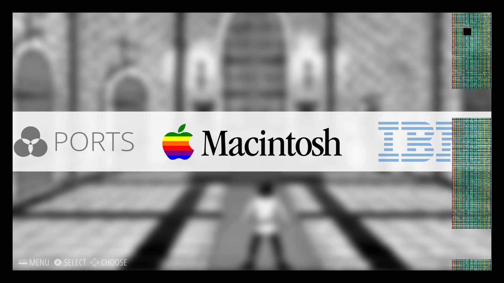   | 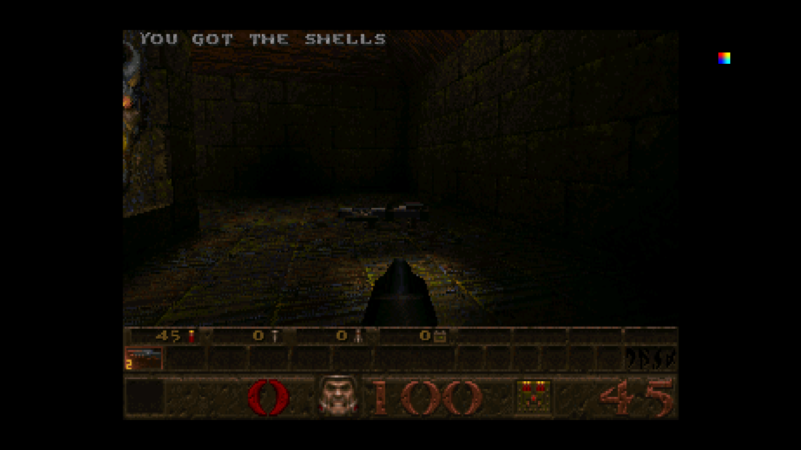                         |

#### 3.2. PiPlay 콘솔 게임

[PiPlay](http://piplay.org/)는 이전에 PiMAME 로 많이 알려진 게임콘솔의 최신작이다.  [PiPlay](http://piplay.org/) 사이트에서 이미지 파일을 다운로드 받아서 SD카드에 굽는다.

**[PiPlay](http://piplay.org/) 윈도우에서 설치 순서**

1. [PiPlay 다운로드](http://blog.sheasilverman.com/pimame-raspberry-pi-os-download/) 에서 최신 버젼을 다운로드 받는다. 
    * 다운로드 받은 파일명은 `piplay-0.8-beta9.zip` 와 비슷하다.
    * 압축을 풀면 `retropie-rpi2.img` 와 비슷하다.
1. 앞축을 풀고 다운로드 받은 이미지를 SD 카드로 굽는다.
    * 준비한 SD카드를 4GB 이상 사용할 수 있도록 `Format Size Adjustment`를 **ON**으로 설정한다.
    * **[SDFormatter](https://www.sdcard.org/downloads/formatter_4/)**를 사용해서 SD카드를 포맷한다. 
    * **[Win32DiskImager](http://sourceforge.net/projects/win32diskimager/)**를 사용해서 압축을 푼 이미지 파일 `retropie-rpi2.img`을 SD카드에 굽는다.
1. 라즈베리파이에 SD카드를 끼워넣고 설치 작업을 완료한다.

|    |                         |
|---|----------------------|
|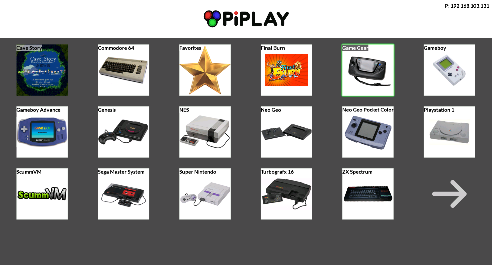   |                          |

### 4. IoT 프로타 파이 

[프로타 파이(PROTA Pi)](http://prota.info/)는 다른 라즈베리 파이 운영체제와는 달리 응용프로그램을 클릭해서 설치하고, 하드웨어 GPIO, 웹서비스도 클릭해서 간단히 설치할 수 있게 해준다. 인터넷을 통해서 보안 혹은 공개 모드로 접속할 수도 있다. 자세한 사항은 [블로그](http://thenaran.blogspot.kr/2015/01/prota-new-class-of-operating-system-for.html)를 참조한다.

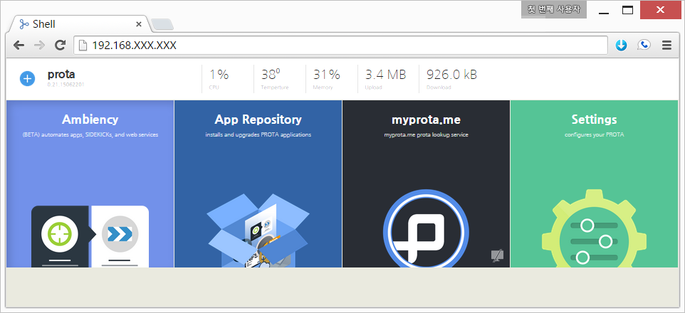

### 5. 파이넷 (Pi-net)

