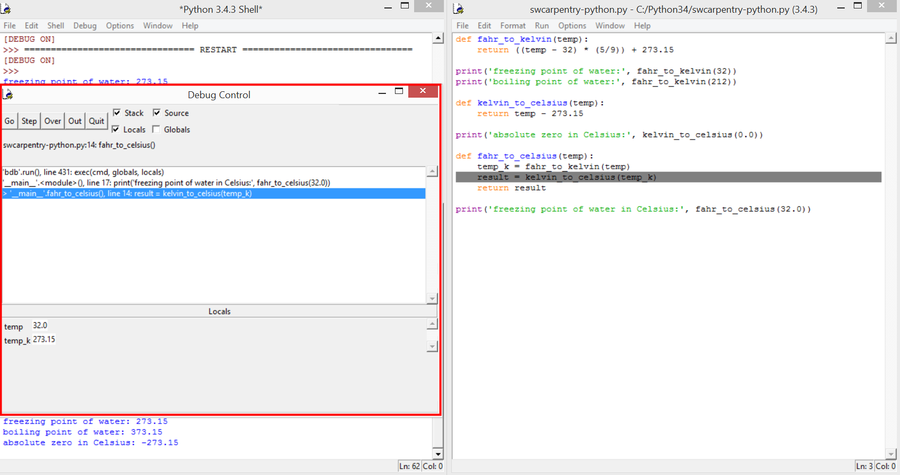
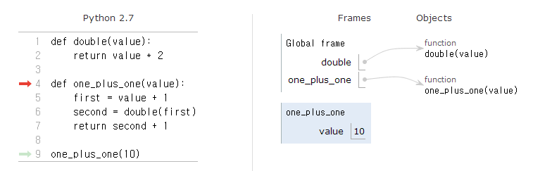
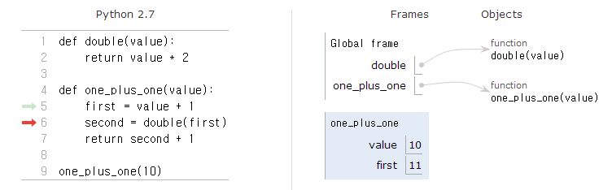
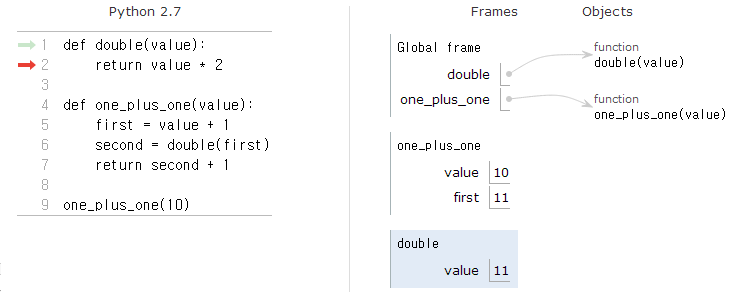
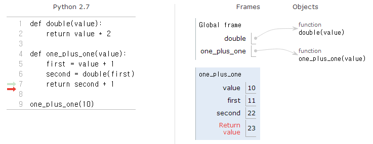

> ### 학습 목표 {.objectives}
>
> *  프로그램 버그 유형을 이해한다.
> *  다양한 디버깅 방법을 숙지한다.
> *  파이썬 IDLE을 사용한 디버깅

### 1. 디버깅(debugging)

프로그램의 오류를 가리키는 “버그(Bug)”라는 말은 1940년대 초 전자계산기계가 고장 났을 때 그레이스 호퍼 장군(여성)이 그 안에 있던 나방 한 마리를 제거(“Debugged”)해서 고친 일로부터 유래했습니다.  그 후 이를 기념하여 오류를 “버그(Bug)”라 하고 오류를 제거하는 것을 “디버깅(Debugging, 벌레잡기)”이라고 부르게 되었습니다. 

**디버그(debug)** 혹은 **디버깅(debugging)**은 컴퓨터 프로그램의 정확성이나 논리적인 오류(버그)를 찾아내고 수정하는 과정이다. **디버거(debugger)**는 디버그를 돕는 도구다. 디버거를 사용해서 한줄 한줄 실행하며 메모리 저장소에 값을 살펴보고, 전역 혹은 지역 변수에 저장된 값을 살펴본다. 특정 코드에 중단점을 지정하여 프로그램 실행하기도 한다. 

시스템이 긴밀히 연결(tightly coupled)되어 있을 경우 디버깅이 쉽지 않다. 왜냐하면, 한 부분을 수정할 때 연결된 다른 부분도 영향을 받아 변경되기 때문이다. 따라서 버그를 특정하여 쉽게 고치려면 시스템을 느슨하게 결합(loosely coupled)시키는 것이 버그를 잡고 수정할 때 편하고 쉽다.

프로그램이 길어지면 전체적으로 이해하기가 어려워지면 그만큼 더 복잡해진다. 그래서 버그가 생길 가능성이 높아진다. 버그가 많이 있다는 것은 또한 버그를 모두 완벽하게 제거하기도 그만큼 어려워 진다. 그리고 완벽하게 버그가 0인 프로그램을 만드는 것은 훨씬 더 어렵다. 그러므로 버그 없는 프로그램을 위해 다음을 염두에 두어야 한다. 

- **프로그램은 가능한 짧게 작성합니다.**
    * 짧게 작성하면 버그가 서식할 수 있는 환경이 그만큼 줄어들게 됩니다.
- **프로그램은 이해하기 쉽게 작성합니다.**
    * 흔히, 자신이 작성한 프로그램도 며칠이 지나면 잊어버리는 경우가 많습니다. 그리고, 여러 사람과 함께 프로그램을 개발하는 경우가 많으므로 다른 사람이 봐도 이해하기 쉽게 프로그래밍 해야 합니다.
- **프로그램에 주석을 달아둡니다.** 
    * 프로그램에서 각 부분의 기능과 역할에 대한 설명을  주석으로 달아놓습니다. 그렇게 하면 다른 사람들도 이해하기 쉽고, 나중에 프로그램을 고치기도 쉽습니다.
- **프로그램을 새로 작성하기보다 가능한 재사용합니다.**
    * 이미 완성된 프로그램은 버그가 거의 없는 상태이고 다른 여러 사람의 눈을 통해서 검증이 된 상태입니다. 그러므로 다시 디버깅할 필요가 없어 시간을 많이 절약할 수 있습니다. 더 큰 장점은 다른 사람이 작성한 프로그램을 통해서 본인의 실력을 향상할 수 있습니다. 

> #### 만일 프로그램에 오류가 생기면? {.callout}
>
> 소프트웨어 버그와 관련된 사건 사고 중 일부 인명과 금전적으로 관련된 사례가 다음에 나와 있다.
> 
> **우주선 폭발 사고(Ariane 5)**: 
> 아리안 5호는 순수한 무인 우주 발사체로 유럽 우주국 주관으로 약 10년에 걸쳐 70억 달러가 개발에 투여되었다.
> 1996년 우주선이 발사 37초 후에 공중에서 폭발하여 약 3,800억 공중으로 사라졌다. 원인은 “64비트 소수점을 16진수 정수값으로 변환하는 코드 한줄”로 인해 발사후 > 경로에서 벗어나기 시작하여 공기역학적인 힘으로 서서히 분해되다가 마지막에 자동항해종료시스템에 의해서 자체적으로 파괴되었다.
> **방사선 치료기(Therac-25)**
> 1985~1987년 사이 최소 6명의 환자가 방사선 과다노출 되었다. 동시 프로그래밍 오류로 인해서 사망이나 치명적인 손상을 일으킬 수 있는 정상치보다 1000배 이상의 > 방사선이 방출되었다. 이를 계기로 의료분야에 소프트웨어의 중요성이 부각되고 함께 연구되어 발전하는 계기가 되었다.
> [출처: The top 10 IT disasters of all time](http://www.zdnet.com/article/the-top-10-it-disasters-of-all-time/)
> [출처: 위키 Therac-25](https://en.wikipedia.org/wiki/Therac-25)

> #### 오류 유형 {.callout}
> 
> **구문 오류(Syntax Error)**: 첫번째 마주치는 오류로 고치기 가장 쉽습니다. 구문 오류는 파이썬 문법에 맞지 않는다는 것을 의미한다. 파이썬은 구문오류가 발생한 줄을 찾아 정확한 위치를 알려준다. 하지만, 파이썬이 제시하는 오류가 그 이전 프로그램 부문에서 발생했을 수도 있기 때문에 파이썬 이 제시하는 곳 뿐만 아니라 그 앞쪽도 살펴볼 필요가 있다. 따라서 구문 오류로 파이썬이 지칭하는 행과 문자는 오류를 고치기 위한 시작점으로 의미가 있다.
>
> **논리 오류(Logic Error)**: 논리 오류의 경우 프로그램 구문은 완벽하지만 명령 어 실행 순서에 실수가 있거나 혹은 문장이 서로 연관되는 방식에 오류가 있는 것이다. 논리 오류의 예를 들어보자. "물병에서 한모금 마시고, 가방에 넣고, 도서관으로 걸어가서, 물병을 닫는다"
>
> **의미론적 오류(Semantic Error)**: 의미론적 오류는 구문론적으로 완벽하고 올 바른 순서로 프로그램의 명령문이 작성되었지만 단순하게 프로그램에 오류가 있다. 프로그램은 완벽하게 작동하지만 여러분이 의도한 바를 수행하지는 못한다. 간단한 예로 여러분이 식당으로 가는 방향을 알려주고 있다. " ... 주유소 사거리에 도착했을 때, 왼쪽으로 돌아 1.6km 쭉 가면 왼 쪽편에 빨간색 빌딩에 식당이 있습니다." 친구가 매우 늦어 전화로 지금 농장에 있고 헛간으로 걸어가고 있는데 식당을 발견할 수 없다고 전화를 합 니다. 그러면 여러분은 "주유소에서 왼쪽으로 혹은 오른쪽으로 돈거야?" 말하면, 그 친구는 "말한대로 완벽하게 따라서 갔고, 말한대로 필기까지 했는데, 왼쪽으로 돌아 1.6km 지점에 주요소가 있다고 했어", 그러면 여러분은 "미안해, 내가 가지고 있는 건 구문론적으로는 완벽한데, 슬프게도 사소하지만 탐지되지 않은 의미론적 오류가 있네!" 라고 말할 것이다.

#### 1.1. 디버깅(debugging)

흔히 범하기 쉬운 구문 오류는 "odd~job", "US$" 같은 특수문자를 포함해서 잘못된 변수명을 생성하는 것과 `class`, `yield`같은 예약어를 변수명으로 사용하는 것이다. 변수명에 공백을 넣는다면, 파이썬은 연산자 없는 두 개의 피연산자로 생각한다.

~~~ {.input}
>>> bad name = 5
~~~
~~~ {.output}
SyntaxError: invalid syntax
~~~
일반적인 구문 오류에 대해서, 오류 메세지는 그다지 도움이 되지 못한다. 
가장 흔한 오류 메세지는 `SyntaxError: invalid syntax`, `SyntaxError: invalid token` 인데 둘다 그다지 오류에 대한 많은 정보를 주지는 못한다.

여러분이 많이 범하는 실행 오류는 정의 전에 사용(''use before def'')하는 것으로 변수에 값을 대입하기 전에 변수를 사용할 경우 발생한다. 여러분이 변수명을 잘못 쓸 때도 발생할 수 있다.

~~~ {.input}
>>> principal = 327.68
>>> interest = principle * rate
~~~
~~~ {.output}
NameError: name 'principle' is not defined
~~~

변수명은 대소문자를 구분한다. 그래서, *LaTeX*는 *latex*은 같지 않다.

이 지점에서 여러분이 범하기 쉬운 의미론적 오류는 연산자 우선 순위일 것이다. 예를 들어   1 / {2 * $\pi$} 를 계산하기 위해서 다음과 같이 프로그램을 작성하게 되면 ...

~~~ {.input}
>>> 1.0 / 2.0 * pi
~~~

나눗셈이 먼저 일어나서 $\pi / 2$이 되는데 의도한 것과 같지 않다. 그래서 이런 경우 오류 메세지는 없지만, 여러분은 잘못된 답을 얻게 된다.

#### 1.2. 역추적(traceback)

오류가 발생했을 때, 파이썬 화면에 출력되는 **역추적(traceback)**에는 상당한 정보가 담겨있다. 하지만,특히 스택에 많은 프레임이 있는 경우 엄청나게 보여 엄두가 나지 않을 수도 있다. 대체로 가장 유용한 정보는 다음과 같은 것이 있다.

* 어떤 종류의 오류인가.
* 어디서 발생했는가.

구문 오류는 대체로 발견하기 쉽지만, 몇 가지는 애매하다. 공백(space)과 탭(tab)의 차이가 눈에 보이지 않아 통상 무시하고 넘어가기 쉽기 때문에 공백 오류를 잡아내기가 까다롭다.

~~~ {.input}
>>> x = 5
>>>  y = 6
~~~

~~~ {.output}
  File "<stdin>", line 1
    y = 6
    ^
SyntaxError: invalid syntax
~~~

상기 예제 문제는 두 번째 줄에 한 칸 공백이 들여써서 발생하는 것이다. 하지만, `y`에 오류 메시지가 있는데 프로그래머를 잘못된 곳으로 인도한다. 대체로 오류 메시지는 문제가 어디에서 발견되었는지를 지칭하지만, 실제 오류는 코드 앞에 종종 선행하는 줄에 있을 수 있다.

동일한 문제가 실행 오류에도 있다. 데시벨(decibels)로 신호 대비 잡음비를 계산한다고 가정하자. 
공식은 $SNR_{db} = 10 \log_{10} (P_{signal} / P_{noise})$ 이다.  파이썬에서 아래와 같이 작성할 수 있다.

~~~ {.input}
import math
signal_power = 9
noise_power = 10
ratio = signal_power / noise_power
decibels = 10 * math.log10(ratio)
print decibels
~~~

하지만, 실행하게 되면, 다음과 같은 오류 메시지 -- 파이썬 3.0에서는 오류 메시지가 발생하지 않는다. 정수 피연산자인 경우에도 나눗셈 연산자가 부동 소수점 나눗셈을 수행 -- 가 발생한다. 

~~~ {.output}
Traceback (most recent call last):
  File "snr.py", line 5, in ?
    decibels = 10 * math.log10(ratio)
OverflowError: math range error
~~~

오류 메지지가 5번째 줄에 있다고 지칭하지만, 잘못된 것은 없다. 실제 오류를 발견하기 위해서, 
출력값이 0 인 *ratio* 값을 *print*문을 사용해서 출력하는 것이 도움이 된다. 문제는 4번째 줄에 있는데, 왜냐하면 두 정수를 나눌 때 내림 나눗셈을 했기 때문입니다. `signal_power` 와 `noise_power` 를 부동 소수점값으로 표현하는게 해결책이다.

대체로, 오류 메시지는 문제가 어디에서 발견되었는지를 알려주지만, 종종 문제의 원인이 어디에서 발생했는지는 알려주지 않는다.

#### 1.3. 텍스트 편집기

텍스트 편집기로 스크립트를 작성한다면 공백과 탭으로 몇번씩 문제에 봉착했을 것입니다. 이런 문제를 피하는 가장 최선의 방식은 절대 탭을 사용하지 말고 공백(스페이스)를 사용하는 것이다. 파이썬을 인식하는 대부분의 텍스트 편집기는 디폴트로 이런 기능을 지원하지만, 몇몇 텍스트 편집기는 이런 기능을 지원하지 않아 탭과 공백 문제를 야기한다.

탭과 공백은 통상 눈에 보이지 않기 때문에 디버그를 어렵게 한다. 자동으로 들여쓰기를 해주는 편집기를 프로그램 작성 시 사용한다.

프로그램을 실행하기 전에 저장하는 것을 잊지 마세요. 몇몇 개발 환경은 자동저장 기능을 지원하지만 그렇지 않는 것도 있다. 이런 이유 때문에 텍스트 편집기에서 작성한 개발 프로그램과 실행운영하고 있는 프로그램이 같지 않을 수도 있다.

동일하고 잘못된 프로그램을 반복적으로 실행한다면, 디버깅은 오래 걸릴 수 있다.

작성하고 있는 코드와 실행하는 코드가 일치하는지 필히 확인하자. 확신을 하지 못한다면, 프로그램의 첫줄에 "print 'hello'" 을 넣어서 실행해 보자. 출력결과 "hello"를 보지 못한다면, 작성하고 있는 프로그램과 실행하고 있는 프로그램은 다른 것이다.

#### 1.4. 이분법을 활용한 디버깅 기법
 
좀더 큰 프로그램을 작성할 때, 좀더 많은 시간을 디버깅에 보내는 자신을 발견할 것이다. 좀더 많은 코드는 버그가 숨을 수 있는 좀더 많은 장소와 오류가 발생할 기회가 있다는 것을 의미한다.

디버깅 시간을 줄이는 한 방법은 **이분법에 따라 디버깅(debugging by bisection)** 하는 것이다. 예를 들어, 프로그램에 100 줄이 있고 한번에 하나씩 확인한다면, 100 번 단계가 필요하다.

대신에 문제를 반으로 나눈다. 프로그램 정확히 중간이나, 중간부분에서 점검한다. `print`문이나, 검증 효과를 갖는 상응하는 대용물을 넣고 프로그램을 실행한다. 

중간지점 점검 결과 잘못 되었다면 문제는 양분한 프로그램 앞부분에 틀림없이 있다. 만약 정확하다면, 문제는 프로그램 뒷부분에 있다.

이와 같은 방식으로 점검하게 되면, 검토 해야하는 코드의 줄수를 절반으로 계속 줄일 수 있다. 단계가 100 번 걸리는 것에 비해 6번 단계 후에 이론적으로 1 혹은 2 줄로 문제 코드의 범위를 좁힐 수 있다.

실무에서, *프로그램의 중간*이 무엇인지는 명확하지 않고, 확인하는 것도 가능하지 않다. 프로그램 코드 라인을 세서 정확히 가운데를 찾는 것은 의미가 없다. 대신에 프로그램 오류가 생길 수 있는 곳과 오류를 확인하기 쉬운 장소를 생각하세요.  점검 지점 앞뒤로 버그가 있을 곳과 동일하게 생각하는 곳을 중간지점으로 고르세요.

#### 1.5. 비판적 사고

프로그램을 작성하면서 배양해야 하는 기술은 항상 자신에게 질문을 하는 것이다.
*여기서 무엇이 잘못될 수 있을까?* 혹은 *내가 작성한 완벽한 프로그램을 망가뜨리기 위해 사용자는 무슨 엄청난 일을 할 것인가?*

예를 들어 앞장의 반복 `while` 루프를 시연하기 위해 사용한 프로그램을 살펴봅시다.

~~~ {.input}
while True:
    line = raw_input('> ')
    if line[0] == '#' :
        continue
    if line == 'done':
        break
    print line

print 'Done!'
~~~
사용자가 입력값으로 빈 공백 줄을 입력하게 될 때 무엇이 발생하는지 살펴봅시다.

~~~ {.output}
> hello there
hello there
> # don't print this
> print this!
print this!
> 
Traceback (most recent call last):
  File "copytildone.py", line 3, in <module>
    if line[0] == '#' :
~~~

빈 공백줄이 입력될 때까지 코드는 잘 작동합니다. 그리고 나서, 0 번째 문자가 없어서 트레이스백(traceback)이 발생한다. 
입력줄이 비어있을 때, 코드 3번째 줄을 **안전**하게 만드는 두 가지 방법이 있다.

하나는 빈 문자열이면 `거짓(False)`을 반환하도록 `startswith` 메쏘드를 사용하는 것이다.

~~~ {.input}
    if line.startswith('#') :
~~~

**가디언 패턴(guardian pattern)**을 사용한 `if`문으로 문자열에 적어도 하나의 문자가 있는 경우만 두번째 논리 표현식이 평가되도록 코드를 작성한다.

~~~ {.input}
    if len(line) > 0 and line[0] == '#' :
~~~

#### 1.6. 공백(whitespace)

파일을 읽고 쓸 때, 공백 때문에 종종 문제에 봉착한다. 이런 종류의 오류는 공백, 탭, 새줄(newline)이 눈에 보이지 않기 때문에 디버그하기도 쉽지 않다.

~~~ {.input}
>>> s = '1 2\t 3\n 4'
>>> print s
~~~
~~~ {.output}
1 2  3
 4
~~~

내장함수 `repr`이 도움이 될 수 있다. 인자로 임의 객체를 잡아 객체 문자열 표현으로 반환한다.
문자열 공백문자는 역슬래쉬 순서(sequence)로 나타냅니다.

~~~ {.output}
>>> print repr(s)
~~~
~~~ {.output}
'1 2\t 3\n 4'
~~~
디버깅에 도움이 될 수 있다.

여러분이 봉착하는 또 다른 문제는 다른 시스템에서는 라인 끝을 표기하기 위해서 다른 문자를 사용한다는 점이다.
어떤 시스템은 *\n* 으로 새줄(newline)을 표기하고, 다른 시스템은 *\r*으로 반환 문자(return character)를 사용한다.
둘다 모두 사용하는 시스템도 있다.  파일을 다른 시스템으로 이식한다면, 이러한 불일치가 문제를 야기한다.

대부분의 시스템에는 A 포맷에서 B 포멧으로 변환하는 응용프로그램이 있다. [위키피이아 새줄](http://wikipedia.org/wiki/Newline) 에서 응용프로그램을 찾을 수 있고, 좀더 많은 것을 읽을 수 있다. 물론, 여러분이 직접 프로그램을 작성할 수도 있다.

#### 1.7. 변형가능/불가 자료구조 디버깅

부주의한 리스트 사용이나 변경가능한 객체를 사용하는 경우 디버깅을 오래 할 수 있다.
다음에 일반적인 함정 유형과 회피하는 방법을 소개한다.

- 대부분의 리스트 메쏘드는 인자를 변경하고, `None`을 반환한다. 이는 새로운 문자열을 반환하고 원 문자열은 그대로 두는 문자열의 경우와 정반대다.

다음과 같이 문자열 코드를 쓰는데 익숙해져 있다면,

~~~ {.input}
word = word.strip()
~~~

다음과 같이 리스트 코드를 작성하고 싶은 유혹이 있을 것이다.

~~~ {.input}
t = t.sort()           # 틀림(WRONG)!

`정렬 (sort)` 메쏘드는 `None`을 반환하기 때문에, 리스트 `t`로 수행한 다음 연산은 실패한다.

리스트 메쏘드와 연산자를 사용하기 전에, 문서를 주의깊게 읽고, 인터랙티브 모드에서 시험하는 것을 권한다.
리스트가 문자열과 같은 다른 순서(sequence)와 공유하는 메쏘드와 연산자는 [docs.python.org/lib/typesseq.html](docs.python.org/lib/typesseq.html) 에 문서화되어 있다.
변경가능한 순서(sequence)에만 적용되는 메쏘드와 연산자는 [docs.python.org/lib/typesseq-mutable.html](docs.python.org/lib/typesseq-mutable.html)에 문서화되어 있다.

- 관용구를 선택하고 고수하라.

리스트와 관련된 문제 일부는 리스트를 가지고 할 수 있는 것이 너무 많다는 것이다.
예를 들어, 리스트에서 요소를 제거하기 위해서, `pop`, `remove`, `del`, 혹은 슬라이스 대입(slice assignment)도 사용할 수 있다.
요소를 추가하기 위해서 `덧붙이기 (append)` 메쏘드나 `+` 연산자를 사용할 수 있다. 
하지만 다음이 맞다는 것을 잊지 마세요.

~~~ {.input}
t.append(x)
t = t + [x]
~~~

하지만, 다음은 잘못됐다.

~~~ {.input}
t.append([x])          # 틀림(WRONG)!
t = t.append(x)        # 틀림(WRONG)!
t + [x]                # 틀림(WRONG)!
t = t + x              # 틀림(WRONG)!
~~~

인터랙티브 모드에서 각각을 연습해 보고 제대로 이해하고 있는지 확인해 보세요.
마지막 한개만 실행 오류를 하고, 다른 세가지는 모두 작동하지만, 잘못된 것을 수행함을 주목하세요.

- 에일리어싱을 회피하기 위해서 사본 만들기.

인자를 변경하는 `정렬 (sort)`같은 메쏘드를 사용하지만, 원 리스트도 보관되길 원한다면, 사본을 만든다.

~~~ {.input}
orig = t[:]
t.sort()
~~~

상기 예제에서 원 리스트는 그대로 둔 상태로 새로 정렬된 리스트를 반환하는 내장함수 `sorted`를 사용할 수 있다.
하지만 이 경우에는, 변수명으로 `sorted`를 사용하는 것을 피해야 한다!

- 리스트, `분할 (split)`, 파일

파일을 읽고 파싱할 때, 프로그램이 중단될 수 있는 입력값을 마주할 수많은 기회가 있다.
그래서 파일을 훑어 ''건초더미에서 바늘''을 찾는 프로그램을 작성할 때 사용한 **가디언 패턴(guardian pattern)**을 다시 살펴보는 것은 좋은 생각이다.

파일 라인에서 요일을 찾는 프로그램을 다시 살펴보자.

~~
From stephen.marquard@uct.ac.za **Sat** Jan  5 09:14:16 2008
~~~

각 라인을 단어로 나누었기 때문에, `startswith`를 사용하지 않고, 라인에 관심있는 단어가 있는지 살펴보기 위해서 단순하게 각 라인의 첫 단어를 살펴본다. 다음과 같이 `continue` 문을 사용해서 ''From''이 없는 라인을 건너 뛴다. 

~~~ {.input}
fhand = open('mbox-short.txt')
for line in fhand:
    words = line.split()
    if words[0] != 'From' : continue
    print words[2]
~~~

프로그램이 훨씬 간단하고, 파일 끝에 있는 새줄(newline)을 제거하기 위해 `rstrip`을 사용할 필요도 없다.
하지만, 더 좋아졌는가?

~~~ {.input}
python search8.py 
~~~

~~~ {.output}
Sat
Traceback (most recent call last):
  File "search8.py", line 5, in <module>
    if words[0] != 'From' : continue
IndexError: list index out of range
~~~

작동하는 것 같지만, 첫줄에 Sat 를 출력하고 나서 역추적 오류(traceback error)로 프로그램이 정상 동작에 실패한다.
무엇이 잘못되었을까? 
어딘가 엉망이 된 데이터가 있어 우아하고, 총명하며, 매우 파이썬스러운 프로그램을 망가뜨린건가?

오랜 동안 프로그램을 응시하고 머리를 짜내거나, 다른 사람에게 도움을 요청할 수 있지만, 빠르고 현명한 접근법은 `print`문을 추가하는 것이다.
`print`문을 넣는 가장 좋은 장소는 프로그램이 동작하지 않는 라인 앞이 적절하고, 프로그램 실패를 야기할 것 같은 데이터를 출력한다.

이 접근법이 많은 라인을 출력하지만, 즉석에서 문제에 대해서 손에 잡히는 단서는 최소한 준다. 
그래서 ` words`를 출력하는 출력문을 5번째 라인 앞에 추가한다. 
''Debug:''를 접두어로 라인에 추가하여, 정상적인 출력과 디버그 출력을 구분한다.

~~~ {.input}
for line in fhand:
    words = line.split()
    print 'Debug:', words
    if words[0] != 'From' : continue
    print words[2]
~~~

프로그램을 실행할 때, 많은 출력결과가 스크롤되어 화면 위로 지나간다. 
마지막에 디버그 결과물과 역추적(traceback)을 보고 역추적(traceback) 바로 앞에서 무슨 일이 생겼는지 알 수 있다.

~~~ {.output}
Debug: ['X-DSPAM-Confidence:', '0.8475']
Debug: ['X-DSPAM-Probability:', '0.0000']
Debug: []
Traceback (most recent call last):
  File "search9.py", line 6, in <module>
    if words[0] != 'From' : continue
IndexError: list index out of range
~~~

각 디버그 라인은 리스트 단어를 출력하는데, 라인을 `분할 (split)`해서 단어로 만들 때 얻어진다.
프로그램이 실패할 때 리스트 단어는 비었다 '[]'. 
텍스트 편집기로 파일을 열어 살펴보면 그 지점은 다음과 같다.

~~~ {.output}
X-DSPAM-Result: Innocent
X-DSPAM-Processed: Sat Jan  5 09:14:16 2008
X-DSPAM-Confidence: 0.8475
X-DSPAM-Probability: 0.0000

Details: http://source.sakaiproject.org/viewsvn/?view=rev&rev=39772
~~~

프로그램이 빈 라인을 만났을 때, 오류가 발생한다. 
물론, 빈 라인은 '0' 단어 (''zero words'')다.
프로그램을 작성할 때, 왜 이것을 생각하지 못했을까?
첫 단어(\verb"word[0]")가 ''From''과 일치하는지 코드가 점검할 때, **인덱스 범위 오류(index out of range)**가 발생한다.

물론, 첫 단어가 없다면 첫 단어 점검을 회피하는 **가디언 코드(guardian code)**를 삽입하기 최적 장소이기는 하다.
코드를 보호하는 방법은 많다. 첫 단어를 살펴보기 전에 단어의 갯수를 확인하는 방법을 택한다.

~~~ {.input}
fhand = open('mbox-short.txt')
count = 0
for line in fhand:
    words = line.split()
    # print 'Debug:', words
    if len(words) == 0 : continue
    if words[0] != 'From' : continue
    print words[2]
~~~

변경한 코드가 실패해서 다시 디버그할 경우를 대비해서, `print`문을 제거하는 대신에 `print`문을 주석 처리한다.
그리고 나서, 단어가 '0' 인지를 살펴보고 만약 '0' 이면, 파일 다음 라인으로 건너뛰도록 `continue`문을 사용하는 **가디언 문장(guardian statement)**을 추가한다.

두 개 `continue`문이 ''흥미롭고'' 좀더 처리가 필요한 라인 집합을 정제하도록 돕는 것으로 생각할 수 있다.
단어가 없는 라인은 ''흥미 없어서'' 다음 라인으로 건너뛴다. 첫 단어에 ''From''이 없는 라인도 ''흥미 없어서'' 건너뛴다.

변경된 프로그램이 성공적으로 실행되어서, 아마도 올바르게 작성된 것으로 보인다. 
**가디언 문장(guardian statement)**이 `words[0]`가 정상작동할 것이라는 것을 확인해 주지만, 충분하지 않을 수도 있다.
프로그램을 작성할 때, ''무엇이 잘못 될 수 있을까?''를 항상 생각해야만 한다.

#### 1.8. 데이터 크기가 큰 경우 디버깅하는 기법

점점 더 큰 데이터로 작업함에 따라, 수작업으로 데이터를 확인하거나 출력을 통해서 디버깅을 하는 것이 어려울 수 있다.
큰 데이터를 디버깅하는 몇가지 방법이 있다.

- **입력값을 줄여라(Scale down the input):** 가능하면, 데이터 크기를 줄여라. 예를 들어, 프로그램이 텍스트 파일을 읽는다면, 첫 10줄로 시작하거나, 찾을 수 있는 작은 예제로 시작하라. 데이터 파일을 편집하거나, 프로그램을 수정해서 첫 `n` 라인만 읽도록 프로그램을 변경하라.
오류가 있다면, `n`을 줄여서 오류를 재현하는 가장 작은 값으로 만들어라. 그리고 나서, 오류를 찾고 수정해 나감에 따라 점진적으로 늘려나가라.
- **요약값과 자료형을 확인하라(Check summaries and types):** 전체 데이터를 출력하고 검증하는 대신에 데이터를 요약하여 출력하는 것을 생각하라: 예를 들어, 딕셔너리 항목의 숫자 혹은 리스트 숫자의 총계.
실행 오류(runtime errors)의 일반적인 원인은 올바른 자료형(right type)이 아니기 때문이다. 이런 종류의 오류를 디버깅하기 위해서, 종종 값의 자료형을 출력하는 것으로 충분하다.
- **자가 진단 작성(Write self-checks):** 종종 오류를 자동적으로 검출하는 코드를 작성한다. 예를 들어, 리스트 숫자의 평균을 계산한다면, 결과값은 리스트의 가장 큰 값보다 클 수 없고, 가장 작은 값보다 작을 수 없다는 것을 확인할 수 있다. ''완전히 비상식적인'' 결과를 탐지하기 때문에 *건전성 검사(sanity check)*라고 부른다.
또 다른 검사법은 두가지 다른 연산의 결과를 비교해서 일치하는지 살펴보는 것이다. *일치성 검사(consistency check)*라고 부른다.
- **고급 출력(Pretty print the output):** 디버깅 출력결과를 서식화하는 것은 오류 발견을 용이하게 한다.

다시 한번, **발판(scaffolding)**을 만드는데 들인 시간이 디버깅에 소비되는 시간을 줄일 수 있다.

#### 1.9. 자료형 관련 디버깅하는 기법

리스트, 딕셔너리, 튜플은 {\bf 자료 구조(data structures)}로 일반적으로 알려져 있다.
이번장에서 리스트 튜플, 키로 튜플, 값으로 리스트를 담고 있는 딕셔너리 같은 복합 자료 구조를 보기 시작했다.
복합 자료 구조는 유용하지만, 소위 **형상 오류(shape errors)**라고 불리는 오류에 노출되어 있다.
즉, 자료 구조가 잘못된 자료형(type), 크기, 구성일 경우 오류가 발생한다. 
혹은 코드를 작성하고, 자료의 모양이 생각나지 않는 경우도 오류의 원인이 된다.

예를 들어, 정수 하나를 가진 리스트를 기대하고, (리스트가 아닌) 일반 정수를 넘긴다면, 작동하지 않는다.

프로그램을 디버깅할 때, 정말 어려운 버그를 잡으려고 작업을 한다면, 다음 네가지를 시도할 수 있다.

- **코드 읽기(reading):** 코드를 면밀히 조사하고, 스스로에게 다시 읽어 주고, 코드가 자신이 작성한 의도를 담고 있는지  점검하라.
- **실행(running):** 변경해서 다른 버젼을 실행해서 실험하라. 
종종, 프로그램이 적절한 곳에 적절한 것을 보여준다면, 문제가 명확하다. 
발판(scaffolding)을 만들기 위해서 때때로 시간을 들일 필요도 있다.
- **반추(ruminating):** 생각의 시간을 갖자. 
어떤 종류의 오류인가: 구문, 실행, 의미론(semantic). 
오류 메시지로부터 혹은 프로그램 출력결과로부터 무슨 정보를 얻을 수 있는가?
어떤 종류 오류가 지금 보고 있는 문제를 만들었을까? 
문제가 나타나기 전에, 마지막으로 변경한 것은 무엇인가?
- **퇴각(retreating):** 어느 시점에선가, 최선은 물러서서, 최근의 변경을 다시 원복하는 것이다. 
잘 동작하고 이해하는 프로그램으로 다시 돌아가서, 다시 프로그램을 작성한다.

초보 프로그래머는 종종 이들 활동 중 하나에 사로잡혀 다른 것을 잊곤 한다. 활동 각각은 고유한 실패 방식과 함께 온다.

예를 들어, 프로그램을 정독하는 것은 문제가 인쇄상의 오류에 있다면 도움이 되지만, 문제가 개념상 오해에 뿌리를 두고 있다면 그다지 도움이 되지 못한다. 
만약 작성한 프로그램을 이해하지 못한다면, 100번 읽을 수는 있지만, 오류를 발견할 수는 없다.
왜냐하면, 오류는 여러분 머리에 있기 때문입니다.

만약 작고 간단한 테스트를 진행한다면, 실험을 수행하는 것이 도움이 될 수 있다.
하지만, 코드를 읽지 않거나, 생각없이 실험을 수행한다면, 프로그램이 작동될 때까지 무작위 변경하여 개발하는 **''랜덤 워크 프로그램(random walk programming)''** 패턴에 빠질 수 있다. 
말할 필요없이 랜덤 워크 프로그래밍은 시간이 오래 걸린다.

생각할 시간을 가져야 한다. 
디버깅은 실험 과학 같은 것이다. 
문제가 무엇인지에 대한 최소한 한 가지 가설을 가져야 한다.
만약 두개 혹은 그 이상의 가능성이 있다면, 이러한 가능성 중에서 하나라도 줄일 수 있는 테스트를 생각해야 한다.

휴식 시간을 가지는 것은 생각하는데 도움이 된다. 
대화를 하는 것도 도움이 된다.
문제를 다른 사람 혹은 자신에게도 설명할 수 있다면, 질문을 마치기도 전에 답을 종종 발견할 수 있다.

하지만, 오류가 너무 많고 수정하려는 코드가 매우 크고, 복잡하다면 최고의 디버깅 기술도 무용지물이다.
가끔, 최선의 선택은 퇴각하는 것이다. 
작동하고 이해하는 곳까지 후퇴해서 프로그램을 간략화하라.

초보 프로그래머는 종종 퇴각하기를 꺼려한다. 
왜냐하면, 설사 잘못되었지만, 한줄 코드를 지울 수 없기 때문이다.
삭제하지 않는 것이 기분을 좋게 한다면, 다시 작성하기 전에 프로그램을 다른 파일에 복사하라.
그리고 나서, 한번에 조금씩 붙여넣어라. 

정말 어려운 버그(hard bug)를 발견하고 고치는 것은 코드 읽기, 실행, 반추, 때때로 퇴각을 요구한다.
만약 이들 활동 중 하나도 먹히지 않는다면, 다른 것들을 시도해 보세요.

#### 1.10. 내장 도움말 활용

만약 특정 메쏘드의 정확한 이름을 기억해 내기 위해서 빠르게 생각나게 하는 것이 필요하다면 도움이 많이 될 수 있는 간단하고 초보적인 내장 문서가 파이썬에 포함되어 있다. 내장 문서 도움말은 인터랙티브 모드의 파이썬 인터프리터에서 볼 수 있다.

`help()`를 사용하여 인터랙티브 도움을 받을 수 있다.

~~~ {.input}
>>> help()
~~~

~~~ {.output}
Welcome to Python 2.6!  This is the online help utility.

If this is your first time using Python, you should definitely check out
the tutorial on the Internet at http://docs.python.org/tutorial/.

Enter the name of any module, keyword, or topic to get help on writing
Python programs and using Python modules.  To quit this help utility and
return to the interpreter, just type "quit".

To get a list of available modules, keywords, or topics, type "modules",
"keywords", or "topics".  Each module also comes with a one-line summary
of what it does; to list the modules whose summaries contain a given word
such as "spam", type "modules spam".

help> modules
~~~

특정한 모듈을 사용하고자 한다면, `dir()` 명령어를 사용하여 다음과 같이 모듈의 메쏘드를 찾을 수 있다.

~~~ {.input}
>>> import re
>>> dir(re)
~~~

~~~ {.output}
[.. 'compile', 'copy_reg', 'error', 'escape', 'findall', 
'finditer', 'match', 'purge', 'search', 'split', 'sre_compile', 
'sre_parse', 'sub', 'subn', 'sys', 'template']
~~~

또한, `dir()` 명령어를 사용하여 특정 메쏘드에 대한 짧은 문서 도움말을 얻을 수 있다.

~~~ {.input}
>>> help (re.search)
~~~

~~~ {.output}
Help on function search in module re:

search(pattern, string, flags=0)
    Scan through string looking for a match to the pattern, returning
    a match object, or None if no match was found.
>>> 
~~~

내장 문서는 광범위하지 않아서, 급하거나, 웹 브라우저나 검색엔진에 접근할 수 없을 때 도움이 될 수 있다.

### 2. 파이썬 IDLE 디버거 
 

파이썬 프로그램 개발은 IDLE3를 열고 파이썬 쉘을 한쪽에 열고, 다른 한쪽에 파이썬 프로그램 코드창을 열고 작업한다. 코드가 개발되면 메뉴에서 `Run` &rarr; `Run Module`을 클릭하거나 단축키로 `F5`를 눌러 개발한 코드를 테스트하거나 실행한다. 
디버깅은 개발/실행모드에서 디버그 모드로 바꿔야 된다.  파이썬2, 3 IDLE에 디버거가 포함되어 있어 별도 디버거를 구매하거나 설치하지 않아도 된다.  `IDLE3`을 시작하고 나서 `Debug` 메뉴에서 `Debugger`를 선택한다. 그러면 **Debugger Control** 메뉴가 열려서 디버그를 시작한다. 

- **Go:** 버튼을 누르면, 프로그램 코드를 정상적으로 실행한다.
- **Step:** 버튼을 누르면, 한번에 한줄씩 실행하고 멈춘다. 함수를 만나면 함수 내부로 들어가서 한번에 한줄씩 실행한다.
- **Over:** 버튼을 누르면, **Step**처럼 동작하단다. 하지만, 함수를 만나면 전체 함수를 실행하고 나서 다음 줄에서 멈춘다.
- **Out:** 버튼을 누르면, 현재 함수 실행을 완료할 때까지 코드를 실행한다.
- **Quit:** 버튼을 누르면, 즉시 프로그램을 중지한다.

파이썬 프로그램 코드 화면에서 마우스 오른쪽 버튼을 클릭해서 **Set Breakpoint**를 통해서 중단점을 설정하거나 **Clear Breakpoint**로 중단점을 해제한다. 중단점을 설정하면 프로그램이 순차적으로 실행되다가 중단점에서 멈춘다. **Stack**(스택)이 화면 중앙에서 스택 정보를 나타내고 그아래 `Locals`와 `Globals` 패널에 프로그램 상태에 대한 자세한 정보가 나와 있다.

#### 2.1. 함수 콜스택  

매개변수를 갖는 함수 정의하고, 콜스택(Call Stack)이 무엇이며 왜 프로그램이 콜스택을 사용하는지 알아보고, 콜스택을 사용해서 중첩 함수 호출 실행을 추적한다.

~~~ {.input}
>>> def double(value):
...     return value * 2
...
>>> def one_plus_one(value):
...     first = value + 1
...     second = double(first)
...     return second + 1
~~~

`one_plus_one(10)`을 호출할 때, 무슨 일이 발생하는지 다음에 나와있다.

1.  **콜스택**에 파이썬이 값 10을 놓는데 함수 호출에 전달되는 값이 또다른 함수 위에 쌓인다는 
    사실로부터 이름을 얻게 된다.

2.  그리고 나서 새로운 변수 `first`를 생성하는데 **스택프레임(stack frame)**은 
    `one_plus_one` 함수 내부에서 발생하는 것을 추적하고 `first`에 값 11 (10 + 1)을 대입한다.

3.  이제 `one_plus_one`가 `double`을 호출하고 나서, 
    파이썬이 또다른 스택 프레임을 생성하고 값 11을 전달한다.

    이제 `value`라는 이름을 갖는 변수가 두개 있음을 주목한다.
    하지만, 서로 다른 스택프레임에 있기 때문에, 실제로는 다른 변수다 --- 우연히 같은 이름을 갖게된 것이다.

4.  `double`은 22 (11 * 2)를 반환한다. 그래서 파이썬이 해당 함수호출을 추적하는데 사용한 스택프레임을 버리고 
    다시 그 밑에 함수를 사용하기 시작한다. 그 스택프레임에는 `second`라고 새로 생성된 변수에 22 값을 놓는다:

5.  마침내 함수 `one_plus_one`가 23(22+1)을 반환한다. 그래서 파이썬이 함수 호출 스택프레임을 버리고 나서
    최종 결과를 출력한다.

[pythontutor.com](http://goo.gl/nPfnnt)에서 콜스택에 대한 자세한 정보 확인합니다.

아마도 진행과정을 일일이 따라가는 것은 엄청난 수고지만, 절대적으로 필요하다. 프로그램에 모든 변수가 한 장소에 저장되어 있다면 어떤 모습일지 상상해보자.
새로운 함수를 작성할 때마다, 우연히 잘못된 변수를 참조하지 않도록 다른 누군가 사용한 변수명을 사용하지 않도록 주의해야만 한다.
주의를 하려면, 호출하는 모든 함수에 있는 단한 줄도 빠짐없이 읽어야만 한다. 설사 이와 같은 작업을 수행할 수 있을 정도로 인내심을 가질 수 있지만,
함수를 작성한 누군가 다시 코드를 수정하고 변수 이름을 변경하는 순간 바로 작성한 프로그램은 곧 망가진다. 

여기 핵심적인 아이디어가 **캡슐화(encapsulation)**다. 
그리고, 올바른 이해할 수 있는 프로그램을 작성하는 것이 매우 중요하다.
함수의 역할은 몇가지 연산작업을 하나로 바꿔주는 것이다.
매번 무언가를 수행할 때마다 수십개 혹은 수백개 문장 대신에 단하나 함수 호출로 생각을 단순화하는데 있다.
이것이 가능한 것은 함수가 서로 서로 간섭하지 않는 것이다; 만약 서로 간섭하게 된다면,
다시한번 세세한 부분에 주의를 기울여야 하고, 급격하게 머리속 단기 기억장소에 부하를 주게 된다.
