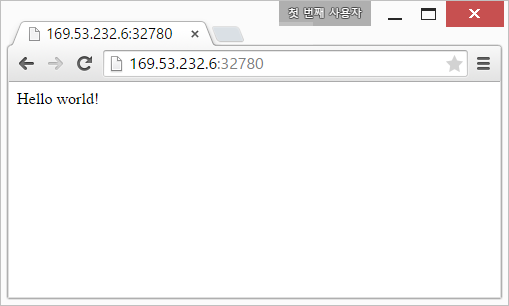

> ### 학습 목표 {.objectives}
>
> *  과학기술 파이썬 툴체인을 가상화한다.
> *  도커를 기반으로 과학 컴퓨팅 개발환경을 가상화한다.

### 1. 도커(Docker) 설치

도커 웹사이트 기준 우분투 환경에 맞춰 도커를 설치한다. 다른 리눅스 OS 설치에 대한 자세한 내용은 
[도커 설치 웹사이트](https://docs.docker.com/installation/ubuntulinux/)를 참조한다.

도커를 지원하는 우분투 운영체제는 `Ubuntu Trusty 14.04 (LTS)`, `Ubuntu Precise 12.04 (LTS)`, `Ubuntu Saucy 13.10` 이 있다.
우분투 버젼이 무엇인지 관계 없이, **64비트**이며, 리눅스 커널이 최소 **3.1**이상이 필요하다.
**3.1** 버젼 이하를 사용하면 몇가지 버그가 있으며 도커 컨테이너의 기능 일부를 사용할 수 없다.

#### 1.1. 리눅스 커널 업그레이드

`uname -r`을 통해서 리눅스 버젼을 확인한다.

~~~ {.input}
root@docker-dev:~# uname -r
~~~
~~~ {.output}
3.13.0-51-generic
~~~

만약 커널 버젼이 **3.1**보다 오래된 구 버젼이라면 다음 명령어를 통해서 업그레이드한다.

~~~ {.input}
root@docker-dev:~# sudo apt-get update
root@docker-dev:~# sudo apt-get -y install linux-image-generic-lts-trusty
root@docker-dev:~# sudo reboot
root@docker-dev:~# uname -r
~~~

~~~ {.output}
3.13.0-53-generic
~~~

커널 버젼이 `3.13.0-51-generic`에서 `3.13.0-53-generic`으로 업그레이드 되었다. 

#### 1.2. 도커 설치

도커는 공식적으로 `apt-get` 우분투 저장소를 통한 방법과 [도커 사이트](https://www.docker.com/)에서 직접 설치하는 방법이 있다.
서로 장단점이 있는데 도커의 경우 관심이 많고 활발하게 진행중인 공개 소프트웨어 프로젝트로 [도커 설치 사이트](https://docs.docker.com/installation/ubuntulinux/)를 참고하여 직접 설치하는 것도 권장한다.

1. `sudo` 권한을 갖는 사용자로 로그인한다.
2. `wget`이 설치되었는지 확인한다.

~~~ {input}
root@docker-dev:~# which wget
/usr/bin/wget
~~~
    - 만약 설치되어 있지 않다면 `sudo apt-get install wget` 명령어로 설치한다.
3. 가장 최신 도커 팩키지를 설치한다.

~~~ {.input}
root@docker-dev:~# wget -qO- https://get.docker.com/ | sh
~~~
4. `docker`가 설치되었는지 확인한다.

~~~ {input}
root@docker-dev:~# sudo docker run hello-world
~~~

~~~ {.output}
Unable to find image 'hello-world:latest' locally
latest: Pulling from hello-world
a8219747be10: Pull complete
91c95931e552: Already exists
hello-world:latest: The image you are pulling has been verified. Important: imag
e verification is a tech preview feature and should not be relied on to provide
security.
Digest: sha256:aa03e5d0d5553b4c3473e89c8619cf79df368babd18681cf5daeb82aab55838d
Status: Downloaded newer image for hello-world:latest
Hello from Docker.
This message shows that your installation appears to be working correctly.

To generate this message, Docker took the following steps:
 1. The Docker client contacted the Docker daemon.
 2. The Docker daemon pulled the "hello-world" image from the Docker Hub.
    (Assuming it was not already locally available.)
 3. The Docker daemon created a new container from that image which runs the
    executable that produces the output you are currently reading.
 4. The Docker daemon streamed that output to the Docker client, which sent it
    to your terminal.

To try something more ambitious, you can run an Ubuntu container with:
 $ docker run -it ubuntu bash

For more examples and ideas, visit:
 http://docs.docker.com/userguide/
~~~

이제 도커 설치가 완료되었다. 도커 설치에 대한 자세한 사항은 [웹사이트][1]를 참조한다.

### 2. 도커(Docker) 이미지 생성, 보기, 이름 변경, 삭제

#### 2.1. 도커 이미지 보기

`docker images` 명령어는 현재 이용가능한 이미지를 화면에 출력한다.

~~~ {.input}
root@docker:~/01.LAMP# docker images
~~~

~~~ {.output}
REPOSITORY          TAG                 IMAGE ID            CREATED             VIRTUAL SIZE
<none>              <none>              0dddfde990c0        19 minutes ago      426.4 MB
ubuntu              trusty              6d4946999d4f        7 days ago          188.3 MB
ubuntu              latest              6d4946999d4f        7 days ago          188.3 MB
hello-world         latest              91c95931e552        9 weeks ago         910 B
~~~

#### 2.2. 도커 이미지 설치

[도커 허브(DockerHub)](https://hub.docker.com/)에 올라간 공용 및 공식 도커 이미지를 검색해서 설치한다.
`docker search` 명령어로 *shiny*를 입력해서 Shiny 서버를 설치한다.
`docker search` 명령어 인자로 `-s 3`를 넘기면 별이 3개 이상인 공용 이미지만 출력하고 만약 공식(OFFICIAL) 이미지면
`[OK]`가 함께 찍여 나온다. 따라서, 선택지가 많은 경우 비공식이 아닌 공식 이미지이며 별이 많은 것을 선택한다. 

설치 명령어는 도커 이미지 중에서 가장 별(STARS)이 많은 *rocker/shiny*를 선택해서 
`docker pull rocker/shiny` 명령어를 실행한다. 로컬 컴퓨터에 *shiny* 이미지가 없으면 [도커 허브(DockerHub)](https://hub.docker.com/)에 접속해서 자동으로 설치한다. 

~~~ {.input}
root@docker:~# docker search -s 3 shiny
~~~
~~~ {.output}
NAME                         DESCRIPTION                                     STARS     OFFICIAL   AUTOMATED
rocker/shiny                                                                 12                   [OK]
quantumobject/docker-shiny   Shiny server : use to host and manage shin...   6                    [OK]
wch1/r-shiny-server                                                          3                    [OK]
~~~

~~~ {.input}
root@dev:~# docker pull rocker/shiny
~~~

~~~ {.output}
Pulling repository rocker/shiny
f984ee68848b: Download complete
511136ea3c5a: Download complete
d338bb63f151: Download complete

....

16583dad808c: Download complete
ae32e6c699a7: Download complete
Status: Downloaded newer image for rocker/shiny:latest
~~~

~~~ {.input}
root@dev:~# docker run --rm -p 3838:3838 rocker/shiny &
~~~

`docker run` 명령어로 `3838`번 포트로 설치한 *Shiny* 서버를 실행한다.

`docker images` 명령어를 통해서 설치된 도커 이미지를 확인한다.

~~~ {.input}
root@dev:~/pyr-cloudlayer# docker images
~~~

~~~ {.output}
REPOSITORY          TAG                 IMAGE ID            CREATED             VIRTUAL SIZE
jekyll/jekyll       latest              19216e6f694d        2 days ago          566.1 MB
rocker/shiny        latest              f984ee68848b        11 weeks ago        1.031 GB
jagregory/pandoc    latest              be6297221dd3        15 months ago       2.143 GB
~~~

`docker info` 명령어를 통해서 `docker` 현황을 파악한다.

~~~ {.input}
root@dev:~/pyr-cloudlayer# docker info
~~~

~~~ {.output}
Containers: 1
Images: 61
Storage Driver: aufs
 Root Dir: /var/lib/docker/aufs
 Backing Filesystem: extfs
 Dirs: 63
 Dirperm1 Supported: false
Execution Driver: native-0.2
Logging Driver: json-file
Kernel Version: 3.13.0-51-generic
Operating System: Ubuntu 14.04.2 LTS
CPUs: 2
Total Memory: 3.908 GiB
WARNING: No swap limit support
~~~

#### 2.3. 도커 이미지 이름 변경

저장소(REPOSITORY) `<none>`을 사람이 기억하기 좋은 명칭으로 변경하는 이미지명으로 
`docker tag` 명령어를 사용해서 `IMAGE ID`나 `REPOSITORY` 명칭을 넣고 바꾸고자하는 이미지명을 인자로 넣어 변경한다.

~~~ {.input}
root@docker:~# docker tag 0dddfde990c0 statkclee/lamp:v1
root@docker:~# docker tag hello-world:latest statkclee/hello-world:xwmooc
root@docker:~# docker images
~~~

~~~ {.output}
REPOSITORY          TAG                 IMAGE ID            CREATED             VIRTUAL SIZE
statkclee/lamp      v1                  0dddfde990c0        19 minutes ago      426.4 MB
ubuntu              trusty              6d4946999d4f        7 days ago          188.3 MB
ubuntu              latest              6d4946999d4f        7 days ago          188.3 MB
statkclee/hello-world   xwmooc              91c95931e552        9 weeks ago         910 B
hello-world         latest              91c95931e552        9 weeks ago         910 B
~~~

#### 2.4. 도커 이미지 삭제

`docker rmi` 명령어에  `IMAGE ID` 혹은 `REPOSITORY` 명칭을 인자로 넣으면 해당 이미지가 삭제된다.

~~~ {.input}
root@docker:~# docker rmi ubuntu:latest
~~~

~~~ {.output}
Untagged: ubuntu:latest
~~~

~~~ {.input}
root@docker:~/01.LAMP# docker images
~~~

~~~ {.output}
REPOSITORY          TAG                 IMAGE ID            CREATED             VIRTUAL SIZE
statkclee/lamp      v1                  0dddfde990c0        20 minutes ago      426.4 MB
ubuntu              trusty              6d4946999d4f        7 days ago          188.3 MB
statkclee/hello-world   xwmooc              91c95931e552        9 weeks ago         910 B
hello-world         latest              91c95931e552        9 weeks ago         910 B
~~~

### 3. 도커(Docker) 맛보기

#### 3.1. 도커 허브

[도커허브(Docker Hub)](https://hub.docker.com/account/signup/)는 Git과 GitHub 관계와 유사하다.
도커를 로컬에 설치했으면, 이를 외부클라우드 저장소에 보관 및 공유가 필요하다. 이를 위한 장소가 [도커허브(Docker Hub)](https://hub.docker.com/account/signup/)다.
도커허브가 제공하는 기능은 다음과 같다.

- 도커 이미지 호스팅(Docker Image Hosting)
- 사용자 인증
- 빌드 트리거(Build Trigger)나 웹훅(Web Hooks)을 사용해서 이미지 빌드 및 작업흐름 자동화
- 깃허브(GitHub) 혹은 비트버킷(BitBucket)과 통합

#### 3.2. 도커 허브 계정 생성

도커허브에 계정을 생성하는 방법은 일반적인 웹사이트 사용자 등록하는 방식과 명령라인을 이용한 방법이 있다.
일반적인 웹사이트 사용자 등록법은 [도커허브(Docker Hub)](https://hub.docker.com/account/signup/)에서 절차에 따라 진행한다.
여기서는 명령라인 방식을 집중적으로 살펴본다.

~~~ {.input}
root@docker-dev:~# sudo docker login
~~~

~~~ {.output}
root@docker-dev:~# sudo docker login
Username: gildong
Password:
Email: gildong@xwmooc.net
WARNING: login credentials saved in /root/.dockercfg.
Account created. Please use the confirmation link we sent to your e-mail to activate it.
~~~

사용자명, 비밀번호, 전자우편 주소를 등록하고, 등록한 전자우편에서 도커에서 보낸 전자우편을 확인하면 계정이 활성화된다.
다음부터 `sudo docker login` 명령어로 로그인해서 도커허브를 사용할 수 있다.

> ## 도커 컨테이너 명령어 요약 {.callout}
>
> `docker run` : 전면 포그라운드(foreground) 인터랙티브 모드 및 후선 백그라운드(background) 데몬 모드 컨테이너 실행  
> `docker ps` : 컨테이너 목록 출력  
> `docker logs` : 컨테이너 표준출력(standard output)  
> `docker stop` : 실행중인 컨테이너 종료
> `docker version` : 도커 버젼

#### 3.3. 도커 허브 "헬로우 월드(Hello World)"

계정을 생성한 다음에 도커 허브에 "헬로우 월드(Hello World)"를 보내보자.
명령어는 `sudo docker run ubuntu:14.04 /bin/echo "Hello World"`이다.

~~~ {.input}
root@docker-dev:~# sudo docker run ubuntu:14.04 /bin/echo "Hello World"
~~~

~~~ {.output}
Unable to find image 'ubuntu:14.04' locally
14.04: Pulling from ubuntu
e9e06b06e14c: Already exists
a82efea989f9: Already exists
37bea4ee0c81: Already exists
07f8e8c5e660: Already exists
ubuntu:14.04: The image you are pulling has been verified. Important: image verification is a tech p
review feature and should not be relied on to provide security.
Digest: sha256:125f9479befe1f71562b6ff20fb301523a2633902ded6d50ade4ebcd7637a035
Status: Downloaded newer image for ubuntu:14.04
Hello World
~~~

기본적으로 `ubuntu:14.04` 이미지가 로컬에 없기 때문에 도커허브에 접속해서 찾아 풀(Pull) 방식으로 다운로드해서 가져온다. 이제 `ubuntu:14.04` 이미지가 로컬에 생성되어 있으니 `sudo docker run ubuntu:14.04 /bin/echo "Hello World"` 명령어를 해부하자.

- `sudo docker run` : 관리자 권한으로 도커를 실행한다.
- `ubuntu:14.04` : 우분투 14.04 이미지를 도커로 실행한다.
- `/bin/echo "Hello World"` : 유닉스 echo 명령어로 "Hello World"를 화면에 출력한다.

#### 3.4. 도커 컨테이너 인터랙티브 모드

`docker run`을 통해서 명령어를 전달하는 방식으로 했지만, 실제 컨테이너 내부로 들어가서 인터랙트브 모드로 컨테이너를 사용하자.

~~~ {.input}
root@docker-dev:~# sudo docker run -t -i ubuntu:14.04 /bin/bash
root@5df339877e7d:/#
~~~

`sudo docker run -t -i ubuntu:14.04 /bin/bash` 명령어를 해부하자. 상기 도커 명령어와 비교하여 차이가 나는 것은 `-t -i` 옵션 플래그가 추가된 것이다.

- `sudo docker run` : 관리자 권한으로 도커를 실행한다.
- `-t -i` : `-t` 옵션 플래그는 컨테이너 내부에 터미널을 배정하고, `-i`는 인터랙티브 연결을 가능하게 한다.
- `ubuntu:14.04` : 우분투 14.04 이미지를 도커로 실행한다.
- `/bin/echo "Hello World"` : 유닉스 echo 명령어로 "Hello World"를 화면에 

~~~ {.output}
root@5df339877e7d:/# pwd
/
root@5df339877e7d:/# ls
bin   dev  home  lib64  mnt  proc  run   srv  tmp  var
boot  etc  lib   media  opt  root  sbin  sys  usr
root@5df339877e7d:/#
root@5df339877e7d:/# exit
exit
root@docker-dev:~#
~~~

컨테이너 내부에서 `pwd` 명령어로 현재 작업디렉토리가 `/` 루트임을 확인할 수 있고, `ls` 명령어를 통해서 현재 디렉토리 파일과 디렉토리를 목록으로 출력한다. `exit` 혹은 `CTRL+D` 키를 눌러 컨테이너를 빠져나온다. 배쉬쉘이 종료되면 컨테이너도 정지된다.

#### 3.5. 유용한 도커 대몬

헬로월드를 본 것이 그다지 의미는 있지 않다. 이제 도커를 데몬화(Daemonization)시켜서 실용적으로 사용할 길을 모색해 보자.

~~~ {.input}
root@docker-dev:~# sudo docker run -d ubuntu:14.04 /bin/sh -c "while true; do echo hello world; sleep 1; done"
~~~ 

`sudo docker run -d ubuntu:14.04 /bin/sh -c "while true; do echo hello world; sleep 1; done"` 명령어를 해부하자. 

- `sudo docker run` : 관리자 권한으로 도커를 실행한다.
- `-d` : `-d` 옵션 플래그은 컨테이너를 데몬으로 실행한다. 즉, 백그라운드 작업으로 실행한다.
- `ubuntu:14.04` : 우분투 14.04 이미지를 도커로 실행한다.
- `/bin/sh -c "while true; do echo hello world; sleep 1; done` : 간단한 유닉스 쉘스크립트로 유닉스 echo 명령어로 "Hello World"를 화면에 무한히 출력한다.

~~~ {.output}
6cd5c7730cd6629f67f540912f0b0018fd8bbdce3c2703bdd5b4634627d6b555
~~~

실행결과 `6cd5c7730...` 문자열이 출력되는데 데몬으로 백그라운드 실행되는 컨테이너 ID가 된다.
컨테이너가 데몬으로 정상적으로 떠서 실행되는지 확인하는 명령어는 `docker ps`다.

~~~ {.input}
root@docker-dev:~# sudo docker ps
~~~

`docker ps` 명령 실행결과 '컨테이너 ID'가 `6cd5c7730...`으로 동일하고, 이미지는 우분투 `ubuntu:14.04`이고, 
명령어는 `"/bin/sh -c 'while t`이 실행되고, 생성시점과 상태 정보를 확인한다.

~~~ {.output}
CONTAINER ID        IMAGE               COMMAND                CREATED             STATUS
6cd5c7730cd6        ubuntu:14.04        "/bin/sh -c 'while t   6 minutes ago       Up 6 minutes
~~~

실제 '컨테이너 ID' `6cd5c7730...`에서 실행되고 있는 것을 확인하려면 `docker logs` 명령어와 인자값으로 '컨테이너 ID'를 
전송한다. 그리고 리다이렉션을 사용해서 첫 5 행 출력결과만 가져온다.

~~~ {.input}docker-jupyter.png
root@docker-dev:~# docker logs 6cd5c | head -5
~~~

~~~ {.output}
hello world
hello world
hello world
hello world
hello world
time="2015-05-28T01:20:11-05:00" level=fatal msg="write /dev/stdout: broken pipe"
~~~

도커 컨테이너를 백그라운드 데몬으로 실행했으니 이제는 이를 중지하자. 중지하는 명령어는 `docker stop`이다.
플래그 옵션으로 `6cd5c`을 넣어주면 해당 컨테이너 데몬이 중지한다. 

~~~ {.input}
root@docker-dev:~# docker stop 6cd5c
~~~

~~~ {.output}
6cd5c
~~~ 

`docker ps` 명령어를 통해서 실제로 데몬 컨테이너가 중지되었는지 확인한다.

~~~ {.input}
root@docker-dev:~# docker ps
~~~

~~~ {.output}
CONTAINER ID        IMAGE               COMMAND             CREATED             STATUS
~~~

> ## 도커 실습환경 {.callout}
> 도커를 이해하는 가장 좋은 실습환경은 도커에서 제공한 가상 도커환경에서 직접 타이핑해보는 것이다.
> [https://www.docker.com/tryit/](https://www.docker.com/tryit/) 사이트에서 
> 직접 8단계까지 실습해보는 것도 좋은 방법이다.

#### 3.6. 도커 DNS 서버 환경설정

우분투 운영체제는 일반적으로 `/etc/resolv.conf` 파일에  도메인네임서버(Domain Name Server, DNS)로 `127.0.0.1`를 사용한다.
네트워크 관리자(NetworkManager)로 `dnsmasq` 명령어로 실제 DNS를 `/etc/resolv.conf` 파일에 `nameserver 127.0.0.1`로 설정한다.

하지만 이런 환경설정으로 도커를 실행하게 되면 아래 경고 메시지가 뜬다.
이유는 도커 컨테이너가 로컬 DNS 네임서버를 사용할 수 없기 때문이다.

~~~ {.error}
WARNING: Local (127.0.0.1) DNS resolver found in resolv.conf and containers
can't use it. Using default external servers : [8.8.8.8 8.8.4.4]
~~~

이 문제를 회피하기 위해서, 도커 컨테이너가 사용하는 DNS 서버를 지정하거나 네트워크 관리자(Network Manager)에 `dnsmasq`를 비활성화한다.
하지만 `dnsmasq`를 비활성화하는 것이 DNS 식별에 시간이 걸려 특정 네트워크에서 속도가 느려질 수 있다.

**도커에서 DNS 서버를 지정하는 방법** 

1. `sudo` 권한을 갖는 사용자로 로그인한다.
2. `nano` 텍스트 편집기로 `/etc/default/docker` 파일을 열어 편집한다.

~~~ {.input}
root@docker-dev:~# sudo nano /etc/default/docker
~~~

3. 도커 환경설정을 추가한다.`8.8.8.8`을 `169.53.232.6` IP주소로 실제 사용할 주소로 변경한다.
`#DOCKER_OPTS="--dns 8.8.8.8 --dns 169.53.232.6"`

~~~ {.input}
# Docker Upstart and SysVinit configuration file

# Customize location of Docker binary (especially for development testing).
#DOCKER="/usr/local/bin/docker"

# Use DOCKER_OPTS to modify the daemon startup options.
#DOCKER_OPTS="--dns 8.8.8.8 --dns 169.53.232.6"

# If you need Docker to use an HTTP proxy, it can also be specified here.
#export http_proxy="http://127.0.0.1:3128/"

# This is also a handy place to tweak where Docker's temporary files go.
#export TMPDIR="/mnt/bigdrive/docker-tmp"
~~~

4. 저장하고 `nano` 편집기를 빠져나온다.
5. 도커 대몬을 재실행한다.

~~~ {.input}
root@docker-dev:~# sudo restart docker
~~~

~~~ {.output}
docker start/running, process 7909
~~~

**도커 최신 버젼 업그레이드**

가장 최신 버젼 도커를 설치하려면 `wget` 명령어에 `-N` 옵션 플레그를 사용한다.

~~~ {.input}
root@docker-dev:~# wget -N https://get.docker.com/ | sh
~~~

#### 3.7. 웹서비스 도커 컨테이너

가장 많이 사용하는 웹응용프로그램을 파이썬 플라스(Flask) 웹플레임워크를 사용하여 응용프로그램을 개발한다.
먼저 `docker run`을 사용해서 파이썬 플라스크 웹플레임워크 이미지를 설치한다.

~~~ {.input}
root@docker-dev:~# sudo docker run -d -P training/webapp python app.py
~~~

`sudo docker run -d -P training/webapp python app.py`명령어를 해석한다.

- `sudo docker run` : 관리자 권한으로 도커를 실행한다.
- `-d` : `-d` 옵션 플래그는 컨테이너를 데몬으로 실행한다. 즉, 백그라운드 작업으로 실행한다.
- `-P` : `-P` 옵션 플래그는 컨테이너 내부 네트워크 포트를 호스트/컴퓨터 포트에 매핑한다. 
- `training/webapp` : 파이썬 플라스크 웹프레임워크 이미지를 실행한다.
- `python app.py` : 파이썬 플라스크 웹응용프로그램을 실행한다.

~~~ {.output}
a663f873627cd4ed8f4bd1c288d56ea975bdc51298df0afcc93365620cfcdb00
~~~

`sudo docker ps -l`을 실행하면 주의 깊게 살펴볼 것이 `PORTS`에 `0.0.0.0:32780->5000/tcp`으로 포트를 `32780`으로 매핑한다. 

~~~ {.input}
root@docker-dev:~# sudo docker ps -l
~~~

~~~ {.output}
CONTAINER ID        IMAGE                    COMMAND             CREATED             STATUS              PORTS                     NAMES
a663f873627c        training/webapp:latest   "python app.py"     8 seconds ago       Up 8 seconds        0.0.0.0:32780->5000/tcp   determined_lovelace
~~~

~~~ {.input}
root@docker-dev:~# ifconfig eth01
~~~

~~~ {.output}
eth1      Link encap:Ethernet  HWaddr 06:28:dd:28:1e:e9
          inet addr:169.53.232.6  Bcast:169.53.232.15  Mask:255.255.255.240
          inet6 addr: fe80::428:ddff:fe28:1ee9/64 Scope:Link
          UP BROADCAST RUNNING MULTICAST  MTU:1500  Metric:1
          RX packets:394567 errors:0 dropped:0 overruns:0 frame:0
          TX packets:75168 errors:0 dropped:0 overruns:0 carrier:0
          collisions:0 txqueuelen:1000
          RX bytes:467528533 (467.5 MB)  TX bytes:13397258 (13.3 MB)
~~~

IP주소가 `169.53.232.6`이고 포트번호가 `32780`에 매핑이 되어 웹브라우져에서 `http://169.53.232.6:32780/`으로 입력하면 도커 컨테이너에 정상적으로 파이썬 플라스크 웹응용프로그램이 실행되는 것을 확인할 수 있다.

[1]: https://docs.docker.com/installation/ubuntulinux/

### 4. 아나콘다 과학 컴퓨팅 툴체인

#### 4.1. 아나콘다 설치

[아나콘다(Anaconda)](http://continuum.io/)는 파이썬 언어를 기반으로 과학 컴퓨팅을 지원하는 통합개발환경(IDE)로 개발시간을 획기적으로 단축시킬 수 있다.

1. 아나콘다 [다운로드 웹페이지](http://continuum.io/downloads)에서 설치 컴퓨터 사양에 맞는 아나콘다를 다운로드 한다.
    - 리눅스 우분투 64 Bit, 파이썬 3.4를 다운로드했다. 웹에서 직적 다운로드하거나, `wget` 명령어를 사용해서 링크를 터미널에 붙여넣고 다운로드 받아도 된다.
1. `bash` 명령어로 쉘스크립트를 실행하면 자동으로 설치된다.
    - 루트 권한이 필요없으며 사용자 홈디렉토리 밑에 `~/anaconda`가 기본 디렉토리가 된다.
    - 삭제를 원한다면 `rm -rf ~/anaconda` 명령어를 사용한다.

~~~ {.shell}
$ wget https://3230d63b5fc54e62148e-c95ac804525aac4b6dba79b00b39d1d3.ssl.cf1.rackcdn.com/Anaconda3-2.3.0-Linux-x86_64.sh
$ bash Anaconda3-2.3.0-Linux-x86_64.sh 
~~~

[참고: Installing Anaconda python on ubuntu](http://askubuntu.com/questions/505919/installing-anaconda-python-on-ubuntu)

#### 4.2. 과학 컴퓨팅 환경 도커 가상화 

[Jupyter 도커 스택](https://github.com/jupyter/docker-stacks)에는 R, 파이썬, 스파크, 파이스파크 등 다양한 노트북을 지원해서 별도 환경설정없이 바로 데이터 기반 분석, 모의실험, 소프트웨어 개발을 시작할 수 있게 한다. [Jupyter Notebook Scientific Python Stack](https://hub.docker.com/r/jupyter/scipy-notebook/)을 `docker pull` 명령어를 통해서 다운로드 받으면 과학 컴퓨팅을 위한 파이썬 툴체인이 설정되고, 웹브라우져를 주피터 노트북을 통해 통합 개발환경을 구축한다.

`GRANT_SUDO=yes` 옵션은 루트 권한을 부여해서 컨테이너에 자유로이 팩키지를 설치하게 하고, 8888로 포워팅하는 `-p 8888:8888` 옵션을 연다.

~~~ {.shell}
$ docker pull jupyter/scipy-notebook
$ docker run -d -e GRANT_SUDO=yes -p 8888:8888 jupyter/scipy-notebook
~~~

웹브라우져 주소창에 `localhost:8888`을 입력하면 주피터 노트북이 실행된다.

[싸이그래머/베이지안 통계 (Python): 파트 4](http://nbviewer.ipython.org/github/psygrammer/bayesianPy/blob/master/part4/pymc01/pymc_intro_install.ipynb)

#### 4.3. PyMC 베이지안 분석환경 설치

`jupyter/scipy-notebook` 이미지를 가져왔으면 `docker run` 명령어를 통해서 컨테이너를 여러개 띄워 환경에 구애받지 않고 자유로이 생성하고 삭제가능하다. PyMC는 `conda install pymc` 명령어를 통해 설치한다. 여기서 `conda`는 아나콘다 기본 팩키지 관리자다.

~~~ {.shell}
$ docker run -it jupyter/scipy-notebook /bin/bash
$ apt-get install python-qt4
$ conda install pymc
$ apt-get install graphviz
$ source activate python2
$ conda install pydot
~~~

#### 4.4. 베이지안 R과 Jags

##### 4.4.1. JAGS

[JAGS](http://mcmc-jags.sourceforge.net/)는 *Just Another Gibbs Sampler*의 약어로 마코프 체인 몬테 카를로(Markov Chain Monte Carlo, MCMC) 모의실험을 사용해서 계층적 베이지안 모형 분석하는 프로그램이다.

1. 쉘 환경에서 별도 팩키지로 `jags`를 설치한다.

~~~ {.shell}
$ sudo apt-cache search jags
$ sudo apt-get install jags
~~~
2. R 환경에서 `R2jags` 팩키지를 설치한다. 

~~~ {.r}
> version
               _                           
platform       x86_64-pc-linux-gnu         
arch           x86_64                      
os             linux-gnu                   
system         x86_64, linux-gnu           
status                                     
major          3                           
minor          2.0                         
year           2015                        
month          04                          
day            16                          
svn rev        68180                       
language       R                           
version.string R version 3.2.0 (2015-04-16)
nickname       Full of Ingredients         
> install.packages("rjags") 
~~~

3. 베이지안 자료분석을 위한 프로그램과 데이터를 다운로드 받는다.
    - [Doing Bayesian Data Analysis: A Tutorial with R, JAGS, and Stan. 2nd Edition.](https://sites.google.com/site/doingbayesiandataanalysis/software-installation)

~~~ {.shell}
$ wget https://sites.google.com/site/doingbayesiandataanalysis/software-installation/DBDA2Eprograms.zip
$ unzip DBDA2Eprograms.zip  
~~~

##### 4.4.2. 베이지안 로지스틱 회귀분석

[Kruschke 스타일](http://doingbayesiandataanalysis.blogspot.kr/2013/10/diagrams-for-hierarchical-models-new.html) 베이지안 모형 시각화 템플릿으로 [리브레 오피스 Draw](http://www.libreoffice.org/features/draw/)를 사용한다. 만약 LaTeX으로 동일한 작업을 하고자 한다면 Tinu Schneider의 [GitHub 저장소]((https://github.com/tinu-schneider/DBDA_hierach_diagram))를 참고한다.

> #### 베이지안 데이터 분석 절차 {.callout}
>
> 1. 데이터를 기술하는 모형을 정의한다.
> 1. 사전확률(Prior)을 지정한다.
> 1. 데이터를 수집한다.
> 1. MCMC를 사용해서 모수의 사후분포를 계산한다.

