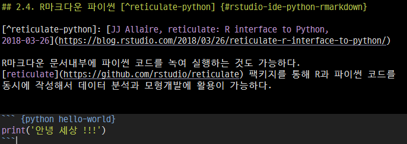

```{r, include=FALSE}
source("tools/chunk-options.R") 
```


# 1. RStudio IDE 파이썬 {#rstudio-ide-python}

[RStudio](https://www.rstudio.com/)는 R언어를 주력으로 하고 있지만, [쥬피터 노트북](http://jupyter.org/)과 마찬가지로 
다양한 언어를 지원한다. 마치 쥬피터 노트북에서 R을 개발언어로 사용할 수 있는 것과 유사하다.
[RStudio](https://www.rstudio.com/) IDE가 익숙하다면 파이썬과 R을 엮어서 사용하는 것도 좋을 듯 하다.
사실 많은 코드가 이미 파이썬으로 개발되어 있어 굳이 R로 다시 짤 필요가 없기는 하다.

# 2. RStudio 파이썬 설정 {#rstudio-ide-python-setup}

## 2.1. 파이썬 설치 {#rstudio-ide-python-install}

가장 먼저 파이썬을 설치한다. [아나콘다(Anaconda)](https://www.anaconda.com/download/) 배포판에 포함된 파이썬, 혹은
[파이썬](https://www.python.org/downloads/)을 다운로드하여 설치한다. 얼마전까지 파이썬2 혹은 파이썬3 뭐가 맞는 것인지 논쟁이 있었지만,
이제는 파이썬3이 대세로 굳어져가고 있다. 

RStudio를 열고 콘솔(console) 패널 옆 터미널(terminal)을 열고 윈도우의 경우 `where python` 명령어를 입력하게 되면 
파이썬이 설치된 것이 확인된다.

``` {r r-terminal, eval = FALSE}
C:\Users\xwMOOC\rstudio>where python
C:\Python34\python.exe
C:\Users\xwMOOC\AppData\Local\Continuum\Anaconda3\python.exe
```

## 2.2. 헬로 월드 {#rstudio-ide-python-hello-world}

작성중인 파이썬 코드 행에 `**CTRL** + **Shift** + 엔터` 치게되면 해당 결과가 콘솔(console) 창에서 확인이 가능하다.

``` {r r-console, eval = FALSE}
> system("python code/01-hello.py")
안녕 세상!!!
```

## 2.3. 파이썬 코드 실행 {#rstudio-ide-python-run-code}

이제 `01-hello.py`로 파이썬 코드를 작성하고 나서 저장한다. 
그리고 나서 단축키로 `**CTRL** + **Shift** + t` 키를 입력하게 되면 터미널 창으로 이동된다.
`python 01-hello.py` 명령어를 입력하게 되면 작성한 파이썬 프로그램을 실행할 수 있다.

``` {r run-file, eval = FALSE}
C:\Users\xwMOOC\20_python\code>python 01-hello.py
안녕 세상!!!
```

## 2.4. R마크다운 파이썬 [^reticulate-python] {#rstudio-ide-python-rmarkdown}

[^reticulate-python]: [JJ Allaire, reticulate: R interface to Python, 2018-03-26](https://blog.rstudio.com/2018/03/26/reticulate-r-interface-to-python/)

R마크다운 문서내부에 파이썬 코드를 녹여 실행하는 것도 가능하다.
[reticulate](https://github.com/rstudio/reticulate) 팩키지를 통해 R과 파이썬 코드를 동시에 작성해서 데이터 분석과 모형개발에 활용이 가능하다.




실제 파이썬 코드 실행결과는 다음 예제에서 확인이 가능하다.

``` {python hello-world}
print('안녕 세상 !!!')
```
