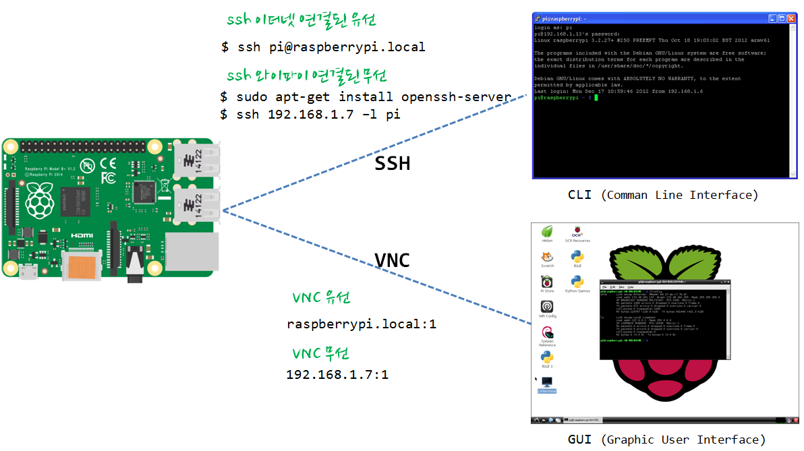

```{r, include=FALSE}
source("tools/chunk-options.R") 
```

## 1. 라즈베리 파이에 접근하는 세가지 방법

라즈베리 파이에 접근하는 세가지 방법은 명령라인인터페이스(CLI), 데스크톱(GUI), 웹을 통한 세가지 방법이 있다.

### 1.1. XRDP 원격 데스크톱 접근

``` {r rpi-connect-cli, eval=FALSE}
# 원격 데스트톱 연결 프로그램 설치 및 설정
pi@raspberrypi ~ $ sudo apt-get update
pi@raspberrypi ~ $ sudo apt-get install -y xrdp
pi@raspberrypi ~ $ sudo service xrdp restart # sudo /etc/init.d/xrdp start 명령어도 가능.
```

|  원격 데스크톱 | 승인 | 연결 연결된 화면 | 
|:-------------------------------:|:----------------------------------:|:----------------------------------:|
|     |    |    | 

원격 데스크톱 서비스를 이용할 수 있는 다양한 방법이 있다.
[Xming](http://www.raspians.com/knowledgebase/?knowledgebase=setting-up-a-remote-desktop-view-the-pi-on-your-windows-pc/), [VNC](https://www.raspberrypi.org/documentation/remote-access/vnc/)를 사용하여 `mstsc` 원격 데스크톱 연결과 같은 효과를 낼 수 있다. 

### 1.2. 명령라인 인터페이스 CLI를 통한 방법

__Git Bash__를 설치하고 콘솔에서 라즈베리 파이 IP를 입력한다. 명령어는 `ssh pi@192.168.103.107`으로 ssh (보안쉘, Secure Shell)로 `192.168.103.107` IP를 갖는 호스트 컴퓨터에 `pi`사용자로 로그인한다.
비밀번호는 `raspberry`를 입력하면 라즈베리파이에 로그인했다.

``` {r rpi-connect-gui, eval=FALSE}
admin@STATxxxxxx /c/pyr-cloudlayer (gh-pages)
$ ssh pi@192.168.103.107
pi@192.168.103.107 s password:
Linux raspberrypi 3.18.11-v7+ #781 SMP PREEMPT Tue Apr 21 18:07:59 BST 2015 armv7l

The programs included with the Debian GNU/Linux system are free software;
the exact distribution terms for each program are described in the
individual files in /usr/share/doc/*/copyright.

Debian GNU/Linux comes with ABSOLUTELY NO WARRANTY, to the extent
permitted by applicable law.
Last login: Thu Jul 30 16:59:13 2015 from 192.168.103.125
pi@raspberrypi ~ $
```

### 1.3. 웹 인터페이스를 통한 방법

라즈베리파이를 웹서버로 만들기 위해서 아파치 웹서버를 설치한다. `sudo apt-get install -y apache2` 명령어를 콘솔에서 입력하면 아파치 웹서버가 설치되어 웹브라우져를 통해 라즈베리파이에 접근할 수 있다.

``` {r rpi-connect-webserver, eval=FALSE}
pi@raspberrypi ~ $ sudo apt-get install -y apache2
```

`/var/www/` 폴더에 `index.html` 파일을 수정하거나 개발된 웹서비스를 웹서비스 제공 디렉토리에 저장하면 된다.


## 2. 유선이나 무선상태에서 가장 많이 사용되는 CLI/GUI 로그인



유선이나 무선을 통해 다양한 방식으로 라즈베리파이에 접속을 할 수 있다.
그리고, 명령라인 인터페이스(CLI), 그래픽사용자 인터페이스(GUI)를 통해 접속하는 방법도 생각할 수 있다.

유선이나 무선 각기 장단점이 있으므로 개발자가 처한 환경에서 최적의 선택을 하면 좋겠다.
유선인 경우 별도 IP주소 확인이 필요하지 않고 안정적인 연결이 가능한 반면 별도 연결선이 필요하고 개발환경이 
와이어링 연결선으로 지저분해지는 단점은 감수한다.

무선은 깔끔하기는 하지만 IP주소를 확인해야 하고 이에 대해 여러 설정을 해줘야 하는 번거러음이 있다.

### 2.1. 무선 CLI 터미널 접속

윈도우를 비롯한 리눅스와 맥에서 `ssh` 로그인 하는 경우 먼저 `hostname -I` 명령어를 통해 IP 주소를 확인하고 이를 확인해서 `ssh pi@<IP주소>` 방식으로 로그인한다.
 
RPi 터미널에서 먼저 사전에 확인할 사항은 IP주소를 확인한 것이다.


``` {r rpi-connect-check-hostname, eval=FALSE}
pi@raspberrypi:~ $ hostname -I
192.168.0.11
```

리눅스 혹은 맥 터미널에서 확인된 RPi IP주소, `192.168.0.11` 입력하여 로그인한다.
 
``` {r rpi-connect-ssh, eval=FALSE}
$ ssh pi@192.168.0.11 
pi@192.168.0.11 s password: 
```


