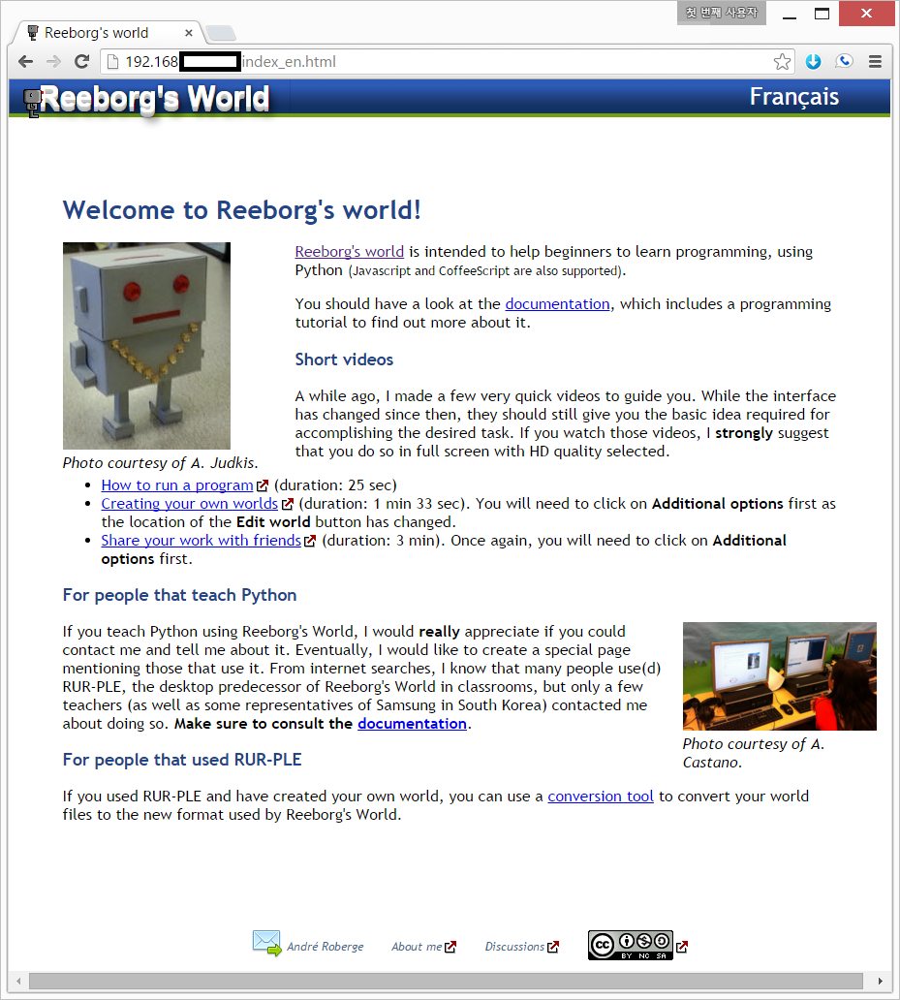

> ### 학습 목표 {.objectives}
>
> * 러플, 리보그, Karel 봇을 살펴본다.

### 1. [리보그](http://reeborg.ca/index_en.html) 소개와 설치

리보그는 [러플](http://rur-ple.xwmooc.org/)의 후속작으로 Andre Roberge가 Richard Pattis의 영감을 강하게 받아 처음 프로그래밍을 접하는 초보자에 핵심적인 내용을 짧은 시간내에 학습하도록 고안되었다.

인증이나 로그인도 필요없고, 필요하면 [GitHub](https://github.com/aroberge/reeborg)에서 리보그를 다운로드 받아 설치하여 한 교실에서 웹서버에 올려 학급친구들과 즐겁게 프로그래밍을 학습할 수 있다.

> #### 리보그 개발 비밀  {.callout}
> 
> 리보그는 프로그래밍 언어로 파이썬에 주력하고 있으며, 이를 통해 동일한 패러다임을 같는 언어인 자바스크립트도 함께 
> 익힐 수 있도록 했으며, 특히, 웹브라우져 프론트엔트에 구현된 [브라이썬(brython)](http://brython.info/)이라는 파이썬 구현결과물 기반위에 
> 개발되었다.
>
> - [파이썬(python)](https://www.python.org/)  
> - [브라이썬(brython)](http://brython.info/)

### 2. 라즈베리 파이 리보그 프로그래밍 환경 설정

라즈베리 파이에 리보그를 설치해서 학급에서 프로그래밍을 연습하기 위해서는 다음과 같이 설정한다.

> #### 리보그 프로그래밍 자재명세서(BOM)  {.getready}
>
> [아파치(Apache)](https://httpd.apache.org/): 웹서버
> [Git](https://git-scm.com/): 이력관리 및 협업
> [리보그(Reeborg)](https://github.com/aroberge/reeborg): 리보그 봇

`sudo apt-get install -y apache2` 명령어를 통해서 아파치 웹서버를 설치한다. [^1]

`sudo service apache2 restart` 명령어는 혹시, 아파치 웹서버가 잘못될 경우 재시작하는 명령어다.

~~~ {.shell}
pi@raspberrypi ~ $ sudo apt-get update
pi@raspberrypi ~ $ sudo apt-get upgrade
pi@raspberrypi ~ $ sudo apt-get install -y apache2
pi@raspberrypi ~ $ sudo service apache2 restart
pi@raspberrypi ~ $ ifconfig
~~~
`ifconfig` 명령어를 통해서 **eth0**에 나온 IP 주소 `192.168.XXX.XXX`를 노트북 혹은 데스크톱에서
웹브라우져를 열고 입력하면 라즈베리 파이 웹서버에 접속하게 된다.

~~~ {.output}
eth0      Link encap:Ethernet  HWaddr b8:XX:XX:XX:c2:97
          inet addr:192.168.XXX.XXX  Bcast:192.168.XXX.XXX  Mask:255.255.255.0
          UP BROADCAST RUNNING MULTICAST  MTU:1500  Metric:1
          RX packets:33281 errors:0 dropped:26 overruns:0 frame:0
          TX packets:15552 errors:0 dropped:0 overruns:0 carrier:0
          collisions:0 txqueuelen:1000
          RX bytes:45279452 (43.1 MiB)  TX bytes:1470682 (1.4 MiB)

lo        Link encap:Local Loopback
          inet addr:127.0.0.1  Mask:255.0.0.0
          UP LOOPBACK RUNNING  MTU:65536  Metric:1
          RX packets:157 errors:0 dropped:0 overruns:0 frame:0
          TX packets:157 errors:0 dropped:0 overruns:0 carrier:0
          collisions:0 txqueuelen:0
          RX bytes:13212 (12.9 KiB)  TX bytes:13212 (12.9 KiB)
~~~
`git clone https://github.com/aroberge/reeborg.git` 으로 리보그 소스 코드를 다운로드를 기본설정된 **reeborg** 디렉토리로 다운로드 받는다. 다운로드 받은 리보그 프로그램을 아파치 웹서버 디렉토리로 이동한다.

~~~ {.shell}
pi@raspberrypi ~ $ git clone https://github.com/aroberge/reeborg.git
pi@raspberrypi ~ $ sudo mv reeborg/* /var/www
~~~

마지막으로 웹 브라우져를 열고 주소창에 `192.168.XXX.XXX/index_en.html`을 입력한다.

[^1]: [SETTING UP AN APACHE WEB SERVER ON A RASPBERRY PI](https://www.raspberrypi.org/documentation/remote-access/web-server/apache.md)