```{r, include=FALSE}
source("tools/chunk-options.R") 
```


# 1. 블록 프로그래밍에서 텍스트 프로그래밍으로 옮겨타기 [^future-learn-block-text] {#block-text}

[^future-learn-block-text]: [Future Learn, Scratch to Python: Moving from Block- to Text-based Programming](https://www.futurelearn.com/courses/block-to-text-based-programming)

스크래치와 같은 블록(Block) 프로그래밍 언어에서 파이썬과 같은 텍스트(text) 프로그래밍 언어로 옮겨타야 하는 이유는 여러가지가 있다.
스크래치와 같은 블록 프로그래밍 언어가 재미있고 사용하기 간단하고 누구나 접근 용이성이 있는 것은 사실이다.
하지만 새로운 언어를 배우는 것이 매우 고통스럽지만 그럼에도 불구하고 텍스트 프로그래밍을 학습해야 하는 이유는 
실제 세상과 의사소통을 하는데 텍스트 프로그래밍 언어가 많이 사용되기 때문이다.
그리고, 블록 프로그래밍에서 불가능한 것이 텍스트 프로그래밍에서는 매우 쉽게 구현될 수 있는 것도 큰 이유가 된다.

따라서, 텍스트 프로그래밍으로 넘어가는 것은 정답인데 너무 빨리 입문하게 되면 프로그래밍 자체를 버려버릴 수도 있고,
너무 늦게 입문하게 되면 새로운 언어를 학습하는 것에 주저할 수 있다. 적절한 시점에 스크래치와 같은 블록 프로그래밍 언어에서 
파이썬과 같은 텍스트 프로그래밍을 시작하는 과정이 필수적으로 생각된다.

# 2. 스크래치 파이썬 구문 비교 {#scratch-python-syntax}

## 2.1. 변수선언 {#scratch-python-syntax-variable}

- 오랜지 색상: **스크립트** &rarr; **데이터** &rarr; **변수 만들기**

변수를 선언하여 값을 저장하여 다시 꺼내서 사용하는 경우 스크래치 블록을 사용하는 경우와 파이썬 코드로 작성한 경우가 다음과 같이 비교된다.


<div class = "row">
  <div class = "col-md-6">

  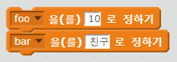

  </div>
  <div class = "col-md-6">
``` {r python-variable, eval=FALSE}
foo = 10
bar = "친구"
```  
  </div>
</div>


## 2.2. 변수값 증가 {#scratch-python-syntax-increment}

- 오렌지 색상: **스크립트** &rarr; **데이터** &rarr; **변수 만들기**

변수값을 1씩 증가 시키거나 감소시키는 경우 다음과 같이 블록을 사용하였으나 파이썬에서는 변수명에 1을 더하는 방식으로 프로그래밍한다.

<div class = "row">
  <div class = "col-md-6">

  

  </div>
  <div class = "col-md-6">
``` {r python-increment, eval=FALSE}
foo = foo + 1 
# 혹은
foo += 1 
```  
  </div>
</div>

## 2.3. 단순 출력 {#scratch-python-syntax-output}

- 보라색 색상: **스크립트** &rarr; **형태** 

프로그램 실행결과를 확인하는 가장 기초적인 방법이 화면에 찍어보는 것이다.
이를 위해서 텍스트 원문을 찍기도 하고 변수에 넣었던 값을 화면에 찍기도 한다.

<div class = "row">
  <div class = "col-md-6">

  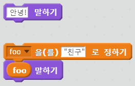

  </div>
  <div class = "col-md-6">
``` {r python-print, eval=FALSE}
print('안녕!')
print(foo)
```  
  </div>
</div>


## 2.4. 조건 반복문 {#scratch-python-syntax-conditional-loop}

- 겨자색 색상: **스크립트** &rarr; **제어** 

앞서 `bar` 변수에 값을 설정한 후에 `bar`값이 10보다 클 때까지 겨자색 내부에 쌓인 블록을 실행하는데 `bar` 변수값을 초기 1에서 반복이 1회 될때마다 1씩 증가시키고 그 값을 말하기로 출력시키는 프로그램을 파이썬으로 작성한다.

<div class = "row">
  <div class = "col-md-6">

  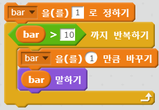

  </div>
  <div class = "col-md-6">
``` {python python-conditional-loop}
bar = 1
while not bar > 10:
    bar += 1
    print(bar)
```
  </div>
</div>


## 2.5. 무한 반복문 {#scratch-python-syntax-infinite-loopp}

- 겨자색 색상: **스크립트** &rarr; **제어** 

무한 반복문을 구현하는 방식은 스크래치에서 `무한 반복하기` (forever) 블록을 사용하는 반면 파이썬에서는 `while` 문에 조건식을 `True`로 설정하면 된다.

<div class = "row">
  <div class = "col-md-6">

  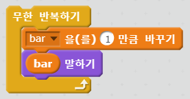

  </div>
  <div class = "col-md-6">
``` {r python-infinite-loop, eval = FALSE}
while true:
    bar += 1
    print(bar)
```
  </div>
</div>

## 2.6. 조건 선택 {#scratch-python-syntax-conditional-selection}

- 겨자색 색상: **스크립트** &rarr; **제어** 

스크래치는 조건 선택을 위한 두가지 블록을 가지고 있고, 만약 그 이상의 다중선택이 필요한 경우 블록 내부에 중첩하여 사용한다.
파이썬은 `if`, `elif`, `else`를 조합해서 사용한다. 

### 2.6.1. 단순 조건 선택 {#scratch-python-syntax-conditional-selection-01}

<div class = "row">
  <div class = "col-md-6">

  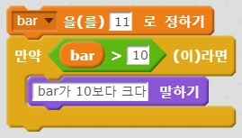

  </div>
  <div class = "col-md-6">
``` {python python-conditional-selection-01}
bar = 11
if bar > 10:
    print("bar는 10 보다 크다.")
```
  </div>
</div>

### 2.6.2. 둘중 한가지 조건 선택 {#scratch-python-syntax-conditional-selection-02}

<div class = "row">
  <div class = "col-md-6">

  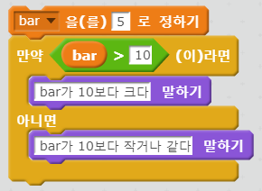

  </div>
  <div class = "col-md-6">
``` {python python-conditional-selection-02}
bar = 5
if bar > 10:
    print("bar는 10 보다 크다.")
else:
    print("bar는 10 보다 작거나 같다")
```
  </div>
</div>

### 2.6.3. 둘가지 이상 조건 선택 {#scratch-python-syntax-conditional-selection-03}

<div class = "row">
  <div class = "col-md-6">

  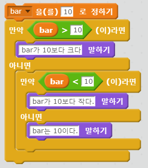

  </div>
  <div class = "col-md-6">
``` {python python-conditional-selection-03}
bar = 10
if bar > 10:
    print("bar는 10 보다 크다.")
elif bar < 10:
    print("bar는 10 보다 작다")
else:
    print("bar는 10이다")
```
  </div>
</div>


## 2.7. 동일함 평가 {#scratch-python-syntax-equality}

- 연두색 색상: **스크립트** &rarr; **연산** 

연산 블록에서 `=`을 동일함 평가를 위해서 사용하는데, 파이썬에서는 `=`이 변수에 값을 할당하는 연산자로 사용되어서 `==` 을 동일하다는 것을 평가하는데 사용한다.

<div class = "row">
  <div class = "col-md-6">

  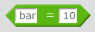

  </div>
  <div class = "col-md-6">
``` {python python-conditional-equality}
bar = 9
bar == 10
print(bar == 10)
```
  </div>
</div>


## 2.8. 리스트(list) {#scratch-python-syntax-list}

- 오렌지 색상: **스크립트** &rarr; **데이터**  &rarr; **리스트 만들기**

스크래치에서는 변수생성하는 방식과 동일하게 리스트를 생성시킬 수 있다.

<div class = "row">
  <div class = "col-md-6">

  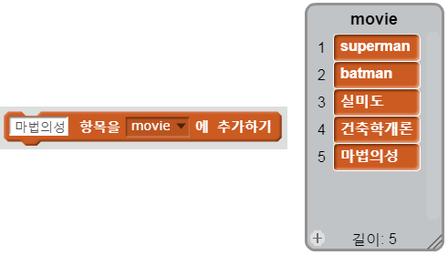

  </div>
  <div class = "col-md-6">
``` {python python-conditional-list}
movies = ['superman', 'batman', '실미도', '건축학개론', '마법의성']
print(movies)
```
  </div>
</div>


### 2.8.1. 리스트(list) 항목추가 {#scratch-python-syntax-list-append}

스크래치에서 리스트 항목 추가할 때 `리스트 만들기` 블록을 사용한다.
파이썬에서 리스트 객체에 `append()` 메쏘드를 사용해서 리스트 원소를 추가시킨다.

<div class = "row">
  <div class = "col-md-6">

  

  </div>
  <div class = "col-md-6">
``` {python python-conditional-list-append}
movies.append('바람과 함께 사라지다')
print(movies)
```
  </div>
</div>

### 2.8.2. 리스트(list) 항목 제거 {#scratch-python-syntax-list-remove}

스크래치에서 리스트 항목 추가할 때 `리스트 만들기` 블록을 사용한다.
파이썬에서 리스트 객체에 `pop()` 메쏘드를 사용해서 리스트 원소를 제거한다.

<div class = "row">
  <div class = "col-md-6">

  

  </div>
  <div class = "col-md-6">
``` {python python-conditional-list-pop}
movies.pop(0)
print(movies)
```
  </div>
</div>


## 2.9. 랜덤(random) 무작위 {#scratch-python-syntax-random}

- 연두색 색상: **스크립트** &rarr; **연산** 

`난수` 블록을 선택하여 랜덤(random) 무작위 난수를 발생시킬 수 있다.
즉, 1부터 10 사이 난수를 무작위로 발생시킬 수 있는데, 파이썬에서는 `random` 모듈을 사용한다.


<div class = "row">
  <div class = "col-md-6">

  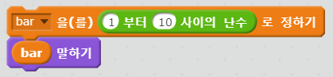

  </div>
  <div class = "col-md-6">
``` {python python-random}
from random import randint
bar = randint(1,10)
print(bar)
```
  </div>
</div>


### 2.9.1. 리스트 목록 중 랜덤(random) 무작위 선택 {#scratch-python-syntax-random-choice}

- 연두색 색상: **스크립트** &rarr; **연산** 

리스트에 저장된 항목을 동일한 방식으로 무작위 추출을 할 수 있다.
먼저 변수를 지정하고 나고, 지정된 변수에 무작위로 추출할 항목을 `movie` 리스트에서 뽑아내서 이를 말하기로 출력한다.

파이썬에서는 `random` 모듈에서 `choice` 함수로 무작위 영화를 하나 추출시킨다.

<div class = "row">
  <div class = "col-md-6">

  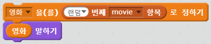

  </div>
  <div class = "col-md-6">
``` {python python-random-choice}
from random import choice
movie = choice(movies)
print(movie)
```
  </div>
</div>

## 2.10. 문자열 붙이기 {#scratch-python-syntax-concatenate}

- 연두색 색상: **스크립트** &rarr; **연산** 

`연산`에서 `결합하기` 블록을 선정하여 두 문자열을 결합시킨다.
파이썬에서는 `+` 연산자가 간단히 그 역할을 대신 수행한다.

<div class = "row">
  <div class = "col-md-6">

  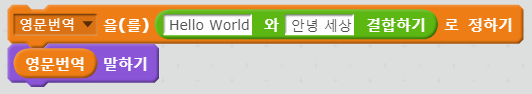

  </div>
  <div class = "col-md-6">
``` {python python-random-concatenate}
translate = "Hello World" + "안녕세상"
print(translate)
```
  </div>
</div>

## 2.11. 색인 찾기(indexing) {#scratch-python-syntax-index}

- 연두색 색상: **스크립트** &rarr; **연산** 

리스트에 저장된 항목을 색인(index)을 활용하여 추출해낼 수 있다.
먼저 변수를 지정하고 나고, 색인을 지정하여 `movie` 리스트에서 뽑아내서 이를 말하기로 출력한다.

파이썬에서 -1 으로 색인값을 지정하면 리스트의 가장 마지막 항목이 추출된다.

<div class = "row">
  <div class = "col-md-6">

  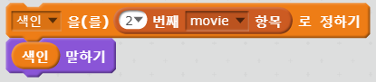

  </div>
  <div class = "col-md-6">
``` {python python-random-index}
print(movies[-1])
```
  </div>
</div>

## 2.12. 입력값 받기 {#scratch-python-syntax-input}

- 하늘색 색상: **스크립트** &rarr; **감지** 

`감지`에서 `묻고 기다리기` 블록을 선택하여 사용자가 입력한 값을 변수에 저장하고 이를 프로그램에서 사용한다.


<div class = "row">
  <div class = "col-md-6">

  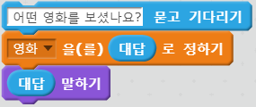

  </div>
  <div class = "col-md-6">
``` {r python-random-input, eval =FALSE}
movie = input("어떤 영화를 보셨나요?")
```
  </div>
</div>

## 2.13. 도전과제 {#scratch-python-syntax-challenge}

파이썬 프로그램으로 작성된 코드를 스크래치 블록 프로그래밍 언어로 변환시킨다.
이름을 묻고 이름을 입력받아 반갑다는 인사를 건내는 프로그램과 
나이를 물어보고 나이를 바탕으로 태어난 연도를 계산해내는 프로그램이다.

<div class = "row">
  <div class = "col-md-6">

  

  </div>
  <div class = "col-md-6">
``` {r python-random-challenge, eval =FALSE}
name = input("이름이 뭐꼬?")
print("안녕. " + name + "아 만나서 반가워^^;")
age = input("나이가 몇살이남?")
age = int(age)
print("태어난 연도가 "+ str(2017 - age)) 
```
  </div>
</div>


