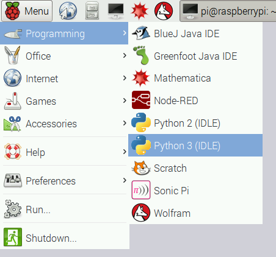
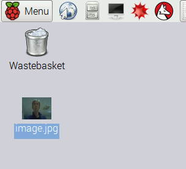
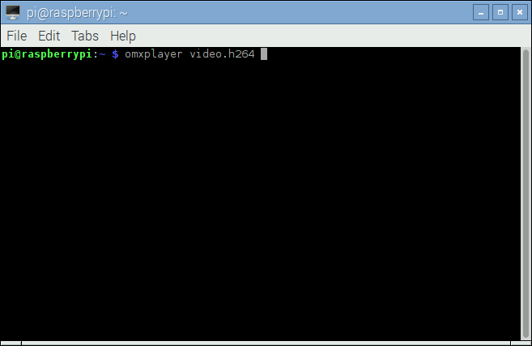
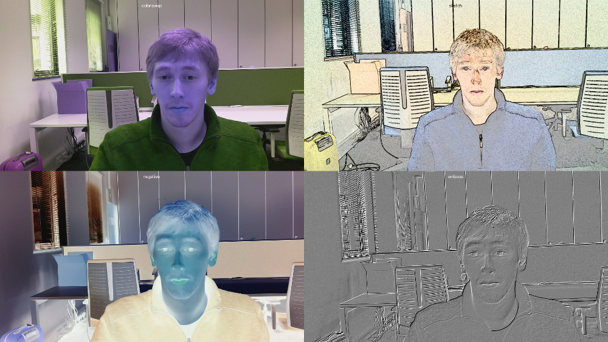

라즈베리파이 카메라 모듈(picamera, 파이카메라)을 사용해서 사진을 찍고, 동영상도 찍고, 이미지에 효과도 넣을 수 있다.

> ## 학습 목표 {.objectives}
>
> * 라즈베리파이에 카메라 모듈을 연결한다.
> * 파이썬으로 카메라 모듈을 제어한다.
> * `start_preview()` `stop_preview()` 명령어를 사용해서 카메라 미리보기를 제어한다.
> * `capture()` 명령어로 정지화면 사진을 찍는다.
> * `start_recording()` `stop_recording()` 명령어로 동영상을 촬영한다.
> * `omxplayer` 플레이어로 촬영한 동영상을 재생한다.
> * 휘도(brightness)와 명암(contrast)를 조정한다.
> * 이미지 효과와 노출 모드(exposure mode)를 적용한다.

> ### 원문 출처 및 저작 라이선스 {.getready}
>
> 이 번역의 원작 "[GETTING STARTED WITH PICAMERA](https://www.raspberrypi.org/learning/getting-started-with-picamera/)"은 라즈베리파이 재단에서 개발하여 공개하고 있다.
> 이 책은 크리에이티브 커먼스(Creative Commons)의 저작자표시(BY, Attribution), 동일조건변경허락(SA, Share-Alike) 라이선스(https://creativecommons.org/licenses/by-sa/2.0/kr/](https://creativecommons.org/licenses/by-sa/2.0/kr/) 를 준용합니다.

### 1. 필요한 하드웨어와 소프트웨어 

* 하드웨어
    * SD카드가 장착된 라즈베리 파이
    * 라즈베리파이 기본 주변장치(USB 마우스, 키보드, 전원장치 등)
    * 파이카메라
* 소프트웨어
    * 라즈비언 최신버젼 : `sudo apt-get dist-upgrade`

먼저 라즈베리파이 전원을 내리고, 라즈베리파이 카메라 포트에 파이카메라 모듈을 연결시킨다.
그리고 나서, 라즈베리파이을 켜고 소프트웨어를 활성화시킨다.

1. 카메라 포트 위치를 찾아 파이카메라를 연결시킨다:

2. 라즈베리파이 부팅해서 시작한다.

3. **Raspberry Pi Configuration Tool** 을 선택한다. `Menu > Preferences > Raspberry Pi Configuration Tool`.

4. 카메라 소프트웨어를 활성화시킨다:

만약 활성화되지 않았다면, 활성화시키고, 라즈베리파이를 재부팅한다.

### 2. 카메라 미리보기 기능

카메라를 연결시켰고, 소프트웨어도 활성화시켰으니, 카메라 미리보기 기능을 시작할 준비가 되었다.

1. `Menu` 주메뉴에서 **파이썬3(Python 3)** 을 선택해서 연다. `Menu > Programming > Python 3 (IDLE)`.

2. 새로 파일을 열고 `camera.py`로 저장한다. 절대로 `picamera.py` 파일명을 사용해서 저장하지 않는다.

3. 다음 코드를 `camera.py` 편집창에 타이핑한다.

~~~ {.python}
from picamera import PiCamera
from time import sleep

camera = PiCamera()

camera.start_preview()
sleep(10)
camera.stop_preview()
~~~

4. **Ctrl + S** 키를 눌러 입력한 내용을 저장하고 나서, **F5** 키를 눌러 실행시킨다.
카메라 미리보기 기능이 10 동안 동작하고 나서 종료된다. 카메라를 옮겨서 카메라가 촬영한 것을 미리보기 기능을 살펴본다.

생방송 카메라 비리보기 기능은 다음과 같이 모니터 화면을 꽉 채워야 된다.

**카메라 미리보기 기능은 라즈베리파이가 모니터에 직접 연결될 때만 동작된다. 원격연결(SSH, VNC)된 경우 카메라 미리보기 기능이 작동되지 않는다.**

5. 미리보기로 볼 때 위와 아래가 뒤바뀐 경우 다음 코드로 회전시켜 보정한다:

~~~ {.python}
camera.rotation = 180
camera.start_preview()
sleep(10)
camera.stop_preview()
~~~

이미지를 `90`, `180`, `270`도로 회전시키거나 `0`으로 설정해서 초기 재설정시킨다.

6. 알파수준을 조정해서 카메라 미리보기 투명도를 변경시킬 수도 있다:

~~~ {.python}
from picamera import PiCamera
from time import sleep

camera = PiCamera()

camera.start_preview(alpha=200)
sleep(10)
camera.stop_preview()
~~~

`alpha` 값은 `0` 에서 `255` 사이 값을 갖는다.

### 3. 정지화면 사진

카메라 모듈에 대한 가장 일반적인 사용법은 정지화면 사진을 찍는 것이다.

1. `sleep` 시간을 줄이도록 코드를 수정하고 `camera.picture()` 행을 추가한다:

~~~ {.python}
camera.start_preview()
sleep(5)
camera.capture('/home/pi/Desktop/image.jpg')
camera.stop_preview()
~~~

사진을 캡쳐하기 전에 적어도 2초 정도 준비 시간을 두는 것이 중요한데, 이유는 센서에게 조명을 준비할 시간을 제공하기 위해서다.

2. 코드를 실행하면 정지화면 사진을 찍기 전에 5초 동안 카메라 미리보기 기능이 열려지게 된다.
사진이 찍힐 때, 잠깐동안 다른 해상도로 미리보기 기능을 조정하는 것도 보인다.

3. 바탕화면에 찍힌 사진이 보이게 된다. 파일 아이콘을 두번 클릭해서 사진을 연다.

4. 루프를 추가해서 연속해서 사진을 5장 찍어본다.

~~~ {.python}
camera.start_preview()
for i in range(5):
    sleep(5)
    camera.capture('/home/pi/Desktop/image%s.jpg' % i)
camera.stop_preview()
~~~

변수 `i`는 현재 반복 인덱스 숫자, `0` 에서 `4` 까지 숫자다. 
따라서, 이미지는 `image0.jpg`, `image1.jpg` ... 저장된다.

5. 코드를 다시 실행하는데 카메라 위치를 고정시킨다. 5초마다 사진을 한장씩 찍게 된다.

6. 다섯번째 사진이 찍히게 되면, 미리보기 기능이 닫혀진다. 이제 바탕화면에 찍힌 이미지를 살펴보면,
새로운 사진이 5장 찍힌게 보일 것이다.

### 4. 동영상 촬영

정지화면 사진을 찍는데 카메라를 사용했으니, 동영상 비디오 녹화로 옮겨보자.

1. 코드를 수정해서 `capture()`를 `start_recording()`, `stop_recording()` 함수로 교체한다.

~~~ {.python}
camera.start_preview()
camera.start_recording('/home/pi/video.h264')
sleep(10)
camera.stop_recording()
camera.stop_preview()
~~~

2. 상기 파이썬 코드를 실행시키면, 10초 동안 동영상을 녹화하고 나서 미리보기 기능이 닫힌다.

3. 동영상을 재생시키려면, 상단 작업막대에서 검은색 모니터 아이콘을 클릭해서 터미널 윈도우를 연다.

4. 다음 명령어를 입력하고 **엔터** 키를 눌러 동영상을 재생시킨다.

~~~ {.shell}
omxplayer video.h264
~~~

5. 촬영된 동영상이 재생된다. `omxplayer` 전송 프레임률이 빠르게 설정되어 있어서 촬영된 것보다 실제로 빠르게 재생된다.

### 5. 효과

처음에, `camera = PiCamera()` 명령어를 통해서 `camera` 객체를 생성했다.
`camera` 객체를 조작해서 설정을 조정할 수 있다.
카메라 소프트웨어는 다양한 효과와 더불어 적용할 수 있는 설정을 다수 제공한다.
일부 기능과 효과는 미리보기에만 적용되고, 사진찍기에는 적용되지 않고, 다른 기능과 효과는 사진찍기에만 적용되지만,
많은 경우 양쪽 모두 적용된다.

1. 사진찍기 해상도는 사전에 설정할 수 있다.
기본디폴트 설정으로 모니터 해상도에 맞춰지지만, 최대 해상도는 정지화면 사진촬영에 $ 2592 \times 1944$, 동영상 녹화에 $1920 \times 1080$ 이 된다. 다음 예제는 해상도를 최대로 설정한 것이다. 최대 해상도를 유지하도록 전송 프레임율을 `15`로 맞췄다.

~~~ {.python}
camera.resolution = (2592, 1944)
camera.framerate = 15
camera.start_preview()
sleep(5)
camera.capture('/home/pi/Desktop/max.jpg')
camera.stop_preview()
~~~

2. 허용되는 최소 해상도는 $64 \times 64$ 다. 최소 해상도로 사진을 한장 찍어본다.

3. 이미지에 `annotate_text` 함수로 텍스트를 쉽게 추가할 수도 있다. 다음을 시도해 본다.

~~~ {.python}
camera.start_preview()
camera.annotate_text = "Hello world!"
sleep(5)
camera.capture('/home/pi/Desktop/text.jpg')
camera.stop_preview()
~~~

4. 밝기 설정도 바꿀 수 있다. 밝기는 `0` 에서 `100` 값을 갖을 수 있고, 기본디폴트 설정값은 `50` 이다.
설정을 다음과 같이 다른 값으로 조정해 본다.

~~~ {.python}
camera.start_preview()
camera.brightness = 70
sleep(5)
camera.capture('/home/pi/Desktop/bright.jpg')
camera.stop_preview()
~~~

5. 루프로 밝기를 조정해 보고, 현재 밝기를 주석을 달아 텍스트로 표시한다:

~~~ {.python}
camera.start_preview()
for i in range(100):
    camera.annotate_text = "Brightness: %s" % i
    camera.brightness = i
    sleep(0.1)
camera.stop_preview()
~~~

6. 마찬가지 방식으로 명도에도 같은 작업을 적용한다:

~~~ {.python}
camera.start_preview()
for i in range(100):
    camera.annotate_text = "Contrast: %s" % i
    camera.contrast = i
    sleep(0.1)
camera.stop_preview()
~~~

7. 다음 코드로 주석 텍스트 크기도 설정할 수 있다.

~~~ {.python}
camera.annotate_text_size = 50
~~~

유효한 텍스트 크기는 `6` 에서 `160`까지다. 기본디폴트 설정값은 `32` 다.

8. 주석 텍스트 색상도 바꿀 수 있다. 먼저 `Color`를 `import` 문에 추가해서 가져온다.

~~~ {.python}
from picamera import PiCamera, Color
~~~

그리고 나서, 다음과 같이 코드를 수정한다:

~~~ {.python}
camera.start_preview()
camera.annotate_background = Color('blue')
camera.annotate_foreground = Color('yellow')
camera.annotate_text = " Hello world "
sleep(5)
camera.stop_preview()
~~~

9. `camera.image_effect`를 사용해서 특별한 이미지 효과를 적용할 수 있다.
가능한 선택옵션은 다음과 같다: `none`, `negative`, `solarize`, `sketch`, 
`denoise`, `emboss`, `oilpaint`, `hatch`, `gpen`, `pastel`, `watercolor`, `film`, 
`blur`, `saturation`, `colorswap`, `washedout`, `posterise`, `colorpoint`, `colorbalance`, 
`cartoon`, `deinterlace1`, `deinterlace2`.
기본디폴트 설정은 `none`으로 되어 있다. 하나를 골라 효과를 적용해 본다.

~~~ {.python}
camera.start_preview()
camera.image_effect = 'colorswap'
sleep(5)
camera.capture('/home/pi/Desktop/colorswap.jpg')
camera.stop_preview()
~~~

10. 미리보기 기능에서 다양한 이미지 효과를 루프를 돌려 시도해 본다.

~~~ {.python}
camera.start_preview()
for effect in camera.IMAGE_EFFECTS:
    camera.image_effect = effect
    camera.annotate_text = "Effect: %s" % effect
    sleep(5)
camera.stop_preview()
~~~

11. `camera.awb_mode` 함수를 사용해서 미리 설정된 모드에 자동 백색 밸런스 기능을 설정해서 특별한 효과를 적용시킨다.
가능한 선택옵션은 다음과 같다: `off`, `auto`, `sunlight`, `cloudy`, 
`shade`, `tungsten`, `fluorescent`, `incandescent`, `flash`, `horizon`.
기본디폴트 설정은 `auto`다. 하나를 골라 적용해본다.

~~~ {.python}
camera.start_preview()
camera.awb_mode = 'sunlight'
sleep(5)
camera.capture('/home/pi/Desktop/sunlight.jpg')
camera.stop_preview()
~~~

`camera.AWB_MODES` 를 갖고 자동 백색 밸런스를 루프돌려 확인한다.

12. `camera.exposure_mode` 함수를 사용해서 미리 설정된 모드에 노출 기능을 설정한다.
가능한 선택옵션은 다음과 같다: `off`, `auto`, `night`, `nightpreview`, `backlight`, 
`spotlight`, `sports`, `snow`, `beach`, `verylong`, `fixedfps`, `antishake`, `fireworks`.
기본디폴트 설정은 `auto` 다. 하나를 골라 적용해본다.

~~~ {.python}
camera.start_preview()
camera.exposure_mode = 'beach'
sleep(5)
camera.capture('/home/pi/Desktop/beach.jpg')
camera.stop_preview()
~~~

`camera.EXPOSURE_MODES` 를 갖고 가능한 노출 모드를 루프돌려 확인한다.

좀더 자세한 내용은 [파이카메라 문서](https://picamera.readthedocs.org/)를 참조한다.
