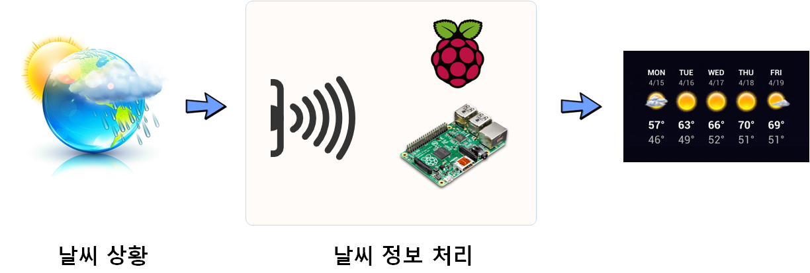
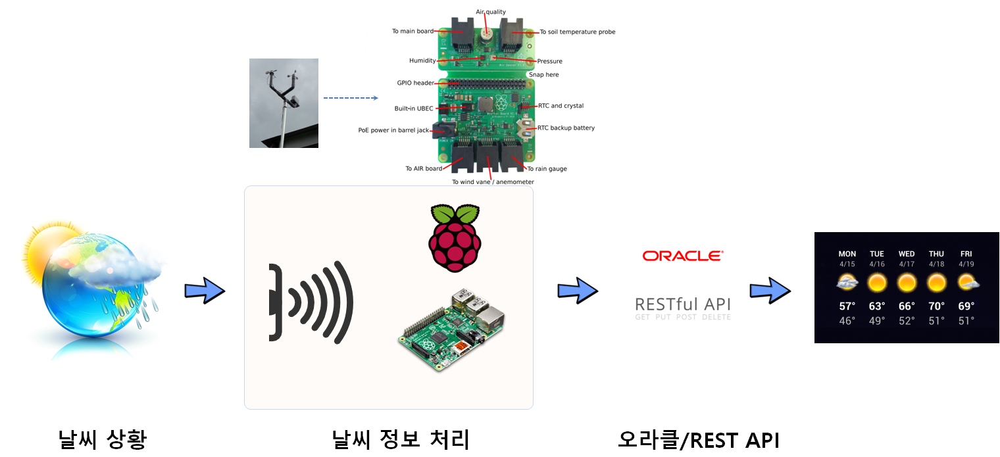

> ### 학습 목표 {.objectives}
>
> - 기상청에서 받아보던 날씨 정보를 직접 확인해보자.


## 라즈베리파이 생태계

기상청에서 받아보던 날씨 정보를 직접 나만의 기상시설을 만들어 보자.
기상청 예보 및 현재 기상 정보는 양질의 기상정보를 생산하기 위해서 숙련된 고급 전문인력과 
축적된 경험과 데이터, 그리고 최첨단 장비가 유기적으로 결합되어 있고 이렇게 생산된 정보를 
방송과 통신을 통해 대중에게 전달되는 과정을 거치게 된다.

하지만, 개인적으로 생각해보면 혹은 경험으로 보면 나하고 아무상관없는 정보가 될 수도 있다.
왜냐하면 내주변에 기상관측시설이 있어 그 정보를 바탕으로 날씨정보가 생산된다면 좋겠지만, 현실은 그렇지 못하다.
대한민국 모든 시민들의 날씨정보를 충족시킬 수 있기 위해서는 거의 모든 곳에 고가의 기상 관측 센서를 설치하고 
실시간으로 뿜어내는 대량의 데이터를 처리하고 이를 날씨 예측모형에 넣어 예보해야 하는데 그것이 그렇게 간단한 것은 아니다.

이에, 나만의 날씨정보를 만들어 낼 수 있도록 가그마한 기상대를 만들어 보자.



나만의 기상대를 만들때 필요한 것은 센서, 날씨 정보 처리장치, 출력 및 표현 방법이 필요하다.

- 센서: 감각모자(라즈베리파이 재단), GrovePi(덱스터)
- 날씨 정보 처리장치 : 라즈베리파이
- 출력 및 표현: 파이썬 `matplotlib`


## 날씨현황 감지

가장 먼저 날씨현황을 감지해야 하는데 여러가지 방법이 있지만 굳이 값비싼 기상정보 수집을 위한 기기를 갖추지 않고도 
외부에서 관측하여 처리한 정보를 실시간으로 바로 받아오는 방법도 가능하다. 즉 API를 활용하여 날씨정보를 바로 받아오는 것이다.

외부 웹 날씨 API를 사용하지 않고 가능한 다른 방식은 직접 기기를 설치해서 측정하고 데이터를 가공하여 적절한 날씨 정보로 변환하여 활용하는 방법이다.
이를 위해서 라즈베리파이 재단에서 제공하는 감각모자(SenseHAT), 덱스터(Dexter Industries)에서 제공하는 `GrovePi`를 활용한다.

### 웹 API [^rpi-web-api]

오라클에서 자금을 내어 아주 간단한 기상장비가 설치되면 각 기상장비에서 측정된 정보가 오라클로 넘어가고 
오라클에서는 이를 잘 정제하여 웹API REST 형태로 데이터를 제공한다. 자세한 사항은 
[RASPBERRY PI ORACLE WEATHER STATION FAQS](https://www.raspberrypi.org/education/weather-station/faqs/)를 참조한다.

| 센서명(영문) | 센서명 (국문)   |                     목적                           |
|--------------|-----------------|----------------------------------------------------|
|Rain gauge    | 강우            | 밀리미터 단위로 강우량 측정                        |
|Anemometer    | 풍량            | 시간당 킬로미터 단위로 바람속도 측정               |
|Weathervane   | 풍향            | 각도 단위로 바람의 방향 측정                       |
|Soil temperature probe| 토양온도| 섭씨 단위로 토양 온도 측정                         |
|Temperature sensor| 온도센서    | 섭씨 단위로 공기온도 측정                          |
|Humidity sensor| 습도센서       | 공기중의 함유된 상대습도를 측정                    |
|Pressure sensor| 기압센서       | 파스칼 단위로 대기압을 측정                        |
|Air quality sensor| 공기질      | 상대퍼센티지로 공기질 측정                         |



오라클에서 제공하는 REST API에 맞춰 데이터를 불러와서 파싱한 후에 온도와 시간만 뽑아 데이터를 저정하고 나서, 
온도변화를 시각화한다. 

``` {python rip-weather-webapi}
from requests import get
import matplotlib.pyplot as plt
from dateutil import parser

url = 'https://apex.oracle.com/pls/apex/raspberrypi/weatherstation/getallmeasurements/490722'

weather = get(url).json()
data = weather['items']

while 'next' in weather:
    url = weather['next']['$ref']
    print('fetching {0}'.format(url))
    weather = get(url).json()
    data += weather['items']

temperatures = [record['ambient_temp'] for record in data]
timestamps = [parser.parse(record['reading_timestamp']) for record in data]

plt.plot(timestamps, temperatures)
#plt.xlim(min(timestamps),max(timestamps))
plt.show()
```

### 웹 API [^rpi-web-api]
