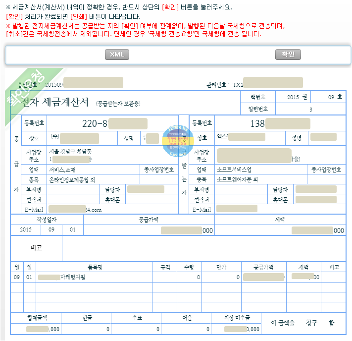

> ### 학습 목표 {.objectives}
>
> *  부가세 환급

### 1. 세금계산서

1. 

### 1. 부가가치세 환급

스타트업 초기 매출보다 매입이 크기 때문에 부가가치세를 환급받을 수 있다. 단, 대다수 스타업의 경우 부가가치세 환급은 1년에 두번만 가능하다. 즉, 1월과 7월에만 가능하기 때문에 몰아서 신청한다. 단, 고정자산 시설투자를 할 경우에는 조기 환급도 가능하다.

> ### 내용검증 오류내역 발생 {.callout} 
> 
> **개인사업자의 예정신고는 예정 및 시설투자로 인한 환급일때만 가능합니다.**라는 오류가 나오는 경우 1월과 7월에 부가가치세 환급 신청을 한다.

#### 1.1 부가가치세 환급 절차 

1. [국세청 홈택스](https://www.hometax.go.kr/) 회원가입한다.
1. 개인 및 스타트업 사업장 둘다 가능해서, 상단 `사업장선택`을 통해 스타트업으로 사용자를 변경한다.
1. `세금신고` &rarr; `부가가치세` 를 선택하고 `일반과세자` &rarr; `정기신고(확정/예정)` 을 선택한다.
1. `일반과세자 기본정보`를 입력하고, `일반과세자 신고내용`을 선택하고, `매입세액` &rarr; `작성하기`를 클릭하여 세부내역을 적어 넣는다.
    - `전자세금계산서 자료 조회`를 클릭하면 매입 시 주고받은 전자세금계산서가 나와 이를 근거로 환급신청을 한다.
1. 모든 내용을 확인하고  `신고서 입력완료`를 클릭한다.   

