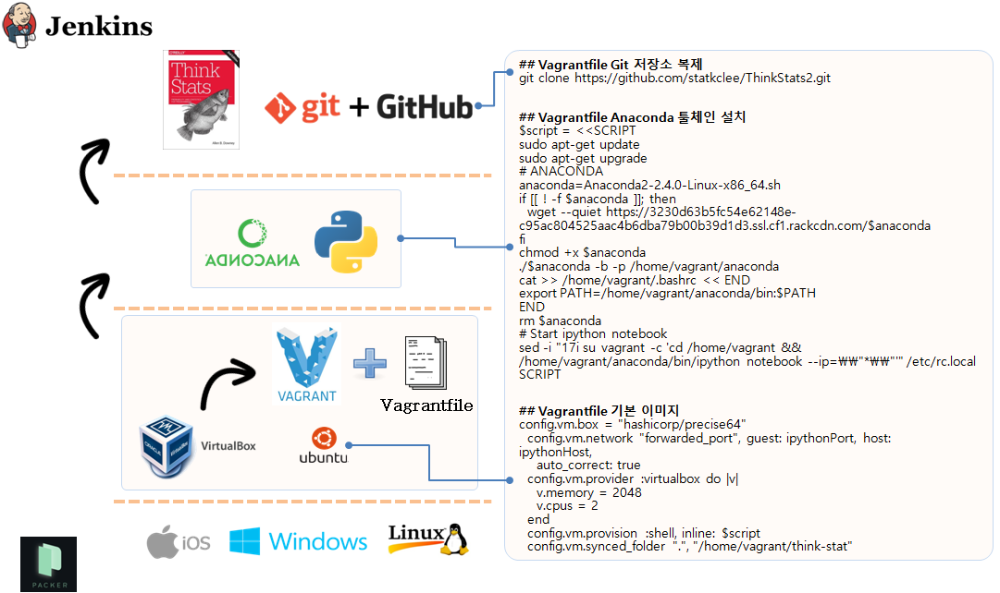
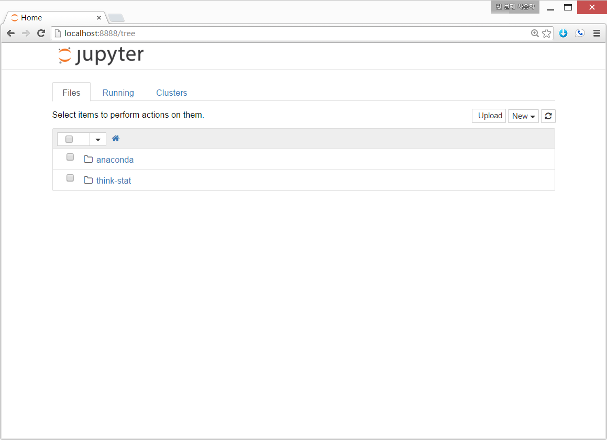

> ### 학습 목표 {.objectives}
>
> * 부랑자(Vagrant)를 활용해서 아나콘다를 설치한다.

### 1. 부랑자(Vagrant)기반 과학컴퓨팅(아나콘다) 설치 개요

사용자 컴퓨터 운영체제 독립적으로 가상상자(VirtualBox)와 부랑자(Vagrant)를 설치한 후에 `Vagrantfile`에 설정된 내용에 맞춰 과학컴퓨팅(아나콘다) 기본환경을 설정한다.

### 2. 부랑자(Vagrant) 환경 설정

기본적으로 부랑자(Vagrant)는 가상상자(VirtualBox)를 가정하고 시작된다. 따라서 가상상자와 함께 부랑자를 함께 먼저 본인이 사용할 컴퓨터 운영체제에 맞춰 설치한다.

~~~ {.shell}
$ vagrant init
$ ls
Vagrantfile
$ vagrant up --provision
$ vagrant ssh
~~~

1. `vagrant init`  명령어는 boilerplate 혹은 skeleton  으로 불리는 `Vagrantfile`을 생성한다.
1. `nano Vagrantfile` 파일에 한글 LaTeX 설치 쉘스크립트를 복사하여 붙여넣는다.
1. `vagrant up --provision` 명령어를 실행하면 기본 운영체제 `최신 우분투 64비트`와 함께 `Anaconda` 엔진을 함께 설치한다.
1. `vagrant ssh` 명령어를 통해서 한글  IPython Notebook이 설치된 가상컴퓨터에 접속한다.
1. `git clone https://github.com/statkclee/ThinkStats2.git` 명령어를 입력하면 작업 프로젝트 파일을 가상컴퓨터 내부로 가져온다.
1. `cd ThinkStats2\code` 명령어를 실행하면 `.ipynb` 파일과 `.py` 코드를 함께 예제로 살펴볼 수 있다.

#### 2.1. IPython 노트북 `Vagrantfile` 환경설정 파일

~~~ {.shell}
# -*- mode: ruby -*-
# vi: set ft=ruby :

$install_python = <<SCRIPT
# ANACONDA
anaconda=Anaconda3-2.4.1-Linux-x86_64.sh
if [[ ! -f $anaconda ]]; then
  wget --quiet https://3230d63b5fc54e62148e-c95ac804525aac4b6dba79b00b39d1d3.ssl.cf1.rackcdn.com/$anaconda
fi
chmod +x $anaconda
./$anaconda -b -p /home/vagrant/anaconda
cat >> /home/vagrant/.bashrc << END
export PATH=/home/vagrant/anaconda/bin:$PATH
END
rm $anaconda
# Start ipython notebook
sed -i "17i su vagrant -c 'cd /home/vagrant && /home/vagrant/anaconda/bin/ipython notebook --no-browser --ip=0.0.0.0'" /etc/rc.local
SCRIPT

Vagrant.configure(2) do |config|
  config.vm.box = "ubuntu/trusty64"

  config.vm.network "forwarded_port", guest: 8000, host: 8000, auto_correct: true

  config.vm.provider :virtualbox do |v|
    v.memory = 2048
    v.cpus = 2
  end
  
  config.vm.provision :shell, inline: $install_python
  config.vm.synced_folder ".", "/home/vagrant/"
end
~~~

### 3. 가상컴퓨터에 IPython 노트북 실행

`vagrant up` 명령어를 통해서 가상 컴퓨터에 IPython 노트북을 올리고 `vagrant ssh`로 접속한 후에 `ipython notebook --ip=0.0.0.0 --no-browser` 명령어를 통해서 IPython 노트북을 웹서버 형태로 서비스를 올린다.  `--ip=0.0.0.0 --no-browser` 옵션사항 설정에 대해서는 xwMOOC 공개수업에서 확인바란다.

그리고 난후에 마지막으로 웹브라우져를 열고 `http://localhost:8888`을 입력하면 모든 것의 설정이 완료되었다.

~~~ {.shell}
admin@xwMOOC ~/scientific-computing $ vagrant up
admin@xwMOOC ~/scientific-computing $ vagrant ssh

   Welcome to Ubuntu 14.04.3 LTS....

vagrant@vagrant-ubuntu-trusty-32:~$ ipython notebook --ip=0.0.0.0 --no-browser
~~~

### 4. 부랑자 가상컴퓨터 끄기

부랑자 가상컴퓨터 사용을 마쳤으면, 이제 모든 것을 꺼서 다른 작업에 컴퓨터의 자원을 환원할 필요가 있다. 다양한 방법이 존재한다. 자세한 내용은 구글링을 하거나 인터넷 질의응답 사이트를 참조한다.

~~~ {.shell}
$ vagrant global-status | awk '/running/{print $1}' | xargs -r -d '\n' -n 1 -- vagrant suspend
~~~
[Shutting down all VirtualBox (vagrant) VMs in one easy to use bash command (that can be put into a bash file)](http://askubuntu.com/questions/457329/shutting-down-all-virtualbox-vagrant-vms-in-one-easy-to-use-bash-command-that)

[참조-Data Science Toolbox](http://datasciencetoolbox.org/): Start doing data science in minutes